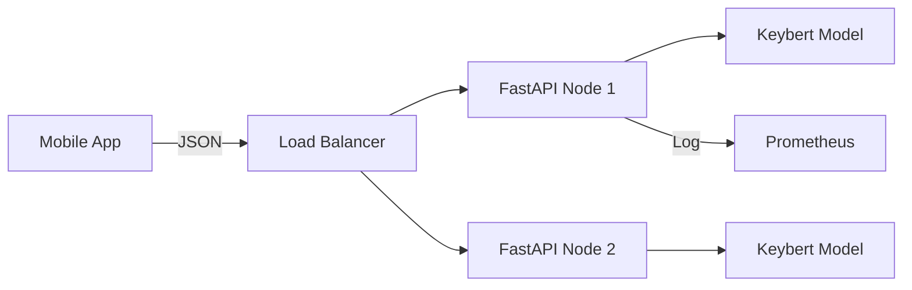

# MLOps: Model Serving (The Restaurant)

## 📜 Story Mode: The Restaurant

> **Mission Date**: 2043.08.15
> **Location**: Deep Space Outpost "Vector Prime"
> **Officer**: Lead Engineer Kael
>
> **The Problem**: The Chef (The Model) cooks amazing food inside the kitchen (Notebook).
> But the customers (Users) can't walk into the kitchen to eat.
>
> I need a **Waiter** (API).
> The Waiter takes an order ("Translate 'Hello'"), brings it to the kitchen, waits for the Chef, and delivers the result ("Bonjour").
>
> If 100 customers order at once, a single waiter fails.
> I need a system meant for scale. Batching orders. Multiple Chefs.
>
> *"Computer! Deploy FastAPI. Set up the /predict endpoint. Enable async batching."*

---

## 1. Problem Setup & Motivation

### The 6 Engineering Questions
1.  **WHAT**:
    *   **Serving**: Making a model available via a network request (HTTP/gRPC).
    *   **Inference**: The act of using a trained model to predict.
2.  **WHY**: Models are useless if locked in a laptop.
3.  **WHEN**: Real-time apps (Uber ETA), Recommendation Engines (Netflix).
4.  **WHERE**: `FastAPI`, `Flask`, `TorchServe`, `Triton Inference Server`.
5.  **WHO**: Sebastián Ramírez (FastAPI).
6.  **HOW**: `POST /predict { "text": "Hello" }` -> `200 OK { "result": "Bongiorno" }`.

> [!NOTE]
> **🛑 Pause & Explain (In Simple Words)**
>
> **Batching (The Bus).**
>
> - **No Batching**: A Taxi. Takes 1 person, drives to destination. Returns. High cost per person.
> - **Batching**: A Bus. Waits for 10 milliseconds. Collects 50 people. Drives them all at once.
> - GPUs love Buses (Matrix logic). GPUs hate Taxis.
> - Good serving systems (TorchServe) implement "Dynamic Batching" automatically.

---

## 2. Mathematical Problem Formulation

### Latency vs Throughput
*   **Latency**: Time for 1 user to get an answer (ms). Lower is better.
*   **Throughput**: Number of users served per second (RPS). Higher is better.
*   **Trade-off**: High batch size improves Throughput but hurts Latency (waiting for the bus to fill).

---

## 3. The Trifecta: Implementation Levels

We will serve a dummy sentiment model.

### Level 1: Pure Python (Flask)
*Simple, blocking, slow.*

### The Ship's Code (Polyglot: Pure Python + Libraries)

```python
import socket
import json

# LEVEL 0: Pure Python (Socket Server)
# Understanding the HTTP Protocol visually
def run_socket_server(port=8080):
    s = socket.socket(socket.AF_INET, socket.SOCK_STREAM)
    s.bind(('0.0.0.0', port))
    s.listen(1)
    print(f"Listening on {port}...")
    
    while True:
        client, addr = s.accept()
        raw = client.recv(1024).decode('utf-8')
        # raw looks like: "POST /predict HTTP/1.1\r\nHost: ...\r\n\r\n{'text':'hi'}"
        
        # Parse logic here...
        prediction = "Positive" 
        
        # Send HTTP Response
        resp = f"HTTP/1.1 200 OK\r\nContent-Type: application/json\r\n\r\n{{\"result\": \"{prediction}\"}}"
        client.sendall(resp.encode('utf-8'))
        client.close()

# LEVEL 1: Flask (Sync)
# Simple, blocking, slow.
"""
from flask import Flask, request, jsonify
app = Flask(__name__)
@app.route('/predict', methods=['POST'])
def predict():
    return jsonify({'result': 'Positive'})
"""

# LEVEL 2: FastAPI (Async)
# Modern, fast, typed.
"""
from fastapi import FastAPI
from pydantic import BaseModel

app = FastAPI()
class Input(BaseModel):
    text: str

@app.post("/predict")
async def predict(data: Input):
    return {"result": "Positive", "confidence": 0.99}
"""
```

### Level 3: Specialized Servers (TorchServe / Triton)
*No Python code needed for the server logic. Just configuration.*

**Config (`config.properties`)**:
```properties
inference_address=http://0.0.0.0:8080
management_address=http://0.0.0.0:8081
number_of_netty_threads=32
job_queue_size=1000
model_store=/mnt/models
```

**Command**:
```bash
torchserve --start --ncs --model-store model_store --models my_model=resnet_18.mar
```
*Handles Logging, Metrics, Batching, and A/B Testing automatically.*

> [!TIP]
> **👁️ Visualizing the Trade-off: Latency vs Throughput**
> Run this script to see why "filling the bus" hurts individual speed but helps system efficiency.
>
> ```python
> import matplotlib.pyplot as plt
> import numpy as np
>
> def plot_serving_tradeoff():
>     # Batch Sizes
>     batches = [1, 2, 4, 8, 16, 32, 64]
>     
>     # Throughput (Requests Per Second) - Increases with batching (Efficiency)
>     # e.g., GPU matrix mult is faster per-item in bulk
>     throughput = [100, 180, 300, 500, 800, 1200, 1500] 
>     
>     # Latency (Milliseconds) - Increases with batching (Waiting)
>     latency = [10, 12, 15, 20, 30, 50, 100]
>     
>     fig, ax1 = plt.subplots(figsize=(10, 6))
>     
>     color = 'tab:red'
>     ax1.set_xlabel('Batch Size')
>     ax1.set_ylabel('Latency (ms)', color=color)
>     ax1.plot(batches, latency, color=color, marker='o', label='Latency (Lower is better)')
>     ax1.tick_params(axis='y', labelcolor=color)
>     
>     ax2 = ax1.twinx()  # instantiate a second axes that shares the same x-axis
>     
>     color = 'tab:blue'
>     ax2.set_ylabel('Throughput (Req/Sec)', color=color)  # we already handled the x-label with ax1
>     ax2.plot(batches, throughput, color=color, marker='s', label='Throughput (Higher is better)')
>     ax2.tick_params(axis='y', labelcolor=color)
>     
>     plt.title("The Serving Dilemma: Maximize Speed or Maximize Volume?")
>     plt.grid(True, linestyle=':', alpha=0.6)
>     fig.tight_layout()  # otherwise the right y-label is slightly clipped
>     plt.show()
>
> # Uncomment to run:
> # plot_serving_tradeoff()
> ```

---

## 4. System-Level Integration



**Where it lives**:
**Netflix**: Uses Triton Inference Server to optimize GPU usage for recommendations.

---

## 5. Evaluation & Failure Analysis

### Failure Mode: Serialize/Deserialize Overhead
For images, sending base64 strings over JSON is slow.
**Fix**: Use **gRPC** (Protobuf) instead of REST (JSON). It's binary and strictly typed. ~10x faster for heavy payloads.

---

## 6. Ethics, Safety & Risk Analysis

### API Abuse
If you expose a public API, someone will spam it.
**Fix**: Rate Limiting (`SlowAPI`), Authentication (JWT Tokens).

---

## 7. Advanced Theory & Research Depth

### Model Quantization for Serving
Serving `float32` models is expensive.
Convert to `int8` (Quantization).
Reduces RAM by 4x. Speedup 2-3x on CPU.
Minimal accuracy loss (<1%).

---

## 8. Assessment & Mastery Checks

### 13. Assessment & Mastery Checks

**Q1: Async def**
Why is `async def` in FastAPI good for ML?
*   *Answer*: It's actually tricky. `async` is good for I/O (Database calls). ML prediction is CPU-bound (Blocking). If you run a heavy model in `async def` without `await`, you block the event loop.
*   **Fix**: Run heavy ML inference in a separate thread/process (`run_in_executor`).

**Q2: Batching**
Why does batching increase latency?
*   *Answer*: You have to wait for the bus to fill up. The first passenger waits for the last passenger.

**Q3: RPC vs REST**
When to use gRPC?
*   *Answer*: Internal microservices. Low latency. Strict schemas. REST is better for public-facing APIs (Web browsers understand JSON naturally).

### 14. Common Misconceptions (Debug Your Thinking)

> [!WARNING]
> **"FastAPI makes my model faster."**
> *   **Correction**: No. It makes the *web server* overhead lower. The model inference time (`model(x)`) is identical.

> [!WARNING]
> **"I can just scale horizontally."**
> *   **Correction**: ML models are huge (RAM). You can't spawn 1000 containers like a NodeJS app. You will run out of cluster memory. Scale carefully.

---

## 9. Further Reading & Tooling

*   **Tool**: **Locust** (Load testing your API).
*   **Server**: **NVIDIA Triton** (The gold standard for GPU serving).

---

## 10. Concept Graph Integration

*   **Previous**: [Docker](05_mlops/01_docker.md).
*   **Next**: [Monitoring](05_mlops/03_monitoring.md).

### Concept Map
```mermaid
graph TD
    Model[ML Model] -- "Wrapped by" --> Server
    Server --> API[API Endpoint]
    
    Server --> Flask[Flask (Sync)]
    Server --> FastAPI[FastAPI (Async)]
    Server --> Triton[Triton (Optimized)]
    
    Request -- "Arrives" --> Queue
    Queue -- "Batched by" --> Batcher
    Batcher -- "Inference" --> GPU
    
    Metric --> Latency[Latency (ms)]
    Metric --> Throughput[Throughput (RPS)]
    
    Latency -- "Tradeoff" --> Throughput
    
    Communication --> REST[JSON / HTTP]
    Communication --> gRPC[Protobuf / HTTP2]
    
    style Model fill:#f9f,stroke:#333
    style Server fill:#bbf,stroke:#333
    style Triton fill:#bfb,stroke:#333
```
