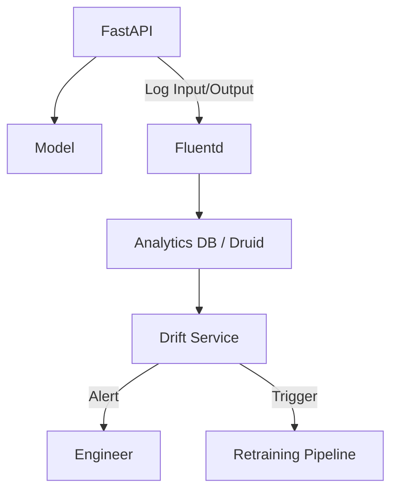
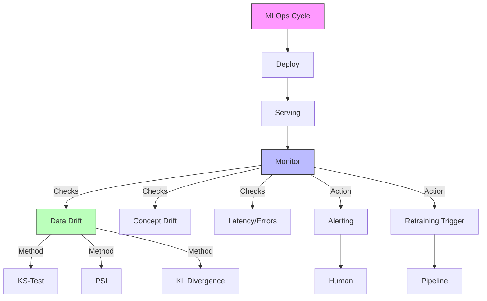

# MLOps: Monitoring & Observability (The Watchtower)

## 📜 Story Mode: The Watchtower

> **Mission Date**: 2043.08.30
> **Location**: Deep Space Outpost "Vector Prime"
> **Officer**: Lead Engineer Kael
>
> **The Problem**: The deployment was a success. The API is answering calls.
> But something is wrong. The users are complaining.
> "The Translator is speaking gibberish."
>
> I check the logs. No errors. HTTP 200 OK. Latency 50ms.
> System-wise, everything is green.
>
> But the *World* has changed.
> We trained on "Formal Alien". The aliens are now speaking "Slang Alien".
> The data coming in (Live) refers to concepts the model never saw during training.
> This is **Data Drift**. The silent killer.
>
> *"Computer! Install Drift Detectors. Compare 'Training Distribution' vs 'Live Distribution'. Alert me if KL Divergence > 0.1."*

---

## 1. Problem Setup & Motivation

### The 6 Engineering Questions
1.  **WHAT**:
    *   **Monitoring**: Watching the health of the system.
    *   **Observability**: Ability to debug *why* it is unhealthy.
    *   **Drift**: When production data moves away from training data.
2.  **WHY**: Models degrade over time. Code doesn't rot, but data does.
3.  **WHEN**: Continuous. Post-deployment.
4.  **WHERE**: `Prometheus`, `Grafana`, `Evidently  AI`, `Arize`.
5.  **WHO**: SREs (Site Reliability Engineers) and MLOps Engineers.
6.  **HOW**: Statistical tests (KS-Test, PSI) on windowed data.

> [!NOTE]
> **🛑 Pause & Explain (In Simple Words)**
>
> **The Thermostat.**
>
> - **System Monitoring**: Is the heater on? Is the house burning down? (CPU, Error Rates).
> - **Model Monitoring**: Is the house actually comfortable? Or is the heater on but the window is open? (Accuracy, Drift).
> - **Ground Truth Delay**: You often don't know the *actual* accuracy until days later (e.g., did the user click the ad?). So you rely on **Proxy Metrics** like Drift.

---

## 2. Mathematical Problem Formulation

### Measuring Drift: Kolmogorov-Smirnov (KS) Test
Comparing two probability distributions $P$ (Train) and $Q$ (Live).
$$ D_{KS} = \max_x | F_P(x) - F_Q(x) | $$
*   $F(x)$: Cumulative Distribution Function.
*   If $D_{KS}$ is large, the data has shifted responsibly.

---

## 3. The Trifecta: Implementation Levels

We will implement a Drift Detector.

### Level 1: Pure Python (Histogram Compare)
*Simple binning overlap.*

### The Ship's Code (Polyglot: Pure Python + Libraries)

```python
import numpy as np
from scipy.stats import ks_2samp
from evidently.report import Report
from evidently.metric_preset import DataDriftPreset

# LEVEL 0: Pure Python (KL-Divergence)
def kl_divergence_pure(p, q):
    """
    p: List of probs (Reference)
    q: List of probs (Live)
    """
    # Sum(P(x) * log(P(x) / Q(x)))
    divergence = 0.0
    epsilon = 1e-10 # Prevent div by zero
    
    for i in range(len(p)):
        p_val = p[i] + epsilon
        q_val = q[i] + epsilon
        divergence += p_val * np.log(p_val / q_val)
        
    return divergence

# LEVEL 1: SciPy (KS-Test)
def statistical_drift(train, live):
    # Returns statistic (D) and p-value
    # Null Hypothesis: Distributions are SAME
    stat, p_value = ks_2samp(train, live)
    
    # If p < 0.05, chance that they are same is < 5%
    # Reject Null -> Drift Detected
    if p_value < 0.05:
        return True 
    return False

# LEVEL 2: Evidently AI (Production)
def evidently_demo(train_df, live_df):
    # Generates an HTML dashboard
    report = Report(metrics=[DataDriftPreset()])
    report.run(reference_data=train_df, current_data=live_df)
    report.run(reference_data=train_df, current_data=live_df)
    report.save_html('drift_report.html')
```

> [!TIP]
> **👁️ Visualizing the Silent Killer: Data Drift**
> Run this script to see how easy it is for distributions to separate.
>
> ```python
> import matplotlib.pyplot as plt
> import numpy as np
> import seaborn as sns
>
> def plot_drift_demo():
>     # 1. Generate Training Data (Reference)
>     np.random.seed(42)
>     train_data = np.random.normal(loc=50, scale=10, size=1000)
>     
>     # 2. Generate Live Data (Drifting)
>     # Shifted mean (Covariate Shift)
>     live_data = np.random.normal(loc=55, scale=12, size=1000)
>     
>     # 3. Plot
>     plt.figure(figsize=(10, 6))
>     
>     sns.kdeplot(train_data, fill=True, color='blue', alpha=0.3, label='Training Data (Reference)')
>     sns.kdeplot(live_data, fill=True, color='red', alpha=0.3, label='Live Data (Drifted)')
>     
>     plt.axvline(np.mean(train_data), color='blue', linestyle='--')
>     plt.axvline(np.mean(live_data), color='red', linestyle='--')
>     
>     plt.title("Data Drift Detection: Distribution Shift")
>     plt.xlabel("Feature Value")
>     plt.ylabel("Density")
>     plt.legend()
>     
>     # Annotate
>     plt.text(65, 0.02, "Warning: Distribution\nhas shifted right!", color='red', fontweight='bold')
>     
>     plt.show()
>
> # Uncomment to run:
> # plot_drift_demo()
> ```

---

## 4. System-Level Integration



**Where it lives**:
**Uber**: **Manifold** system. Visualizes feature distributions of millions of trips to detect issues map-wide.

---

## 5. Evaluation & Failure Analysis

### Failure Mode: False Alarms
Statistical tests are sensitive on large data.
With $N=1,000,000$, even a tiny meaningless shift gives $p < 0.05$.
**Fix**: Use effect size (like `Population Stability Index - PSI`) instead of just p-values.

---

## 6. Ethics, Safety & Risk Analysis

### Feedback Loops
If your model predicts "Crime Risk", and police go there, they find crime.
This new data is fed back.
The model confirms its own bias.
**Fix**: Monitoring must track **Feedback Loop Bias**.

---

## 7. Advanced Theory & Research Depth

### Concept Drift ($P(Y|X)$ changes)
Input features ($X$) look the same, but the relationship to Target ($Y$) changes.
Example: "Corona" used to mean Beer. Now means Virus.
Harder to detect because you need Ground Truth ($Y$).

---

## 8. Assessment & Mastery Checks

### 13. Assessment & Mastery Checks

**Q1: Ground Truth Delay**
How do you monitor model performance if you don't get labels for a week?
*   *Answer*: You can't monitor *accuracy* live. You monitor *predictions* distribution. If model starts predicting "Fraud" 90% of the time (vs historical 1%), something is wrong, even if you don't know the true fraud status yet.

**Q2: Drift Types**
Covariate Shift vs Concept Drift?
*   *Answer*: **Covariate**: Input Shift (Users are younger now). **Concept**: Function Shift (Housing prices formula changed).

**Q3: Retraining Frequency**
Should I retrain every night?
*   *Answer*: Only if drift is detected OR performance degrades. Retraining blindly risks "Catastrophic Forgetting" or overfitting to recent noise.

### 14. Common Misconceptions (Debug Your Thinking)

> [!WARNING]
> **"If Drift < 0.05, model is fine."**
> *   **Correction**: Not necessarily. You could have stable distribution but terrible accuracy (e.g., model outputting random noise that *mimics* the training distribution). Drift is a proxy, not a guarantee.

> [!WARNING]
> **"Monitoring is just Logging."**
> *   **Correction**: Logging is "Record what happened". Monitoring is "Alert when what happened is bad". Observability is "Tell me WHY it was bad".

---

## 9. Further Reading & Tooling

*   **Tool**: **Prometheus** (Time Series DB).
*   **Tool**: **Grafana** (Visualization).

---

## 10. Concept Graph Integration

*   **Previous**: [Serving](05_mlops/02_serving.md).
*   **Next**: [Final Project & Graduation](../TOC.md).
*   **Next**: [GenAI](06_genai/01_diffusion.md).

### Concept Map

