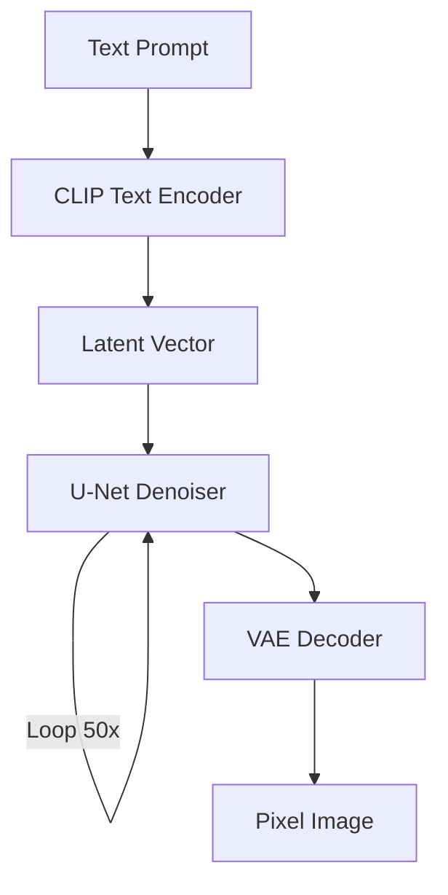

# Generative AI: Diffusion Models (The Restoration)

## 📜 Story Mode: The Restoration

> **Mission Date**: 2043.09.01
> **Location**: Deep Space Outpost "Vector Prime" - Art Gallery
> **Officer**: Lead Engineer Kael
>
> **The Problem**: We found a masterpiece painting, but it's covered in static noise.
> I want to restore it. But I don't know what it looked like.
>
> **The Insight**: If I learn exactly how dust settles on a painting (Forward Process), I might be able to reverse time and suck the dust off (Reverse Process).
>
> I will train a model not to *draw*, but to *clean*.
> I will show it pure noise and tell it: "There is a Mona Lisa hidden in here. Find it."
> Step by step, it removes the static, until the image emerges from the chaos.
>
> *"Computer! Calculate the Gaussian Noise Schedule. Train the U-Net to predict noise $\epsilon$."*

---

## 1. Problem Setup & Motivation

### The 6 Engineering Questions
1.  **WHAT**:
    *   **Diffusion**: Parametrized Markov Chain.
    *   **Forward**: $x_0 \to x_T$ (Add noise until pure Gaussian).
    *   **Reverse**: $x_T \to x_0$ (Learn to remove noise step-by-step).
2.  **WHY**: GANs are unstable (Mode Collapse). VAEs are blurry. Diffusion is stable and high-quality.
3.  **WHEN**: Image Generation (Midjourney), Audio Synthesis.
4.  **WHERE**: `StableDiffusionPipeline` (HuggingFace Diffusers).
5.  **WHO**: Sohl-Dickstein (2015), Ho et al. (DDPM, 2020).
6.  **HOW**: Train network $\epsilon_\theta(x_t, t)$ to predict the noise added at step $t$.

> [!NOTE]
> **🛑 Pause & Explain (In Simple Words)**
>
> **The Foggy Morning.**
>
> - **Forward**: You watch a clear mountain view get covered by fog. At $t=1000$, it's just white-out.
> - **Reverse**: You ask a painter: "Here is a white canvas (fog). Paint the mountain."
> - **Iterative**: The painter doesn't paint it all at once.
>   - Step 999: "I think there's a shape here." (Removes a tiny bit of fog).
>   - Step 500: "It looks like a peak."
>   - Step 0: "Here is the HD mountain."

---

## 2. Mathematical Problem Formulation

### The Noise Schedule ($\beta_t$)
We define a schedule $\beta_1, \dots, \beta_T$.
$$ q(x_t | x_{t-1}) = \mathcal{N}(x_t; \sqrt{1 - \beta_t} x_{t-1}, \beta_t \mathbf{I}) $$
We can jump directly to step $t$:
$$ x_t = \sqrt{\bar{\alpha}_t} x_0 + \sqrt{1 - \bar{\alpha}_t} \epsilon $$
Target: Minimize $|| \epsilon - \epsilon_\theta(x_t, t) ||^2$.

---

## 3. The Trifecta: Implementation Levels

We will implement the **Forward Noise Process**.
Task: Given an image pixel $x_0 = 0.5$ and noise $\epsilon = 0.1$, compute $x_t$.

### The Ship's Code (Polyglot: Pure Python + Libraries)

```python
import math
import numpy as np
import torch

# LEVEL 0: Pure Python (Noise Schedule Logic)
def get_alphas_pure(betas):
    # alpha = 1 - beta
    # alpha_bar = cumulative product of alphas
    alphas = [1.0 - b for b in betas]
    alphas_cumprod = []
    current_prod = 1.0
    for a in alphas:
        current_prod *= a
        alphas_cumprod.append(current_prod)
    return alphas_cumprod

def add_noise_pure(x0, t, alphas_cumprod):
    # x_t = sqrt(alpha_bar) * x0 + sqrt(1 - alpha_bar) * epsilon
    # Simplified scalar version
    alpha_bar = alphas_cumprod[t]
    epsilon = 0.5 # Fixed noise for demo
    
    mean = math.sqrt(alpha_bar) * x0
    variance_part = math.sqrt(1 - alpha_bar) * epsilon
    
    return mean + variance_part

# LEVEL 1: NumPy (Vectorized)
def add_noise_numpy(x0, t, alphas_cumprod):
    alpha_bar = alphas_cumprod[t]
    noise = np.random.normal(size=x0.shape)
    
    mean = np.sqrt(alpha_bar) * x0
    var = np.sqrt(1 - alpha_bar) * noise
    return mean + var

# LEVEL 2: PyTorch (Diffusers Style)
def q_sample_torch(x0, t, alphas_cumprod):
    noise = torch.randn_like(x0)
    
    # Extract alpha_bar for batch 't'
    sqrt_alpha_bar = torch.sqrt(alphas_cumprod[t])
    sqrt_one_minus_alpha_bar = torch.sqrt(1. - alphas_cumprod[t])
    
    return sqrt_alpha_bar * x0 + sqrt_one_minus_alpha_bar * noise
```

    return sqrt_alpha_bar * x0 + sqrt_one_minus_alpha_bar * noise
```

> [!TIP]
> **👁️ Visualizing the Entropy: The Forward Process**
> Run this script to see an image dissolve into chaos.
>
> ```python
> import matplotlib.pyplot as plt
> import numpy as np
> from sklearn.datasets import load_sample_image
>
> def plot_diffusion_process():
>     # 1. Load Image
>     try:
>         china = load_sample_image("china.jpg") / 255.0
>         x0 = china[::2, ::2, :] # Downsample for speed
>     except:
>         x0 = np.zeros((200, 300, 3)) # Fallback black
>         x0[50:150, 100:200, :] = 1.0 # White square
>     
>     # 2. Define Schedule
>     T = 1000
>     betas = np.linspace(0.0001, 0.02, T)
>     alphas = 1. - betas
>     alphas_cumprod = np.cumprod(alphas)
>     
>     # 3. Steps to Visualize
>     steps = [0, 100, 400, 999]
>     
>     fig, axes = plt.subplots(1, 4, figsize=(16, 4))
>     
>     for i, t in enumerate(steps):
>         # q_sample logic
>         sqrt_alpha_bar = np.sqrt(alphas_cumprod[t])
>         sqrt_one_minus_alpha_bar = np.sqrt(1. - alphas_cumprod[t])
>         noise = np.random.randn(*x0.shape)
>         
>         xt = sqrt_alpha_bar * x0 + sqrt_one_minus_alpha_bar * noise
>         xt = np.clip(xt, 0, 1) # Clip for display
>         
>         axes[i].imshow(xt)
>         axes[i].set_title(f"Step {t}\nNoise: {sqrt_one_minus_alpha_bar:.2f}")
>         axes[i].axis('off')
>         
>     plt.suptitle("The Forward Diffusion Process (Destroying Information)")
>     plt.show()
>
> # Uncomment to run:
> # plot_diffusion_process()
> ```

## 4. System-Level Integration



**Where it lives**:
**Midjourney**: A massive Diffusion model conditioned on text.
**Adobe Firefly**: Integrated into Photoshop.

---

## 5. Evaluation & Failure Analysis

### Failure Mode: Hands & Text
Diffusion models struggle with high-frequency spatial details (fingers) and local consistency (letters).
**Fix**: Negative Prompts ("bad anatomy"), ControlNet (pose guidance).

---

## 6. Advanced Theory & Research Depth

### Latent Diffusion (Stable Diffusion)
Pixel space is huge ($512 \times 512 \times 3 \approx 786,000$ dims).
Too slow to diffuse.
**Solution**: Use a VAE to compress image to "Latent Space" ($64 \times 64 \times 4 \approx 16,000$ dims).
Do diffusion there. Decode back.
Speedup: 50x.

---

## 7. Assessment & Mastery Checks

### 13. Assessment & Mastery Checks

**Q1: DDPM vs DDIM**
What's the difference?
*   *Answer*: DDPM is Markovian (needs all steps). DDIM is non-Markovian (can skip steps, e.g., generate in 50 steps instead of 1000).

**Q2: Classifier Guidance**
How do we control the generation (e.g., "Make it a cat")?
*   *Answer*: Use a separate Classifier $p(y|x)$ to check if the noisy image looks like a cat. Compute gradients $\nabla_x \log p(y|x)$ and push the diffusion process in that direction.

**Q3: Latent Space**
Why Diffusion in Latent Space?
*   *Answer*: Speed. Pixel space is too high-dimensional. Compressing to latent space reduces compute by 50x without losing semantic meaning.

### 14. Common Misconceptions (Debug Your Thinking)

> [!WARNING]
> **"Diffusion adds noise to the image until it's gone."**
> *   **Correction**: That's the *Forward* process. The model you train learns the *Reverse* process (removing noise).

> [!WARNING]
> **"It just copies art from the training set."**
> *   **Correction**: No. The model learns probability distributions of pixel relationships. It effectively "hallucinates" new images that follow those statistical rules. It doesn't store JPEGs.

---

## 8. Concept Graph Integration

*   **Previous**: [Transformers](../04_nlp/05_transformers_architectures.md).
*   **Next**: [Evaluation](../04_nlp/02_embeddings.md).
> 
> ### Concept Map
> ```mermaid
> graph TD
>     Image[Data x_0] -- "Forward Process" --> Noise[Pure Noise x_T]
>     Noise -- "Reverse Process" --> Generative[Generated Data]
>     
>     ReverseProcess -- "Requires" --> Model[UNet Denoiser]
>     Model -- "Predicts" --> Epsilon[Noise Component]
>     
>     Conditioning --> Text[Text Prompt]
>     Conditioning --> ImageCond[Image Control]
>     
>     Text -- "Encoded by" --> CLIP
>     CLIP -- "Guides" --> UNet
>     
>     Architecture --> PixelSpace[Slow]
>     Architecture --> LatentSpace[Fast (Latent Diffusion)]
>     
>     LatentSpace -- "Uses" --> VAE
>     
>     style Image fill:#f9f,stroke:#333
>     style Noise fill:#bbf,stroke:#333
>     style Model fill:#bfb,stroke:#333
> ```
