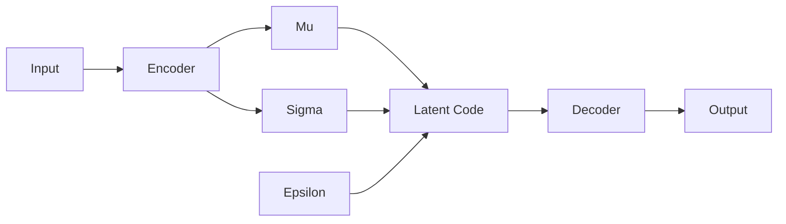

# Generative AI: VAEs & GANs (The Dreamer)

## 📜 Story Mode: The Dreamer & The Critic

> **Mission Date**: 2043.09.15
> **Location**: Deep Space Outpost "Vector Prime"
> **Officer**: Lead Engineer Kael
>
> **The Problem**: Diffusion is great but slow. I need speed.
>
> **Strategy A: The Compressor (VAE)**
> I want to boil the universe down to its essence. A "Latent Code".
> If I understand the *structure* of a face (Eyes, Nose, Mouth positions), I can just tweak the numbers.
> $z_{eyes} += 1$. The eyes open.
> This is the Variational Autoencoder.
>
> **Strategy B: The Forger (GAN)**
> I have a Forger (Generator) and a Cop (Discriminator).
> The Forger tries to paint a fake galaxy.
> The Cop tries to detect it.
> They fight.
> Eventually, the Forger gets so good the Cop can't tell the difference.
> This is the Generative Adversarial Network.
>
> *"Computer! Define the Latent Space. Start the Zero-Sum Game."*

---

## 1. Problem Setup & Motivation

### The 6 Engineering Questions
1.  **WHAT**:
    *   **VAE**: Probabilistic Encoder-Decoder. Learns a smooth distribution $P(z|x)$.
    *   **GAN**: Game theoretic approach. Two networks competing.
2.  **WHY**:
    *   **VAE**: Good for disentanglement & interpolation. (Blurry results).
    *   **GAN**: Sharp, realistic results. (Hard to train).
3.  **WHEN**: Real-time filters (Snapchat uses GANs), Data Compression (VAE).
4.  **WHERE**: `GAN` (PyTorch examples), `VQ-VAE`.
5.  **WHO**: Kingma & Welling (VAE, 2013), Goodfellow (GAN, 2014).
6.  **HOW**:
    *   VAE: Min Reweighted ELBO (Evidence Lower Bound).
    *   GAN: $\min_G \max_D V(D, G)$.

> [!NOTE]
> **🛑 Pause & Explain (In Simple Words)**
>
> **The Police Sketch vs The Counterfeit.**
>
> - **VAE (Police Sketch)**: You describe a criminal to an artist. "Average height, roughly 30 years old." (Probability Distribution). The artist draws a "blurry" generic face that fits.
> - **GAN (Counterfeit)**: You try to pay with fake money. The cashier rejects it. You make a better fake. The cashier gets a UV light. You buy better paper. An arms race.

---

## 2. Mathematical Problem Formulation

### The VAE Reparameterization Trick
We need to sample $z \sim \mathcal{N}(\mu, \sigma)$. Sampling is random (can't backprop).
Trick: Move randomness to an input $\epsilon$.
$$ z = \mu + \sigma \cdot \epsilon, \quad \epsilon \sim \mathcal{N}(0, 1) $$
Now $\mu$ and $\sigma$ are deterministic paths for gradients.

### The GAN Loss
$$ L = \mathbb{E}[\log D(x)] + \mathbb{E}[\log(1 - D(G(z)))] $$
Discriminator wants to maximize this (Detect real and fake).
Generator wants to minimize this (Fool discriminator).

---

## 3. The Trifecta: Implementation Levels

### The Ship's Code (Polyglot: Pure Python + Libraries)

```python
import random
import numpy as np
import torch
import torch.nn as nn

# LEVEL 0: Pure Python (Reparameterization Logic)
def reparam_pure(mu, sigma):
    # z = mu + sigma * epsilon
    # eps from Standard Normal
    epsilon = random.gauss(0, 1) 
    z = mu + sigma * epsilon
    return z

# LEVEL 1: NumPy (Batch)
def reparam_numpy(mu, log_var):
    # Log Variance is used for numerical stability
    # std = exp(0.5 * log_var)
    std = np.exp(0.5 * log_var)
    eps = np.random.randn(*mu.shape)
    return mu + std * eps

# LEVEL 2: PyTorch (Autoutograd)
class VAE(nn.Module):
    def reparameterize(self, mu, logvar):
        std = torch.exp(0.5 * logvar)
        eps = torch.randn_like(std)
        # Gradient can flow through mu and logvar, but NOT eps
        return mu + eps * std
```

> [!TIP]
> **👁️ Visualizing the Latent Space: The Walk**
> Run this script to simulate "walking" between two digits in VAE space.
>
> ```python
> import matplotlib.pyplot as plt
> import numpy as np
>
> def plot_latent_interpolation():
>     # 1. Simulate Latent Vectors (2D)
>     z_start = np.array([-2.0, 0.0]) # Represents "1"
>     z_end = np.array([2.0, 0.0])    # Represents "7"
>     
>     # 2. Interpolate
>     steps = 10
>     alpha = np.linspace(0, 1, steps)
>     path = [z_start * (1-a) + z_end * a for a in alpha]
>     
>     # 3. Simulate Decoded Images (Fake logic)
>     # As we move left to right, line angle changes
>     fig, axes = plt.subplots(1, 10, figsize=(15, 2))
>     
>     for i, z in enumerate(path):
>         # Fake Decoder: Draw a line based on Z value
>         grid = np.zeros((28, 28))
>         
>         # Logic: Angle shifts from vertical to diagonal
>         angle_factor = (range(28)) if z[0] > 0 else np.zeros(28, dtype=int)
>         # This is purely dummy visualization logic to show concept of "Morphing"
>         # Real VAE would output pixel intensities
>         
>         # Draw a vertical line that tilts
>         tilt = int((z[0] + 2) * 3) # Map -2..2 to 0..12
>         for r in range(28):
>             c = 14 + int((r/28) * tilt)
>             if 0 <= c < 28:
>                 grid[r, c] = 1.0
>                 
>         axes[i].imshow(grid, cmap='gray')
>         axes[i].set_title(f"{i/steps:.1f}")
>         axes[i].axis('off')
>         
>     plt.suptitle("Latent Space Interpolation (Morphing 1 -> 7)")
>     plt.show()
>
> # Uncomment to run:
> # plot_latent_interpolation()
> ```

---

## 4. System-Level Integration



> [!TIP]
> **Adversarial Flow**
> ```mermaid
> graph LR
>      Noise[Random Noise z] --> Generator
>      Generator --> Fake[Fake Image]
>      Real[Real Data] --> Discriminator
>      Fake --> Discriminator
>      Discriminator --> Output{Real or Fake?}
>      
>      Output -- "Backprop" --> D_Loss
>      Output -- "Backprop" --> G_Loss
>      
>      style Generator fill:#f9f,stroke:#333
>      style Discriminator fill:#bbf,stroke:#333
> ```

---

## 5. Evaluation & Failure Analysis

### Failure Mode: Mode Collapse (GAN)
The Generator finds *one* image that fools the Discriminator (e.g., a specific dog).
It produces *only* that dog forever.
**Fix**: Wasserstein GAN (WGAN), Unrolled GANs.

---

## 6. Advanced Theory & Research Depth

### VQ-VAE (Vector Quantized)
Instead of continuous Latent Space, snap to a grid (Discrete).
Used in DALL-E 1.
Combines VAE stability with Transformer compatibility (Sequences).

---

## 7. Assessment & Mastery Checks

### 13. Assessment & Mastery Checks

**Q1: Prior**
What is the "Prior" in VAE?
*   *Answer*: We force the latent space $z$ to look like a Standard Normal Gaussin $\mathcal{N}(0, 1)$ using KL-Divergence Loss. This ensures the space is smooth and centered.

**Q2: GAN Instability**
Why is Min-Max hard?
*   *Answer*: If Discriminator is too good, Generator learns nothing (Gradient vanishes). If Generator is too good, Discriminator guesses randomly. They must balance.

**Q3: Mode Collapse**
What is it?
*   *Answer*: The Generator finds the distinct image that "wins" and repeats it. It stops exploring the distribution.

### 14. Common Misconceptions (Debug Your Thinking)

> [!WARNING]
> **"VAEs are just for compression."**
> *   **Correction**: They are *Generative*. You can sample $z \sim \mathcal{N}(0,1)$ and decode a *new* image. Autoencoders (AE) are for compression.

> [!WARNING]
> **"GANs have a loss function that goes to 0."**
> *   **Correction**: No. In a perfect Nash Equilibrium, the loss stabilizes (Discriminator outputs 0.5 probability everywhere). It doesn't minimize to 0 like in Supervised Learning.

---

## 8. Concept Graph Integration

*   **Previous**: [Diffusion Models](06_genai/01_diffusion.md).
> *   **Next**: [LLM Engineering](06_genai/03_llm_engineering.md).
> 
> ### Concept Map
> ```mermaid
> graph TD
>     GenAI[Generative AI] --> VAE
>     GenAI --> GAN
>     GenAI --> Diffusion
>     
>     VAE -- "Goal" --> DensityEstimation[Estimate P(x)]
>     GAN -- "Goal" --> SampleQuality[Realistic Samples]
>     
>     VAE -- "Mechanism" --> EncoderDecoder
>     VAE -- "Loss" --> ELBO[ELBO]
>     
>     GAN -- "Mechanism" --> GameTheory[Min-Max Game]
>     GAN -- "Loss" --> Adversarial[Adversarial Loss]
>     
>     Components --> LatentSpace[Latent Space z]
>     LatentSpace -- "Property" --> Smoothness[Interpolation]
>     
>     style GenAI fill:#f9f,stroke:#333
>     style VAE fill:#bbf,stroke:#333
>     style GAN fill:#bfb,stroke:#333
> ```
