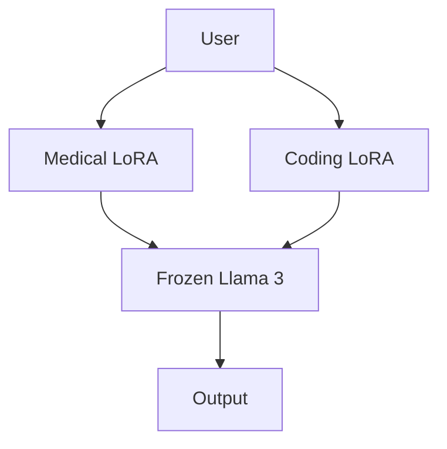
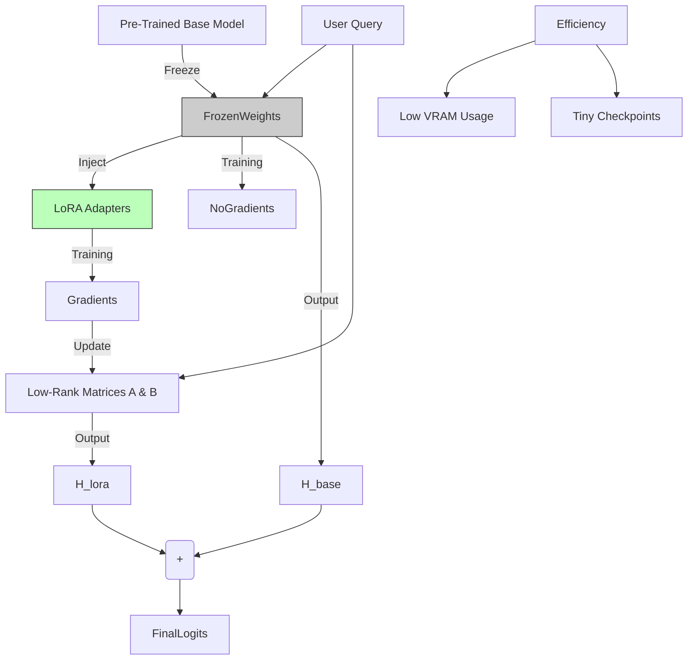

# Generative AI: Fine-Tuning & PEFT (The Specialist)

## 📜 Story Mode: The Specialist

> **Mission Date**: 2043.11.01
> **Location**: Deep Space Outpost "Vector Prime"
> **Officer**: Lead Engineer Kael
>
> **The Problem**: RAG is good, but the prompt is getting too long.
> Also, the model is too polite.
> I need it to speak "Naval Code".
> Input: "Status?" -> Output: "Hull 90%." (Currently it says: "Hello! I am happy to report that the hull is...")
>
> I need to change its *behavior*, not just its knowledge.
> I need to **Fine-Tune** it.
> But I can't update all 7 Billion parameters. My GPU will melt.
>
> **The Solution**: PEFT (Parameter-Efficient Fine-Tuning).
> I will freeze the brain. I will add a tiny "Adapter" layer (1% of size).
> I will only train the Adapter.
>
> *"Computer! Load Llama-3. Inject LoRA adapters. Rank=8. Train on the Naval Logbook."*

---

## 1. Problem Setup & Motivation

### The 6 Engineering Questions
1.  **WHAT**:
    *   **Fine-Tuning**: Updating weights on a specific dataset.
    *   **PEFT**: Updating only a *small subset* of weights.
    *   **LoRA (Low-Rank Adaptation)**: Factorizing weight updates into small matrices.
2.  **WHY**: Full Fine-Tuning is too expensive (Needs 8x A100s). PEFT runs on 1 GPU.
3.  **WHEN**: Style transfer, Specific formats (JSON only), Medical/Legal domains.
4.  **WHERE**: `HuggingFace PEFT`, `Unsloth`.
5.  **WHO**: Microsoft (LoRA, 2021).
6.  **HOW**: $W_{new} = W_{frozen} + B \cdot A$.

> [!NOTE]
> **🛑 Pause & Explain (In Simple Words)**
>
> **The Sticker.**
>
> - **Pre-Trained Model**: A finished painting of a landscape.
> - **Full Fine-Tuning**: Repainting the whole canvas. Expensive. Risk of ruining it.
> - **LoRA/PEFT**: Putting a transparent sticker on top and drawing on the sticker.
> - You don't touch the original painting. You can peel the sticker off later.

---

## 2. Mathematical Problem Formulation

### LoRA (Low-Rank Adaptation)
We want to update Weight $W$ (size $d \times d$).
Instead of learning $\Delta W$ (size $d \times d$):
We learn matrices $A$ ($d \times r$) and $B$ ($r \times d$), where $r \ll d$.
$$ \Delta W = B \cdot A $$
Example: $d=1000, r=8$.
Full parameters: $1,000,000$.
LoRA parameters: $8,000 + 8,000 = 16,000$. (98% reduction).

---

## 3. The Trifecta: Implementation Levels

We will implement the **LoRA Layer forward pass**.

### The Ship's Code (Polyglot: Pure Python + Libraries)

```python
import numpy as np
import torch
import torch.nn as nn

# LEVEL 0: Pure Python (Matrix Math)
def lora_forward_pure(x, W, A, B):
    # x: input (1, d)
    # W: frozen weights (d, out)
    # A: lora_A (d, r)
    # B: lora_B (r, out)
    
    # 1. Base Path
    h_base = np.dot(x, W)
    
    # 2. LoRA Path
    # x -> A -> B
    h_lora = np.dot(np.dot(x, A), B)
    
    # 3. Combine
    return h_base + h_lora

# LEVEL 1: PyTorch (Manual Layer)
class LoRALayer(nn.Module):
    def __init__(self, in_dim, out_dim, rank=8):
        super().__init__()
        # Frozen Base
        self.linear = nn.Linear(in_dim, out_dim)
        self.linear.weight.requires_grad = False
        
        # Trainable Adapters
        self.lora_A = nn.Parameter(torch.randn(in_dim, rank))
        self.lora_B = nn.Parameter(torch.zeros(rank, out_dim))
        
    def forward(self, x):
        base = self.linear(x)
        lora = x @ self.lora_A @ self.lora_B
        return base + lora

# LEVEL 2: PEFT Library (Production)
"""
from peft import LoraConfig, get_peft_model
config = LoraConfig(r=8, lora_alpha=32, target_modules=["q_proj", "v_proj"])
model = get_peft_model(base_model, config)
model.print_trainable_parameters()
"""
"""
```

> [!TIP]
> **👁️ Visualizing the Savings: LoRA vs Full Finetune**
> Run this script to compare the number of trainable parameters.
>
> ```python
> import matplotlib.pyplot as plt
>
> def plot_peft_efficiency():
>     # Dimensions
>     d_model = 4096
>     rank = 8
>     
>     # Full Fine-Tuning (One Linear Layer)
>     # W (4096 x 4096)
>     full_params = d_model * d_model
>     
>     # LoRA
>     # A (4096 x 8) + B (8 x 4096)
>     lora_params = (d_model * rank) + (rank * d_model)
>     
>     # Plot
>     labels = ['Full FT', 'LoRA (r=8)']
>     values = [full_params, lora_params]
>     
>     fig, ax = plt.subplots(figsize=(6, 6))
>     bars = ax.bar(labels, values, color=['red', 'green'])
>     
>     # Log scale because the difference is huge
>     ax.set_yscale('log')
>     ax.set_title(f"Trainable Parameters (Log Scale)\nReduction: {full_params/lora_params:.0f}x")
>     ax.set_ylabel("Parameter Count")
>     
>     # Label values
>     ax.bar_label(bars, fmt='%.0e')
>     
>     plt.grid(axis='y', linestyle='--', alpha=0.5)
>     plt.show()
>     
>     print(f"Full: {full_params:,}")
>     print(f"LoRA: {lora_params:,}")
>     print(f"Ratio: {lora_params/full_params:.4%}")
>
> # Uncomment to run:
> # plot_peft_efficiency()
> ```

---

## 4. System-Level Integration


**Hot Swapping**: You can serve 1000 users with one Base Model, just switching the tiny LoRA adapters for each user request.

---

## 5. Evaluation & Failure Analysis

### Failure Mode: Catastrophic Forgetting
Even with LoRA, if you train only on Math, it might forget how to Speak English.
**Fix**: Replay Buffers (mix in some old data).

---

## 13. Assessment & Mastery Checks

**Q1: Rank (r)**
What happens if $r$ is too small (e.g., 1)?
*   *Answer*: The adapter doesn't have enough capacity to learn the new task.

**Q2: QLoRA**
What is QLoRA?
*   *Answer*: LoRA + Quantization. The Base Model is loaded in 4-bit (NF4). The LoRA adapters are FP16. Allows fine-tuning Llama-70B on a single GPU.

**Q3: RAG vs Fine-Tuning**
Which one for "Company Knowledge Base"?
*   *Answer*: RAG. Knowledge changes daily. Fine-tuning is for *skills/style*.

### 14. Common Misconceptions (Debug Your Thinking)

> [!WARNING]
> **"Fine-Tuning makes the model factually accurate."**
> *   **Correction**: It reduces hallucinations slightly, but RAG is much better for facts. FT is for "Tone" and "Format".
 
### Concept Map

