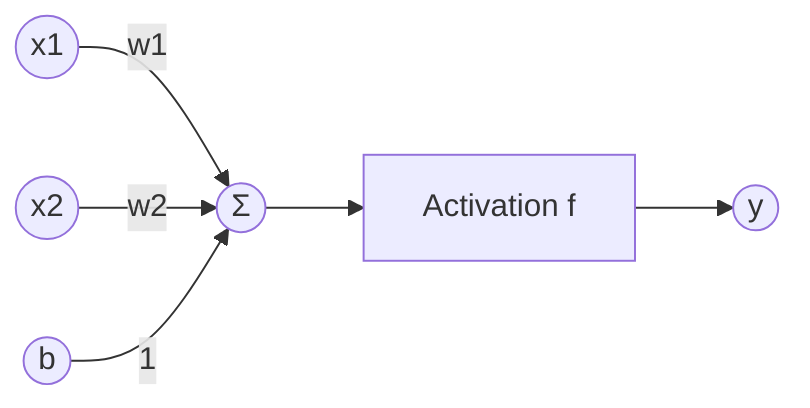
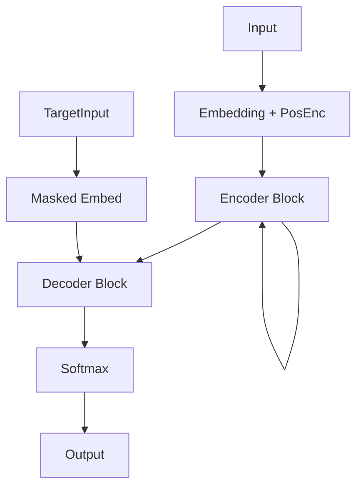
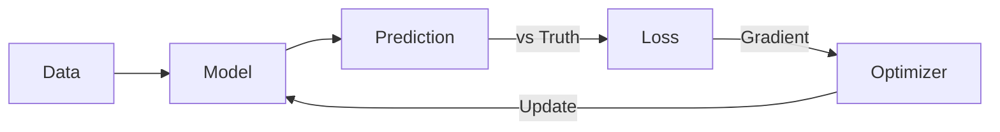
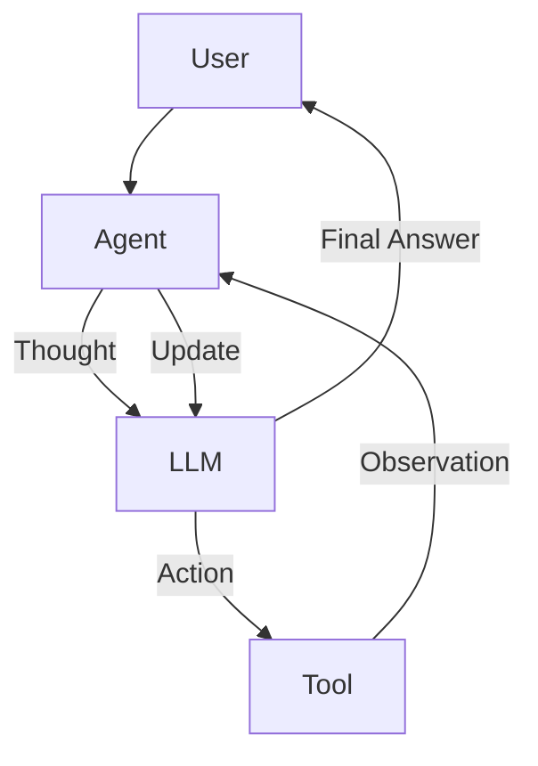
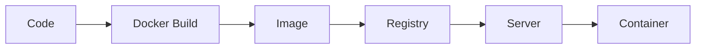
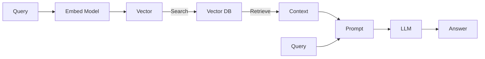

# Appendix D: Visualization Gallery

A collection of the systems diagrams used in this book.

## 🏗️ Neural Architectures

### The Perceptron

### The Transformer (Encoder-Decoder)

## 🔄 Machine Learning Loops

### The Supervised Loop

### The Agent Loop (ReAct)

## 🚢 MLOps & Systems

### Docker Build Flow

### RAG System

