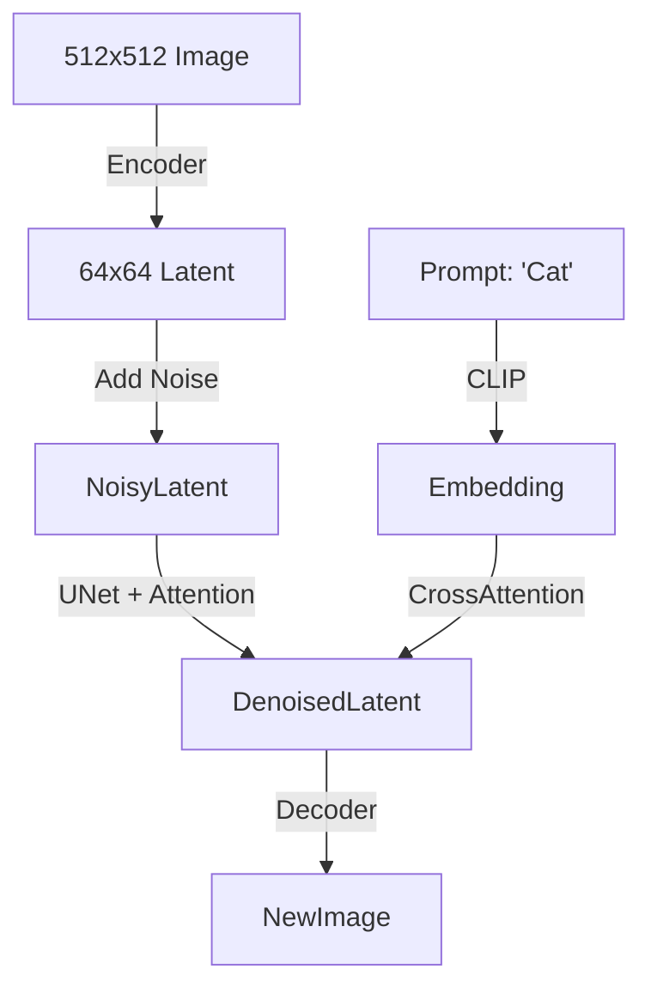
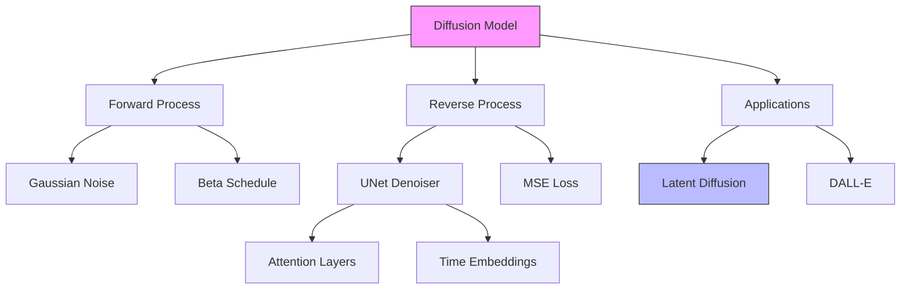

# GenAI Track: Modern Generative Models (Deep Dive)

## 📜 Story Mode: The Dream Weaver

> **Mission Date**: 2043.11.01
> **Location**: Art Synthesis Lab
> **Officer**: Lead Architect Neo
>
> **The Problem**: We need to generate training data for the Mars Rover. 
> GANs are fast but suffer from "Mode Collapse" (They only draw 3 types of rocks).
> We need a model that captures the *entire distribution* of reality.
>
> **The Solution**: **Diffusion Models**.
> We will destroy the data with noise, then train a neural network to repair it.
> Like reversing entropy.
>
> *"Computer. Set Noise Schedule to Cosine. Start Denoising Process."*

---

## 1. Problem Setup & Motivation

### The 6 Engineering Questions
1.  **WHAT**: A probabilistic model that generates data by reversing a noise process.
2.  **WHY**: Superior Mode Coverage vs GANs. Stable training (No adversarial minimax game).
3.  **WHEN**: High-fidelity image/audio generation where diversity matters.
4.  **WHERE**: Stable Diffusion, DALL-E 3, Sora.
5.  **WHO**: Ho et al. (DDPM), Song et al. (Score-Based Models).
6.  **HOW**: $x_T \to x_{T-1} \dots \to x_0$.

---

## 2. Mathematical Deep Dive: The Physics of Diffusion

### 2.1 The Forward Process (Destruction)
We add Gaussian noise over $T$ steps (Markov Chain).
$$ q(x_t | x_{t-1}) = \mathcal{N}(x_t; \sqrt{1 - \beta_t} x_{t-1}, \beta_t I) $$
Key Trick: We can jump directly to step $t$ without looping:
$$ q(x_t | x_0) = \mathcal{N}(x_t; \sqrt{\bar{\alpha}_t} x_0, (1 - \bar{\alpha}_t) I) $$
where $\alpha_t = 1 - \beta_t$ and $\bar{\alpha}_t = \prod \alpha_s$.

### 2.2 The Reverse Process (Creation)
We want $p_\theta(x_{t-1} | x_t)$. This is hard.
We approximate it with a Neural Network $\mu_\theta(x_t, t)$.
Objective: Predict the noise $\epsilon$ added at step $t$.
$$ L_{simple} = \mathbb{E}_{t, x_0, \epsilon} [ || \epsilon - \epsilon_\theta(\sqrt{\bar{\alpha}_t}x_0 + \sqrt{1 - \bar{\alpha}_t}\epsilon, t) ||^2 ] $$
**Intuition**: The network learns to say "That pixel looks too snowy, let me darken it".
>
> ### Visual Flow: Forward vs Reverse
>
> ```mermaid
> graph LR
>     subgraph Forward Process (Destruction - q)
>     x0[Clean Image] -- "+ Noise (t=1)" --> x1[Slightly Noisy]
>     x1 -- "+ Noise (t=...)" --> xt[Noisy Step t]
>     xt -- "+ Noise (t=T)" --> xT[Pure Gaussian Static]
>     end
>
>     subgraph Reverse Process (Creation - p)
>     xT -- "- Pred Noise (UNet)" --> xt_rev[Step t-1]
>     xt_rev -- "- Pred Noise" --> x1_rev[Near Clean]
>     x1_rev -- "- Pred Noise" --> x0_gen[Generated Image]
>     end
>     
>     style Forward Process fill:#ffebee
>     style Reverse Process fill:#e8f5e9
> ```

---

## 3. The Ship's Code (Polyglot: PyTorch Implementation)

```python
import torch
import torch.nn as nn
import torch.nn.functional as F

# LEVEL 2: The UNet Denoiser (Simplified)
class SimpleUNet(nn.Module):
    def __init__(self):
        super().__init__()
        # Time Embedding (Sinusoidal)
        self.time_mlp = nn.Sequential(
            nn.Linear(1, 32),
            nn.SiLU(),
            nn.Linear(32, 32)
        )
        # Downsample
        self.down1 = nn.Conv2d(3, 32, 3, padding=1)
        self.down2 = nn.Conv2d(32, 64, 3, padding=1)
        # Upsample
        self.up1 = nn.ConvTranspose2d(64, 32, 2, stride=2)
        self.up2 = nn.Conv2d(64, 3, 3, padding=1)

    def forward(self, x, t):
        # Embed Time
        t = t.view(-1, 1).float()
        t_emb = self.time_mlp(t)
        t_emb = t_emb.unsqueeze(-1).unsqueeze(-1)
        
        # Down
        x1 = F.relu(self.down1(x) + t_emb)
        x2 = F.relu(self.down2(x1))
        
        # Up (With Skip Connection)
        x_up = F.relu(self.up1(x2))
        return self.up2(x_up + x1) # Skip x1

# LEVEL 2: The Training Loop (DDPM)
def train_step(model, x0, optimizer, n_steps=1000):
    # 1. Sample t uniformly
    t = torch.randint(0, n_steps, (x0.shape[0],)).to(x0.device)
    
    # 2. Generate Noise
    epsilon = torch.randn_like(x0)
    
    # 3. Create Noisy Image (Forward Process)
    # Note: alphas_cumprod is derived from schedule
    sqrt_alpha_bar = torch.sqrt(alphas_cumprod[t])[:, None, None, None]
    sqrt_one_minus_alpha_bar = torch.sqrt(1 - alphas_cumprod[t])[:, None, None, None]
    
    x_t = sqrt_alpha_bar * x0 + sqrt_one_minus_alpha_bar * epsilon
    
    # 4. Predict Noise
    pred_epsilon = model(x_t, t)
    
    # 5. Loss
    loss = F.mse_loss(pred_epsilon, epsilon)
    loss.backward()
    optimizer.step()
```

> [!TIP]
> **👁️ Visualizing the Noise Schedule (Beta Schedule)**
> Run this to see how we destroy the image. Linear schedule is aggressive. Cosine is gentle.
>
> ```python
> import numpy as np
> import matplotlib.pyplot as plt
>
> def plot_noise_schedules():
>     steps = 1000
>     t = np.linspace(0, 1, steps)
>     
>     # 1. Linear Schedule (Original DDPM)
>     # beta starts at 0.0001, ends at 0.02
>     beta_linear = np.linspace(0.0001, 0.02, steps)
>     alpha_linear = 1 - beta_linear
>     alpha_bar_linear = np.cumprod(alpha_linear)
>     
>     # 2. Cosine Schedule (Improved)
>     # s = 0.008. alpha_bar = f(t) / f(0)
>     s = 0.008
>     f = np.cos(((t + s) / (1 + s)) * np.pi / 2) ** 2
>     alpha_bar_cosine = f / f[0]
>     
>     # Plot Signal Retention (alpha_bar)
>     plt.figure(figsize=(10, 5))
>     plt.plot(t, alpha_bar_linear, label='Linear Schedule (Destroys fast)', color='red', linestyle='--')
>     plt.plot(t, alpha_bar_cosine, label='Cosine Schedule (Preserves info)', color='blue')
>     plt.xlabel('Time Step (t)')
>     plt.ylabel('Signal Remaining (Alpha Bar)')
>     plt.title('The Rate of Destruction: How fast does the image turn to static?')
>     plt.legend()
>     plt.grid(True)
>     plt.show()
>
> # Uncomment to run:
> # plot_noise_schedules()
> ```

---

## 4. System Architecture: Latent Diffusion (Stable Diffusion)



**Why Latent Space?**
*   Pixel Space: $512 \times 512 \times 3 = 786,432$ dims.
*   Latent Space: $64 \times 64 \times 4 = 16,384$ dims.
*   **Speedup**: 50x faster training and inference.

---

## 13. Industry Interview Corner

### ❓ Real World Questions

**Q1: "Explain Classifier-Free Guidance (CFG)."**
*   **Answer**: "CFG is a trick to make the image match the text prompt stronger. We run the model twice: once with text ($\epsilon_{cond}$) and once empty ($\epsilon_{uncond}$).
    $\epsilon_{final} = \epsilon_{uncond} + w (\epsilon_{cond} - \epsilon_{uncond})$.
    If $w > 1$, we force the image away from 'generic' features towards 'text-specific' features. Too high $w$ burns the image."

**Q2: "What is the difference between DDPM and DDIM?"**
*   **Answer**: "DDPM is a Markov Chain (step $t$ depends on $t+1$). It requires 1000 steps to sample. **DDIM** (Denoising Diffusion Implicit Models) reformulates the ODE to be non-Markovian, allowing us to skip steps (e.g., 50 steps instead of 1000) with minimal quality loss."

---

## 14. Debug Your Thinking (Misconceptions)

> [!WARNING]
> **"Diffusion memorizes the training data."**
> *   **Correction**: It memorizes the *distribution*. A 2GB model cannot store 5 Billion images (LAION-5B). It learns the "Physics of how pixels relate", not the pixels themselves.

> [!WARNING]
> **"More steps = Better Image."**
> *   **Correction**: Diminishing returns. After 50-100 steps (with DDIM/DPMSolver), quality plateaus. 1000 steps is usually a waste of compute for inference.

### Concept Map

