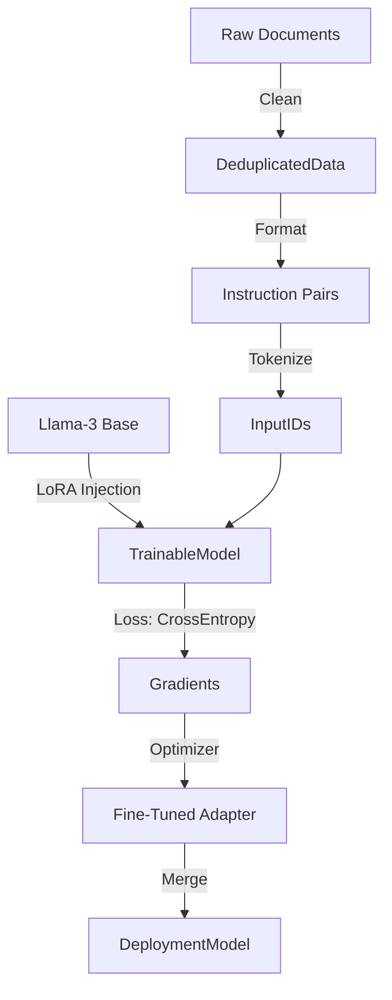

# GenAI Track: LLM Architecture & Engineering (Deep Dive)

## 📜 Story Mode: The Librarian

> **Mission Date**: 2043.11.08
> **Location**: The Great Archives
> **Officer**: Knowledge Engineer Lyra
>
> **The Problem**: We have 10 Petabytes of manuals.
> A keyword search returns 50,000 documents.
> We need a system that *reads* everything and understands the context.
> But standard Transformers decode too slowly.
>
> **The Solution**: **LLM Engineering**.
> FlashAttention for speed. LoRA for specialization.
> We will build a brain, not just a database.
>
> *"Computer. Mount the Llama-3 Checkpoint. Quantize to 4-bit. Begin Fine-Tuning."*

---

## 1. Problem Setup & Motivation

### The 6 Engineering Questions
1.  **WHAT**: Training, Fine-Tuning, and Serving Large Language Models.
2.  **WHY**: Base models are generalists. Enterprise needs specialists (Medical, Legal, Code).
3.  **WHEN**: You have specific data format or knowledge that RAG cannot solve.
4.  **WHERE**: `HuggingFace Transformers`, `Unsloth`, `vLLM`.
5.  **WHO**: Tri Dao (FlashAttention), Tim Dettmers (BitsAndBytes).
6.  **HOW**: Pre-training (Next Token Prediction) $\to$ SFT (Instruction Tuning) $\to$ RLHF (Alignment).

---

## 2. Mathematical Deep Dive: Efficiency

### 2.1 Rotary Positional Embeddings (RoPE)
Absolute Positional Embeddings ($x+p$) fail to extrapolate to longer lengths.
**RoPE** rotates the query/key vectors in 2D planes:
$$ \begin{pmatrix} q_0 \\ q_1 \end{pmatrix} \to \begin{pmatrix} \cos m\theta & -\sin m\theta \\ \sin m\theta & \cos m\theta \end{pmatrix} \begin{pmatrix} q_0 \\ q_1 \end{pmatrix} $$
*   Relies only on relative distance $(m-n)$.
*   Decays naturally with distance.
*   Enables Llama-3 to scale to 128k context.

### 2.2 FlashAttention (IO Awareness)
Standard Attention: $S = QK^T$, $P = \text{softmax}(S)$, $O = PV$.
Problem: $S$ and $P$ are $N \times N$ matrices. For $N=100k$, this explodes VRAM.
**FlashAttention**:
*   Tiling: Slice $Q, K, V$ into blocks that fit in GPU SRAM (L1 Cache).
*   Recompute: Don't store $S$. Recompute it during backward pass.
*   **Result**: $O(N)$ memory instead of $O(N^2)$. Wall-clock speedup $3-5\times$.

---

## 3. The Ship's Code (Polyglot: Unsloth Training)

```python
from unsloth import FastLanguageModel
import torch
from trl import SFTTrainer
from transformers import TrainingArguments

# LEVEL 2: Production Fine-Tuning (SFT)
def train_llama():
    # 1. Load Model (4-bit Quantized for memory)
    model, tokenizer = FastLanguageModel.from_pretrained(
        model_name = "unsloth/llama-3-8b-bnb-4bit",
        max_seq_length = 2048,
        dtype = None,
        load_in_4bit = True,
    )
    
    # 2. Add LoRA Adapters
    model = FastLanguageModel.get_peft_model(
        model,
        r = 16, # Rank
        target_modules = ["q_proj", "k_proj", "v_proj", "o_proj"],
        lora_alpha = 16,
        lora_dropout = 0,
        use_gradient_checkpointing = True,
    )
    
    # 3. Format Data (Alpaca Style)
    prompt_style = """### Instruction:
    {}
    ### Input:
    {}
    ### Response:
    {}"""
    
    # 4. Trainer
    trainer = SFTTrainer(
        model = model,
        train_dataset = dataset,
        dataset_text_field = "text",
        max_seq_length = 2048,
        args = TrainingArguments(
            per_device_train_batch_size = 2,
            gradient_accumulation_steps = 4,
            max_steps = 100,
            learning_rate = 2e-4,
            fp16 = not torch.cuda.is_bf16_supported(),
            bf16 = torch.cuda.is_bf16_supported(),
            optim = "adamw_8bit",
        ),
    )
    trainer.train()
```

---

## 4. System Architecture: Instruction Tuning Pipeline



---

## 13. Industry Interview Corner

### ❓ Real World Questions

**Q1: "Why do we use Grouped-Query Attention (GQA) in Llama-2/3?"**
*   **Answer**: "Multi-Head Attention (MHA) is slow at decoding because loading Keys/Values is memory bandwidth bound. Multi-Query Attention (MQA) shares 1 KV head for all Query heads, which is fast but hurts quality. **GQA** is the middle ground: Share KV heads among *groups* of Queries (e.g., 8 groups). Best trade-off."

**Q2: "Explain the Chinchilla Scaling Law."**
*   **Answer**: "DeepMind found that most models were undertrained. The optimal compute allocation is to scale Parameters and Data equally. For every doubling of model size, double the training tokens. Rule of thumb: **20 Tokens per Parameter**. (7B model needs 140B tokens)."

---

## 14. Debug Your Thinking (Misconceptions)

> [!WARNING]
> **"Fine-Tuning is for Knowledge."**
> *   **Correction**: FT is for **Format** and **Style** (e.g., speaking JSON, or speaking like a Pirate). It is inefficient for new Facts (use RAG).
