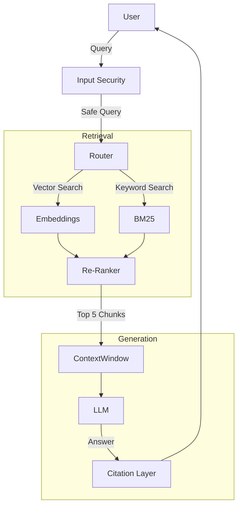

# GenAI Track: Capstone - Enterprise RAG (Deep Dive)

## 📜 Story Mode: The Oracle

> **Mission Date**: 2043.12.01
> **Location**: Headquarters
> **Officer**: Chief Strategy Officer
>
> **The Goal**: A "Corporate Oracle".
> A system that knows every email, every document, every slack message in the company's history.
> And answers questions instantly, citing sources.
>
> **The Challenge**: Hallucinations. High Latency. Security (Interns shouldn't see CEO salaries).
>
> **The Build**: **The Enterprise RAG Platform**.

---

## 1. Project Requirements

### 1.1 Core Specs
*   **Input**: PDF/Docx/HTML Ingestion pipeline.
*   **Storage**: Vector DB (Pinecone/Weaviate) + Metadata.
*   **Retrieval**: Hybrid Search (Dense + Sparse).
*   **Generation**: Llama-3-70B (Hosted via vLLM).
*   **Factuality**: RAGAS Evaluation Score > 0.9.

### 1.2 The Dataset
*   **Source**: [Financial Reports (10-K)](https://sec.gov).
*   **Size**: 1000 documents.
*   **Challenge**: Tables and Charts (Multimodal RAG).

---

## 2. Architecture: Advanced RAG



### 2.1 Key Components
*   **Chunking Strategy**: RecursiveCharacterTextSplitter (`chunk_size=512`, `overlap=50`).
*   **Embedding Model**: `text-embedding-3-small` or `bge-m3`.
*   **Re-Ranker**: `bge-reranker-v2-m3`. Critical for boosting precision.

---

## 3. The Code: RAG Inference Pipeline

```python
from langchain.vectorstores import Pinecone
from langchain.retrievers import ContextualCompressionRetriever
from langchain.retrievers.document_compressors import CohereRerank

def enterprise_rag(query):
    # 1. Hybrid Search (Vector + Keywowrd)
    # Assume index is configured for hybrid
    initial_docs = vectorstore.similarity_search(query, k=25)
    
    # 2. Re-Ranking (The Filter)
    compressor = CohereRerank(top_n=5)
    compression_retriever = ContextualCompressionRetriever(
        base_compressor=compressor, base_retriever=vectorstore
    )
    ranked_docs = compression_retriever.get_relevant_documents(query)
    
    # 3. Context Construction
    context = "\n".join([d.page_content for d in ranked_docs])
    
    # 4. Prompt Engineering (Chain of Verifiable Thought)
    prompt = f"""
    Answer the user query using ONLY the context below. 
    Cite the [Source ID] for every sentence.
    
    Context:
    {context}
    
    Query: {query}
    """
    
    return llm.invoke(prompt)
```

---

## 4. Evaluation Strategy (RAGAS)

We cannot just "eyeball" the answers. We need Metrics.
Using **RAGAS** (RAG Assessment):

1.  **Faithfulness**: Is the answer derived *only* from context? (LLM Judge checks Answer vs Context).
2.  **Answer Relevance**: Does the answer address the query? (LLM Judge checks Answer vs Query).
3.  **Context Precision**: Did the search find the needle? (Calculated on Golden Dataset).

| Metric | Target | Fail Condition |
| :--- | :--- | :--- |
| Faithfulness | > 0.9 | Hallucination Detected |
| Latency | < 3s | System too slow |
| Context Recall | > 0.8 | Missing information |

---

## 5. Deployment & Security

*   **API**: FastAPI server with async endpoints.
*   **RBAC (Role-Based Access Control)**:
    *   Metadata filtering in Vector DB: `filter={"access_level": "public"}`.
    *   This ensures User A never retrieves User B's private docs.
