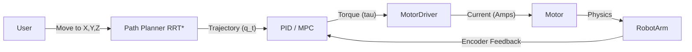

# Robotics Track: Kinematics, Dynamics & Control (Deep Dive)

## 📜 Story Mode: The Puppeteer

> **Mission Date**: 2043.11.12
> **Location**: Fabrication Bay 7
> **Officer**: Mecha-Engineer Titan
>
> **The Problem**: The robotic arm needs to weld a seam with sub-millimeter precision.
> But welding causes heat expansion. And the arm weighs 500kg.
> Gravity and Inertia are fighting us.
>
> **The Solution**: **Control Theory**.
> We calculate the Inverse Kinematics to find the angles.
> We calculate the Dynamics to find the torques.
> We apply a PID loop to correct the errors.
>
> *"Computer. Solve Jacobian. Compensate for Gravity. Engage Servos."*

---

## 1. Problem Setup & Motivation

### The 6 Engineering Questions
1.  **WHAT**: The math of *moving* machines accurately.
2.  **WHY**: Without math, robots are just flailing metal. Safety & Precision require it.
3.  **WHEN**: Whenever you have a multi-jointed system (Arm, Leg, Drone).
4.  **WHERE**: `Pinocchio` (Dynamics), `MoveIt` (Planning), `ROS 2 Control`.
5.  **WHO**: Denavit & Hartenberg (DH Parameters), Russ Tedrake (Underactuated Robotics).
6.  **HOW**: $F=ma$ (Newton) $\to$ $\tau = M(q)\ddot{q} + C\dot{q} + G$ (Lagrangian).

---

## 2. Mathematical Deep Dive: The Equations of Motion

### 2.1 Forward Kinematics (DH Parameters)
Chain of Homogeneous Transformations:
$$ T_{base}^{end} = A_1 A_2 \dots A_n $$
Each joint $A_i$ is a rotation and translation matrix.
Result: Where is the hand relative to the base? ($x, y, z, roll, pitch, yaw$).

### 2.2 Numerical Inverse Kinematics (IK)
Given target $x_{des}$, find joint angles $q$.
Iterative Update (Newton-Raphson):
$$ q_{k+1} = q_k + J^\dagger(q_k) (x_{des} - FK(q_k)) $$
*   $J(q)$: Jacobian (Rate of change of $x$ w.r.t $q$).
*   $J^\dagger$: Pseudoinverse (Damped Least Squares to avoid singularities).

### 2.3 Dynamics (Lagrangian)
How much Torque ($\tau$) do I need?
$$ \tau = M(q)\ddot{q} + C(q, \dot{q})\dot{q} + G(q) $$
*   **M(q)**: Mass Matrix (Inertia). "It's heavy to start moving".
*   **C(q, q_dot)**: Coriolis/Centrifugal. "It pulls out when spinning".
*   **G(q)**: Gravity. "It falls down".
*   This is the **Inverse Dynamics** problem (Computed Torque Control).

---

## 3. The Ship's Code (Polyglot: PID Control)

```python
import numpy as np

# LEVEL 2: Joint Space Controller
class JointController:
    def __init__(self, kp, kd, ki, dt):
        self.kp = kp # Stiffness
        self.kd = kd # Damping
        self.ki = ki # Gravity/Steady-state Error
        self.dt = dt
        self.integral_err = 0
        self.prev_err = 0

    def compute_torque(self, q_target, q_current, dq_current):
        # 1. Error Calc
        error = q_target - q_current
        
        # 2. Derivative (Target velocity assumed 0)
        d_error = (0 - dq_current) 
        
        # 3. Integral
        self.integral_err += error * self.dt
        
        # 4. PID Law
        torque = (self.kp * error) + (self.kd * d_error) + (self.ki * self.integral_err)
        
        return torque

# Simulation Loop
def control_loop(robot, target_angles):
    controller = JointController(kp=100, kd=10, ki=1, dt=0.001)
    
    for _ in range(1000):
        q, dq = robot.get_state()
        tau = controller.compute_torque(target_angles, q, dq)
        robot.apply_torque(tau)
        robot.step()
```

---

## 4. System Architecture: The Control Loop



---

## 13. Industry Interview Corner

### ❓ Real World Questions

**Q1: "What is a Singularity in Robotics?"**
*   **Answer**: "A configuration where the Jacobian loses rank (Determinant=0). The arm loses a degree of freedom (e.g., straight arm cannot move 'out' anymore). Velocities go to infinity in the math ($1/0$). We avoid this with **Manipulability Ellipsoids** or Damped Least Squares."

**Q2: "Why do we need Gravity Compensation?"**
*   **Answer**: "Even when stopped, a robot arm needs torque to hold itself up. If we rely on simple PD control, the arm will sag (Steady State Error). We add a Feed-Forward Gravity term $G(q)$ to cancel weight perfectly, effectively making the robot feel weightless."

---

## 14. Debug Your Thinking (Misconceptions)

> [!WARNING]
> **"High Gain (Kp) makes it accurate."**
> *   **Correction**: High Kp makes it **Oscillate**. You need Damping (Kd) to stop the shaking. Tuning PID is an art (Ziegler-Nichols method).

> [!WARNING]
> **"Simulation matches Reality."**
> *   **Correction**: **The Reality Gap**. Friction is impossible to model perfectly. Cable drag? Gear backlash? Real controllers need **Integrators** (I-term) or **Adaptive Control** to handle unmodeled physics.
