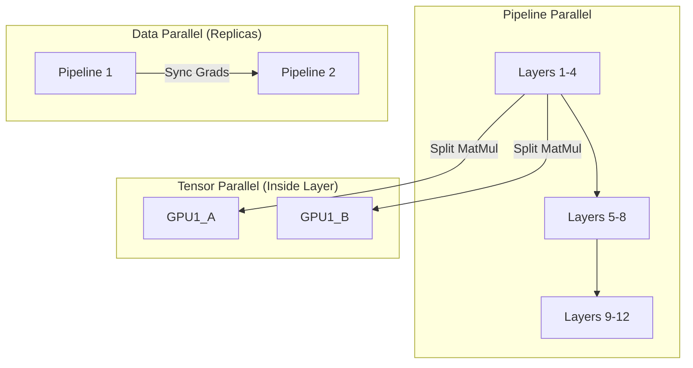

# MLOps Track: Scalable Infrastructure (Deep Dive)

## 📜 Story Mode: The Architect

> **Mission Date**: 2043.11.03
> **Location**: Server Cluster "Titan"
> **Officer**: SysAdmin Prime
>
> **The Problem**: The new model "GPT-5000" has 1 Trillion Parameters.
> It requires 4 Terabytes of VRAM.
> The largest GPU on Earth has 80 GB.
>
> **The Solution**: **Distributed Parallelism**.
> We will slice the brain.
> Layers 1-10 on GPU 1. Layers 11-20 on GPU 2.
> We will synchronize the thoughts.
>
> *"Computer. Initialize Megatron-DeepSpeed. Partition Strategy: 3D Parallelism."*

---

## 1. Problem Setup & Motivation

### The 6 Engineering Questions
1.  **WHAT**: Training models that exceed the memory/compute of a single device.
2.  **WHY**: LLMs are huge. Training takes months on single GPU (or impossible).
3.  **WHEN**: Model > 1B parameters or Dataset > 1TB.
4.  **WHERE**: `Ray Train`, `PyTorch DDP`, `DeepSpeed`, `Horovod`.
5.  **WHO**: Microsoft (DeepSpeed), NVIDIA (Megatron), Anyscale (Ray).
6.  **HOW**: Split Data (DDP) OR Split Model (Pipeline/Tensor).

---

## 2. Mathematical Deep Dive: Communication Overhead

### 2.1 Ring All-Reduce
In DDP, every GPU computes gradients on its chunk of data. We need the **Average Gradient** across all GPUs.
Naive approach: Everyone sends to Master (Bottleneck).
**Ring All-Reduce**:
1.  GPU $i$ sends chunk to GPU $i+1$.
2.  Data flows in a ring.
3.  **Time Complexity**: $2(N-1) \frac{M}{N \cdot B}$.
    *   $N$: GPUs. $M$: Model Size. $B$: Bandwidth.
    *   Crucially, Time is *almost independent* of $N$. Scale efficient.

### 2.2 Memory Consumption (ZeRO optimizer)
Standard Training Memory = Weights ($W$) + Gradients ($G$) + Optimizer States ($O$).
For Adam: $O$ is $2 \times W$ (Momentum + Variance).
Total $\approx 16 \times$ Parameters.
**ZeRO-3 (Zero Redundancy Optimizer)**:
Shard $W, G, O$ across all GPUs. Fetch them only when needed for calculation.
Allows linear scaling of model size with GPUs.

---

## 3. The Ship's Code (Polyglot: Ray & PyTorch DDP)

```python
import torch
import torch.nn as nn
from torch.nn.parallel import DistributedDataParallel as DDP
import ray
from ray.train import ScalingConfig, Checkpoint, report
from ray.train.torch import TorchTrainer

# LEVEL 2: Distributed Training Loop (Ray)
def train_func(config):
    # 1. Setup Process Group (NCCL Backend)
    ray.train.torch.accelerate()
    
    # 2. Model & DDP Wrap
    model = nn.Linear(10, 1)
    model = ray.train.torch.prepare_model(model)
    
    # 3. Data Sharding
    dataset = ray.train.get_dataset_shard("train")
    
    criterion = nn.MSELoss()
    optimizer = torch.optim.Adam(model.parameters(), lr=0.01)
    
    for epoch in range(config["epochs"]):
        for batch in dataset.iter_torch_batches(batch_size=32):
            optimizer.zero_grad()
            output = model(batch["x"])
            loss = criterion(output, batch["y"])
            loss.backward()
            optimizer.step()
            
        # Report metrics to Master
        report({"loss": loss.item()})

# The Orchestrator
def main():
    trainer = TorchTrainer(
        train_loop_per_worker=train_func,
        scaling_config=ScalingConfig(num_workers=4, use_gpu=True),
        datasets={"train": my_ray_dataset}
    )
    result = trainer.fit()
```

---

## 4. System Architecture: 3D Parallelism



**The Holy Trinity**:
1.  **Data Parallel**: For Speed.
2.  **Pipeline Parallel**: For Depth (Memory).
3.  **Tensor Parallel**: For Width (Huge Matrices).

---

## 13. Industry Interview Corner

### ❓ Real World Questions

**Q1: "When should I use Parameter Server vs Ring All-Reduce?"**
*   **Answer**: "Parameter Server is old school (central bottleneck). Good for sparse models (Recommenders) where updates are tiny. **Ring All-Reduce** (NCCL) is standard for Dense models (LLMs/CV) because it utilizes full bandwidth of all nodes symmetrically."

**Q2: "What is Gradient Accumulation?"**
*   **Answer**: "If you can't fit Batch Size 32 in memory, you run Batch Size 8 four times, accumulating gradients `loss.backward()` without `optimizer.step()`. Then step once. Simulates BS 32. Trade-off: Compute time increases (no parallel overlap)."

---

## 14. Debug Your Thinking (Misconceptions)

> [!WARNING]
> **"More GPUs = Linear Speedup."**
> *   **Correction**: Communication Overhead. If the network (InfiniBand/Ethernet) is slow, GPUs spend 50% time waiting for data. Amdahl's Law applies. 

> [!WARNING]
> **"Batch Size should be as large as possible."**
> *   **Correction**: Too large batch size hurts **Generalization** (converges to sharp minima). There is an optimal scaling law (Linear Scaling Rule: $\text{LR} \propto \text{BatchSize}$).
