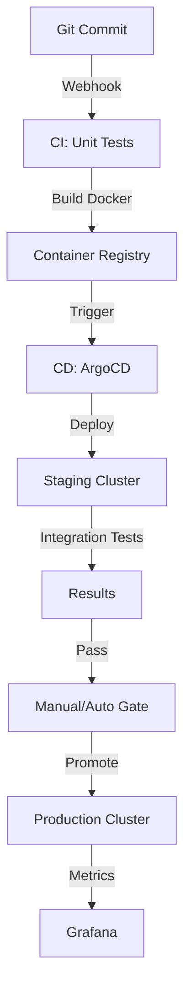

# MLOps Track: ML Platform Engineering (Deep Dive)

## 📜 Story Mode: The Factory Manager

> **Mission Date**: 2043.11.08
> **Location**: Cloud Ops Center
> **Officer**: Platform Engineer
>
> **The Problem**: Data Scientists are emailing Jupyter Notebooks to Engineers.
> Models crack in production because "The Data changed".
> Retraining takes 3 weeks of manual copy-pasting.
>
> **The Solution**: **The ML Platform**.
> Feature Store for data consistency.
> Model Registry for version control.
> Pipelines for automation.
>
> *"Computer. Trigger Airflow DAG 'Retrain-Churn-v2'. Promote to Staging if Accuracy > 90%."*

---

## 1. Problem Setup & Motivation

### The 6 Engineering Questions
1.  **WHAT**: Tooling to automate the lifecycle of ML (Data $\to$ Train $\to$ Deploy $\to$ Monitor).
2.  **WHY**: Reproducibility and Velocity. Reduce "Time-to-Market" from Months to Hours.
3.  **WHEN**: You have >1 Model or >1 Data Scientist.
4.  **WHERE**: `Feast`, `MLflow`, `Kubeflow`, `Airflow`.
5.  **WHO**: Airbnb (Bighead), Uber (Michelangelo), Netflix (Metaflow).
6.  **HOW**: IaC (Terraform) $\to$ CI/CD $\to$ Serving.

---

## 2. Mathematical Deep Dive: Skew & Drift

### 2.1 Training-Serving Skew
The logic used to compute a feature in experimentation differs from production.
*   **Training**: `pandas.rolling_mean` (Batch).
*   **Serving**: `stream_window_agg` (Java/C++).
*   **Solution**: **Feature Store**. Define logic *once*, compute consistency for both Offline (Parquet) and Online (Redis).

### 2.2 Concept Drift (Detecting Change)
Detecting if $P(Y|X)$ changed.
**KL Divergence**:
$$ D_{KL}(P || Q) = \sum P(x) \log \frac{P(x)}{Q(x)} $$
If $D_{KL} > \text{threshold}$, the data distribution has shifted significantly. Trigger Retraining.

---

## 3. The Ship's Code (Polyglot: Feature Store)

```python
from feast import Entity, FeatureView, Field, FileSource
from feast.types import Float32, Int64
from datetime import timedelta

# LEVEL 2: Defining a Feature Store
# 1. Define Entity (Primary Key)
driver = Entity(name="driver", join_keys=["driver_id"])

# 2. Define Source (Offline Parquet)
driver_stats_source = FileSource(
    path="data/driver_stats.parquet",
    timestamp_field="event_timestamp",
)

# 3. Define Features
driver_hourly_stats_view = FeatureView(
    name="driver_hourly_stats",
    entities=[driver],
    ttl=timedelta(days=1),
    schema=[
        Field(name="conv_rate", dtype=Float32),
        Field(name="acc_rate", dtype=Float32),
        Field(name="avg_daily_trips", dtype=Int64),
    ],
    online=True, # Enable Redis Sync
    source=driver_stats_source,
)

# Usage in Prod
# feature_vector = store.get_online_features(
#    features=["driver_hourly_stats:conv_rate"],
#    entity_rows=[{"driver_id": 1001}]
# )
```

---

## 4. System Architecture: The CI/CD Pipeline



---

## 13. Industry Interview Corner

### ❓ Real World Questions

**Q1: "What is a Feature Store vs a Data Warehouse?"**
*   **Answer**: "Data Warehouse (Snowflake) is for Analytics/BI (high latency SQL). Feature Store (Feast) is for Operational ML (millisecond latency lookup). Feature Store *syncs* data from Warehouse to a KV-store (Redis) for real-time inference."

**Q2: "How do you handle schema evolution in ML?"**
*   **Answer**: "Rigorous versioning. If input features change (e.g., 'age' becomes 'age_group'), it breaks the model. We use **Protobuf/Avro** schemas in the Feature Store and enforce strict type checking in the API contracts (Pydantic)."

---

## 14. Debug Your Thinking (Misconceptions)

> [!WARNING]
> **"Deploying is the hard part."**
> *   **Correction**: **Monitoring** is the hard part. Models fail silently. They don't throw 500 Errors; they just give revenue-losing predictions. You need statistical monitoring, not just system monitoring.
