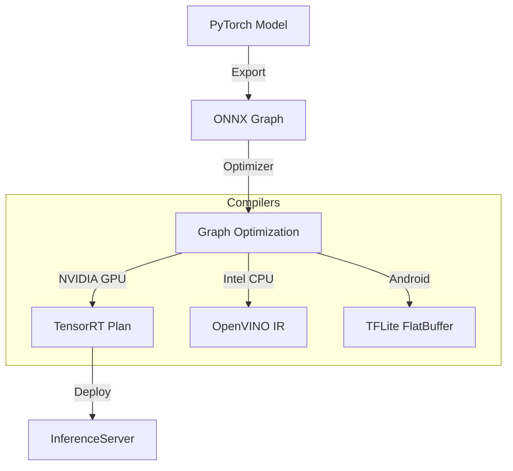

# MLOps Track: Edge AI & Optimization (Deep Dive)

## 📜 Story Mode: The Minimalist

> **Mission Date**: 2043.11.15
> **Location**: Orbital Drone Swarm
> **Officer**: Embedded Systems Lead
>
> **The Problem**: We have a Transformer model. It is 500MB.
> The drone has 2GB RAM and runs on battery.
> If we run full float32, the battery dies in 2 minutes.
>
> **The Solution**: **Optimization**.
> Quantize weights to INT8.
> Prune the zeros. 
> Compile for the Neural Engine.
>
> *"Computer. Run Post-Training Quantization. Calibrate on 100 samples. Flash to firmware."*

---

## 1. Problem Setup & Motivation

### The 6 Engineering Questions
1.  **WHAT**: Reducing Model Size and Latency while maintaining Accuracy.
2.  **WHY**: Mobile phones, IoT, and Browsers have limited Compute/Battery. Cost savings in Cloud.
3.  **WHEN**: Deploying to Edge Device OR High-Traffic cloud endpoints.
4.  **WHERE**: `ONNX Runtime`, `TensorRT`, `CoreML`, `TFLite`.
5.  **WHO**: Song Han (Deep Compression), NVIDIA (TensorRT Team).
6.  **HOW**: Quantization, Pruning, Distillation, Compilation.

---

## 2. Mathematical Deep Dive: Quantization

### 2.1 Affine Quantization (Asymmetric)
Maps real range $[min, max]$ to integer range $[0, 255]$ (uint8).
$$ Q(x) = \text{round}(\frac{x}{S} + Z) $$
$$ x \approx S(Q(x) - Z) $$
*   $S = \frac{max - min}{255}$ (Scale).
*   $Z = -\text{round}(\frac{min}{S})$ (Zero Point).
*   **Challenge**: Outliers (e.g., one weight is 100.0, rest are 0.1) stretch the scale $S$, destroying precision for small values.
*   **Fix**: Histogram calibration or Training (QAT).

### 2.2 Pruning
$$ W' = W \odot M $$
$M$ is a binary mask. If $|w| < \epsilon$, set $M=0$.
Sparse Matrix Multiplication is faster *if* hardware supports it (NVIDIA Ampere Sparse Tensor Cores).

---

## 3. The Ship's Code (Polyglot: ONNX Runtime)

```python
import onnx
from onnxruntime.quantization import quantize_dynamic, QuantType

# LEVEL 2: Dynamic Quantization
def optimize_model(model_path):
    # 1. Load ONNX Model
    input_model_path = "bert_model.onnx"
    output_model_path = "bert_model_int8.onnx"
    
    # 2. Quantize (Float32 -> Int8)
    # Dynamic: Quantize weights, but compute activations dynamically
    quantize_dynamic(
        input_model_path,
        output_model_path,
        weight_type=QuantType.QUInt8 # Unsigned Int 8
    )
    
    print(f"Optimized model saved to {output_model_path}")

# Run Inference
import onnxruntime as ort

def run_inference():
    sess_options = ort.SessionOptions()
    sess_options.graph_optimization_level = ort.GraphOptimizationLevel.ORT_ENABLE_ALL
    
    session = ort.InferenceSession("bert_model_int8.onnx", sess_options)
    # Run...
```

---

## 4. System Architecture: The Compilation Pipeline



**Key Optimizations**:
*   **Operator Fusion**: Combine `Conv2d + ReLU` into one kernel call.
*   **Constant Folding**: Pre-compute static graph branches.
*   **Precision Calibration**: Determine dynamic range of activations.

---

## 13. Industry Interview Corner

### ❓ Real World Questions

**Q1: "When should I use Post-Training Quantization (PTQ) vs Quantization Aware Training (QAT)?"**
*   **Answer**: "Always start with **PTQ** (Easy, fast). If accuracy drop > 2%, switch to **QAT** (Fine-tune with simulated quantization nodes). QAT recovers the accuracy loss but requires full training pipeline."

**Q2: "Why is INT8 faster?"**
*   **Answer**: "1. **Memory Bandwidth**: Fetching 8 bits vs 32 bits is $4\times$ faster (main bottleneck). 2. **Compute**: Modern CPUs/GPUs have dedicated INT8 arithmetic units (DP4a instructions) that can do $4\times$ (or more) ops per cycle compared to FP32."

---

## 14. Debug Your Thinking (Misconceptions)

> [!WARNING]
> **"16-bit Float (FP16) loses accuracy."**
> *   **Correction**: Rarely for Inference. Deep Learning is remarkably robust to noise. Mixed Precision (FP16) is the *standard* now. INT8 involves small loss. INT4 involves noticeable loss.

> [!WARNING]
> **"Optimized models run everywhere."**
> *   **Correction**: A TensorRT engine built for an RTX 3090 **will not run** on an RTX 4090. It is hardware-specific (compiled to assembly). Do not ship Engine files; ship ONNX and compile on first launch.
