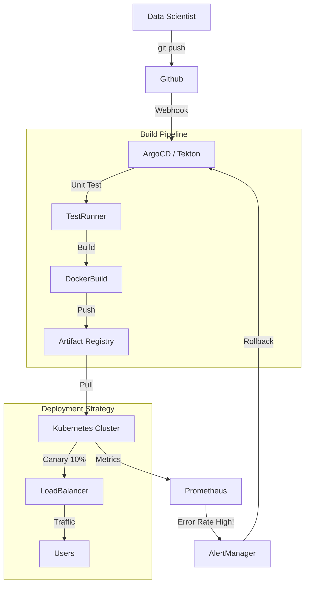

# MLOps Track: Capstone - The Enterprise Platform (Deep Dive)

## 📜 Story Mode: The CTO

> **Mission Date**: 2043.12.01
> **Location**: Corporate HQ
> **Officer**: Chief Technology Officer
>
> **The Goal**: "Self-Service AI".
> Any Engineer in the company should be able to train and deploy a model in 1 hour.
> Without emailing DevOps.
>
> **The Build**: **The Internal ML Platform (PaaS)**.

---

## 1. Project Requirements

### 1.1 Core Specs
*   **Interface**: CLI & Web UI for Engineers.
*   **Templates**: "Scikit-Learn Standard", "PyTorch GPU Distributed".
*   **Automation**: GitOps (Push code $\to$ Auto-Deploy).
*   **Observability**: Centralized Dashboard (Grafana).

### 1.2 The Tech Stack
*   **Orchestrator**: Kubernetes (EKS/GKE).
*   **Serving**: KServe or Ray Serve.
*   **Monitoring**: Prometheus + Grafana.
*   **Registry**: MLflow.

---

## 2. Architecture: End-to-End PaaS



### 2.1 The Golden Path
We define a "Golden Path" (standard opinionated way).
1.  **Cookiecutter Template**: Creates repo structure with `Dockerfile`, `train.py`, `service.yaml`.
2.  **Makefile**: `make train`, `make deploy`.
3.  **Governance**: Enforce tags (Owner, CostCenter).

---

## 3. The Code: Infrastructure as Code (Terraform)

```hcl
# LEVEL 2: Provisioning the ML Cluster
provider "aws" {
  region = "us-east-1"
}

# EKS Cluster
module "eks" {
  source          = "terraform-aws-modules/eks/aws"
  cluster_name    = "ml-platform-prod"
  cluster_version = "1.27"
  
  # Node Groups (GPU)
  eks_managed_node_groups = {
    gpu_nodes = {
      min_size     = 1
      max_size     = 10
      desired_size = 2
      
      instance_types = ["g5.xlarge"]
      ami_type       = "AL2_x86_64_GPU"
    }
  }
}

# Install Kube-Prometheus-Stack (Helm)
resource "helm_release" "prometheus" {
  name       = "prometheus"
  repository = "https://prometheus-community.github.io/helm-charts"
  chart      = "kube-prometheus-stack"
  namespace  = "monitoring"
  create_namespace = true
}
```

---

## 4. Evaluation Strategy (Platform KPIs)

How do we measure success of the Platform itself?

| Metric | Definition | Target |
| :--- | :--- | :--- |
| **Deployment Frequency** | How often models ship to prod. | > 5/day |
| **Change Failure Rate** | % of deployments causing rollback. | < 5% |
| **Mean Time to Recovery** | Time from failure to fix. | < 30 mins |
| **Lead Time** | Time from "Idea" to "Production". | < 1 day |

---

## 5. Deployment & Cost

*   **Cost Attribution**: Tagging every resource. "Team A spent $500 on GPUs".
*   **Spot Instances**: Use Spot nodes for Training (save 70%). Checkpoint often.
*   **Auto-Scaling**: Scale to Zero at night for Dev environments.
