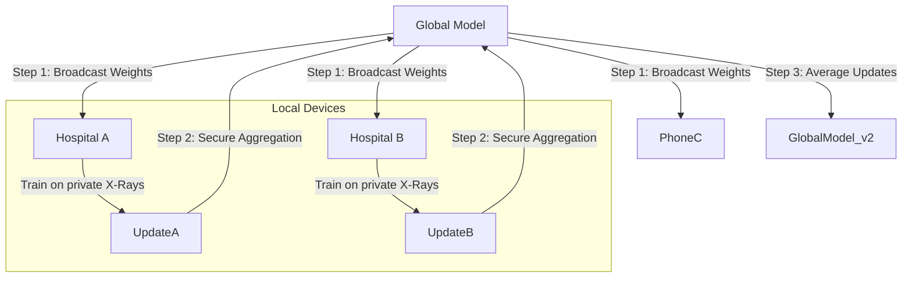

# ai_security_robustness: Adversarial Defense & Privacy (Deep Dive)

## 📜 Story Mode: The Shield

> **Mission Date**: 2043.11.20
> **Location**: Deep Space Outpost "Vector Prime"
> **Officer**: Security Chief Aegis
>
> **The Problem**: The enemy didn't hack our firewall. They hacked our *Model*.
> They painted a tiny sticker on their fighter jets.
> Our AI classified the jet as a "Toaster".
>
> **The Threat**: **Adversarial Attacks**.
> **The Leak**: **Model Inversion** (Stealing patient data from gradients).
>
> **The Solution**: **Robustness & Privacy**.
> Adversarial Training. Differential Privacy. Federated Learning.
>
> *"Computer! Run PGD Attack. Harden the weights. Inject epsilon noise."*

---

## 1. Problem Setup & Motivation

### The 6 Engineering Questions
1.  **WHAT**: Techniques to defend ML models against attacks and prevent data leakage.
2.  **WHY**: AI is brittle. A one-pixel change can crash a self-driving car.
3.  **WHEN**: Deploying public-facing or safety-critical AI (Finance, Health, Defense).
4.  **WHERE**: `AdverTorch`, `Opacus` (PyTorch Privacy), `CleverHans`.
5.  **WHO**: Ian Goodfellow (Adversarial Examples), Cynthia Dwork (Differential Privacy).
6.  **HOW**: $\min_\theta \max_\delta L(f(x+\delta), y)$ (Robust Optimization).

---

## 2. Mathematical Deep Dive: The Attack & The Defense

### 2.1 FGSM (Fast Gradient Sign Method)
The attacker wants to find a perturbation $\eta$ that *maximizes* loss.
$$ \eta = \epsilon \cdot \text{sign}(\nabla_x J(\theta, x, y)) $$
*   We take a step *up* the gradient of the loss with respect to the *input pixel*.

### 2.2 Differential Privacy (DP)
We want to guarantee that the output of the model is roughly the same whether *User X* is in the training set or not.
$$ P(M(D) \in S) \le e^\epsilon P(M(D') \in S) + \delta $$
*   **Mechanism**: Add Gaussian noise to the gradients during training.
*   **Privacy Budget ($\epsilon$)**: Lower is more private, but lower accuracy.

---

## 3. The Ship's Code (Polyglot: Attack & Defense)

```python
import torch
import torch.nn as nn
from opacus import PrivacyEngine

# LEVEL 2: Adversarial Attack (FGSM)
def fgsm_attack(image, epsilon, data_grad):
    # Create the perturbed image
    sign_data_grad = data_grad.sign()
    perturbed_image = image + epsilon * sign_data_grad
    return torch.clamp(perturbed_image, 0, 1)

# LEVEL 3: Privacy-Preserving Training (Opacus)
def train_private(model, optimizer, train_loader):
    privacy_engine = PrivacyEngine()
    
    # Wrap components to inject noise into gradients
    model, optimizer, train_loader = privacy_engine.make_private(
        module=model,
        optimizer=optimizer,
        data_loader=train_loader,
        noise_multiplier=1.1,
        max_grad_norm=1.0,
    )
    
    # Standard Loop
    for x, y in train_loader:
        optimizer.zero_grad()
        output = model(x)
        loss = criterion(output, y)
        loss.backward()
        optimizer.step()
```

---

## 4. System Architecture: Federated Learning (Secure Aggregation)

Instead of sending data to the server, we send the *Model* to the phone.



**Privacy Guarantee**: The Server never sees the X-Rays. It only sees the "Weight Updates" (which can be encrypted via Homomorphic Encryption).

---

## 13. Industry Interview Corner

### ❓ Real World Questions

**Q1: "Can I defend against all adversarial attacks?"**
*   **Answer**: "No. It is a cat-and-mouse game. PGD (Projected Gradient Descent) is stronger than FGSM. AutoAttack is stronger than PGD. The only theoretical guarantee is 'Lipschitz Continuity' or 'Randomized Smoothing', which limits how much the output can change for a small input change."

**Q2: "What is the cost of Differential Privacy?"**
*   **Answer**: "**Utility Drop**. Adding noise to gradients makes training harder. You usually lose 2-10% accuracy. You also need larger batch sizes (simulated) to make the noise average out. It is a business trade-off: Accuracy vs Privacy."

---

## 14. Debug Your Thinking (Misconceptions)

> [!WARNING]
> **"Encrypting the data (HTTPS) makes it private."**
> *   **Correction**: That protects data *in transit*. It does not protect against **Model Inversion**. If I can query your model and reconstruct a picture of 'Patient Zero', encryption didn't help. You need DP or FL.

> [!WARNING]
> **"Adversarial Attacks are just theoretical."**
> *   **Correction**: Researchers have fooled Tesla Autopilot with "Phantom Stop Signs" projected on the road. They have fooled Face ID with "Psychedelic Glasses". This is a real physical threat vector.
