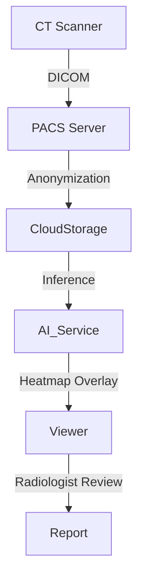

# specialized_applications: Healthcare, Finance & Science (Deep Dive)

## 📜 Story Mode: The Specialist

> **Mission Date**: 2043.12.10
> **Location**: Bio-Dome Beta
> **Officer**: Medical AI Lead
>
> **The Problem**: A generic "Image Classifier" thinks a tumor is a baseball.
> A generic "Forecasting Model" crashes the stock market.
> Domain nuances matter faster than Big Data.
>
> **The Solution**: **Specialized AI**.
> DICOM processing for X-Rays.
> Time-Series Momentum strategies for Finance.
> Graph Neural Networks for Molecule Discovery.
>
> *"Computer. Load the MIMIC-III dataset. Calibrate for Clinical Precision."*

---

## 1. Problem Setup & Motivation

### The 6 Engineering Questions
1.  **WHAT**: Applying AI to domains with specific constraints (Regulations, Data Formats, Risk Profiles).
2.  **WHY**: "Move fast and break things" doesn't work when "things" are human lives or GDP.
3.  **WHEN**: Medical Diagnosis, Algorithmic Trading, Drug Discovery.
4.  **WHERE**: `Monai` (Medical), `Zipline` (Finance), `DeepChem` (Science).
5.  **WHO**: Pranav Rajpurkar (Medical AI), Marcos Lopez de Prado (Financial ML).
6.  **HOW**: Custom Preprocessing $\to$ Domain Architecture $\to$ Rigorous Backtesting.

---

## 2. Domain Deep Dive A: Healthcare AI

### 2.1 Medical Imaging (DICOM)
*   **Data**: 3D Volumes (CT Scans). Hounsfield Units (HU) instead of RGB.
*   **Architecture**: 3D CNNs (V-Net, SegNet).
*   **Challenge**: Class Imbalance. 99% of pixels are healthy.
*   **Loss Function**: Dice Loss (Overlap based).
    $$ L_{dice} = 1 - \frac{2 \sum y_{true} y_{pred}}{\sum y_{true} + \sum y_{pred}} $$

## 3. Domain Deep Dive B: Financial AI

### 3.1 Algorithmic Trading
*   **Data**: Tick data (Limit Order Book). Non-stationary. Low Signal-to-Noise ratio.
*   **Architecture**: LSTM / Temporal Convolutional Networks (TCN).
*   **Challenge**: **Overfitting**. A model that memorizes 2008 will fail in 2024.
*   **Technique**: Purged K-Fold Cross Validation (Removing overlap between train/test windows).

---

## 4. The Ship's Code (Polyglot: Medical Segmentation)

```python
import torch
import torch.nn as nn
import monai
from monai.networks.nets import UNet
from monai.losses import DiceLoss

# LEVEL 2: 3D Medical Segmentation
def train_segmentation():
    # 1. Network (3D UNet)
    model = UNet(
        spatial_dims=3,
        in_channels=1,
        out_channels=2, # Background, Tumor
        channels=(16, 32, 64, 128, 256),
        strides=(2, 2, 2, 2),
    )
    
    # 2. Loss (Soft Dice)
    loss_function = DiceLoss(to_onehot_y=True, softmax=True)
    optimizer = torch.optim.Adam(model.parameters(), 1e-4)
    
    # 3. Training Loop
    for batch_data in train_loader:
        inputs, labels = batch_data["image"], batch_data["label"]
        optimizer.zero_grad()
        outputs = model(inputs)
        loss = loss_function(outputs, labels)
        loss.backward()
        optimizer.step()
```

---

## 5. System Architecture: The Clinical Pipeline



---

## 13. Industry Interview Corner

### ❓ Real World Questions

**Q1: "Why is 'Accuracy' a bad metric for Fraud Detection?"**
*   **Answer**: "Fraud is rare (0.1%). A model that predicts 'No Fraud' every time has 99.9% accuracy. We need **Precision** (Don't block legit cards) and **Recall** (Catch the thieves). Use F1-Score or AUC-PR."

**Q2: "What is Backtesting Overfitting?"**
*   **Answer**: "Running 1000 strategies on historical data and picking the best one. The best one is likely just lucky on that specific history. Solution: **Deflated Sharpe Ratio** (Adjusting for the number of trials)."

---

## 14. Debug Your Thinking (Misconceptions)

> [!WARNING]
> **"More data is always better in Finance."**
> *   **Correction**: Old financial data (1980s) is structurally different (No High Frequency Trading). Training on it introduces regime bias. Sometimes **Recent Data > Big Data**.

> [!WARNING]
> **"Medical AI replaces Doctors."**
> *   **Correction**: "AI will not replace Radiologists. Radiologists who use AI will replace those who don't." It is a **Triage Tool**, not a Decision Maker.
