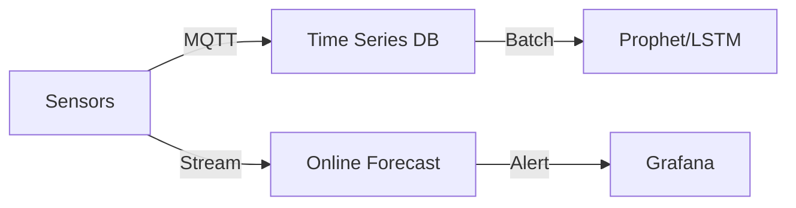

# Specialization: Time Series Forecasting (The Oracle)

## 📜 Story Mode: The Oracle

> **Mission Date**: 2043.11.15
> **Location**: Deep Space Outpost "Vector Prime" - Reactor Core
> **Officer**: Specialist Chronos
>
> **The Problem**: The reactor core temperature fluctuates. 1000K... 1005K... 998K...
> If it hits 1200K, we explode.
> I don't want to know the temp *now*. I want to know the temp *in 10 minutes*.
>
> **The Solution**: **Forecasting**.
> I need to convert the sequence of past ticks into a probability of the future.
> Seasonality (Daily cycles). Trend (Rising heat). Noise (Sensor jitter).
>
> *"Computer! Decompose the signal. Train the LSTM. Predict Horizon: 600 seconds."*

---

## 1. Problem Setup & Motivation

### The 6 Engineering Questions
1.  **WHAT**:
    *   **Time Series**: Data points indexed by time.
    *   **Forecasting**: Predicting $y_{t+h}$ given $y_{0...t}$.
    *   **Stationarity**: Statistical properties (mean/var) don't change over time.
2.  **WHY**: Stock market, Weather, Server Load, Inventory.
3.  **WHEN**: You have historical data and need future planning.
4.  **WHERE**: `Prophet` (Meta), `Nixtla`, `Statsmodels`, `Julia TimeSeries`.
5.  **WHO**: Box & Jenkins (ARIMA).
6.  **HOW**: Autoregression ($y_t = w y_{t-1} + b$).

---

## 2. Mathematical Problem Formulation

### ARIMA (AutoRegressive Integrated Moving Average)
$$ y_t' = c + \phi_1 y_{t-1}' + \dots + \theta_1 \epsilon_{t-1} + \epsilon_t $$
*   **AR**: Past values.
*   **I**: Differencing (Subtracting yesterday from today to remove trend).
*   **MA**: Past errors (Shocks).

---

## 3. The Trifecta: Implementation Levels

We will implement **Exponential Smoothing**.

### The Ship's Code (Polyglot: Pure Python + Libraries)

```python
import numpy as np

# LEVEL 0: Pure Python (Exponential Moving Average)
def ema_pure(data, alpha):
    # alpha: smoothing factor (0 < a < 1). 
    # High alpha = care about recent. Low alpha = smooth heavily.
    ema = []
    current_val = data[0]
    
    for x in data:
        # Update: New = alpha*Observed + (1-alpha)*Old
        current_val = alpha * x + (1 - alpha) * current_val
        ema.append(current_val)
    return ema

# LEVEL 1: NumPy (Windowing for Supervised Learning)
def make_windows_numpy(data, window_size):
    # Convert sequence [1, 2, 3, 4, 5] to X=[[1,2], [2,3], [3,4]], y=[3, 4, 5]
    X, y = [], []
    for i in range(len(data) - window_size):
        X.append(data[i:i+window_size])
        y.append(data[i+window_size])
    return np.array(X), np.array(y)

# LEVEL 2: Prophet (Production Library)
"""
from prophet import Prophet
m = Prophet()
m.fit(df)  # df needs 'ds' (date) and 'y' (value) cols
future = m.make_future_dataframe(periods=365)
forecast = m.predict(future)
"""
```

---

## 4. System-Level Integration



---

## 5. Evaluation & Failure Analysis

### Failure Mode: The Turkey Problem
A turkey sees the farmer feed it every day for 1000 days.
Model predicts: "Farmer loves me. Food confidence: 99%."
Day 1001: Thanksgiving.
**Lesson**: Time Series models cannot predict "Black Swans" (events never seen in history).

---

## 13. Assessment & Mastery Checks

**Q1: Stationarity**
Why do we "Difference" data?
*   *Answer*: Models like ARIMA assume the mean and variance are constant. If stock price goes up forever (Trend), mean changes. Differencing ($Price_t - Price_{t-1}$) makes it look like noise centered around 0.

**Q2: Fourier Transform**
How does it help?
*   *Answer*: Breaks complex wave into simple sine waves. Good for finding Seasonality (Weekly, Yearly cycles).

**Q3: Leakage**
What is "Look-ahead Bias"?
*   *Answer*: Using tomorrow's weather to predict today's ice cream sales. In training, you randomly shuffle data? NO. You must split strictly by time (Train: Jan-Nov, Test: Dec).

### 14. Common Misconceptions (Debug Your Thinking)

> [!WARNING]
> **"More data is always better."**
> *   **Correction**: In Time Series, old data might be irrelevant. Consumer behavior in 1990 is useless for predicting 2024. "Concept Drift" is huge.

> [!WARNING]
> **"Deep Learning beats Stat models."**
> *   **Correction**: For simple univariate series, ARIMA/ETS often beats LSTM/Transformers and is 100x cheaper. DL shines on massive, multivariate datasets.
