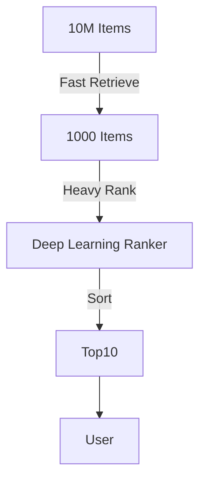

# Specialization: Recommender Systems (The Merchant)

## 📜 Story Mode: The Merchant

> **Mission Date**: 2043.12.05
> **Location**: Deep Space Outpost "Vector Prime" - Canteen
> **Officer**: Logistics Chief Varr
>
> **The Problem**: Solving Logistics is boring. Crew morale is key.
> Crewman Jinx likes "Space Tacos". Crewman Vi likes "Protein Cubes".
> I have 5,000 new items. What do I suggest to Jinx?
>
> **The Solution**: **Collaborative Filtering**.
> If Jinx and Vi both liked "Zero-G Pizza", and Vi likes "Moon Pie"...
> Jinx will probably like "Moon Pie".
>
> *"Computer! Build the Matrix Factorization. Recommend Top-5 Items."*

---

## 1. Problem Setup & Motivation

### The 6 Engineering Questions
1.  **WHAT**: Predict user preference for an item ($Rating_{ui}$).
2.  **WHY**: Amazon (35% sales), Netflix (80% stream time).
3.  **WHEN**: Users > Items > 1000.
4.  **WHERE**: `Surprise` (Lib), `TorchRec`, `LightGCN`.
5.  **WHO**: Koren et al. (Netflix Prize).
6.  **HOW**: $R \approx U \times V^T$.

---

## 2. Mathematical Problem Formulation

### Matrix Factorization
User-Item Matrix $R$ (Sparse).
Decompose into User Vectors $U$ and Item Vectors $V$.
$$ \hat{r}_{ui} = \mathbf{u}_i \cdot \mathbf{v}_j + b_u + b_i + \mu $$
Minimize MSE on observed ratings:
$$ \min_{U,V} \sum (r_{ui} - \mathbf{u}_i \cdot \mathbf{v}_j)^2 + \lambda(||u||^2 + ||v||^2) $$

---

## 3. The Trifecta: Implementation Levels

### The Ship's Code (Polyglot: Pure Python + Libraries)

```python
import numpy as np
import torch
import torch.nn as nn

# LEVEL 0: Pure Python (Collaborative Filtering Logic)
def predict_pure(user_vec, item_vec):
    # Dot product
    return sum(u*v for u, v in zip(user_vec, item_vec))

# LEVEL 1: NumPy (SVD)
def svd_recsys(R, k=2):
    # R: Matrix with 0 for missing
    # Naive SVD (Normally you use ALS for sparse)
    U, S, Vt = np.linalg.svd(R, full_matrices=False)
    # Reconstruct
    R_hat = U[:, :k] @ np.diag(S[:k]) @ Vt[:k, :]
    return R_hat

# LEVEL 2: PyTorch (Neural Collaborative Filtering)
class NCF(nn.Module):
    def __init__(self, n_users, n_items, dim=32):
        super().__init__()
        self.user_emb = nn.Embedding(n_users, dim)
        self.item_emb = nn.Embedding(n_items, dim)
        self.fc = nn.Linear(dim * 2, 1) # Neural mix
        
    def forward(self, u, i):
        # Concatenate User and Item embeddings
        x = torch.cat([self.user_emb(u), self.item_emb(i)], dim=1)
        return torch.sigmoid(self.fc(x))
```

---

## 4. System-Level Integration (Candidate Generation)



**Two-Tower Architecture**:
User Encoder $\to$ User Vector.
Item Encoder $\to$ Item Vector.
Matching = Dot Product (ANN Search).

---

## 13. Assessment & Mastery Checks

**Q1: Cold Start Problem**
What if a new user joins?
*   *Answer*: We have no history. Use **Content-Based Filtering** (Recommend popular items, or ask "What genres do you like?" on signup).

**Q2: Implicit vs Explicit**
Difference?
*   *Answer*: **Explicit**: "5 Stars". **Implicit**: "Clicked" or "Watched 50%". Implicit is strictly more abundant but noisier.

### 14. Common Misconceptions (Debug Your Thinking)

> [!WARNING]
> **"Just use highest rating."**
> *   **Correction**: An item with one 5-star rating isn't better than one with one hundred 4.8-star ratings. Use **Bayesian Average** or dampening.
