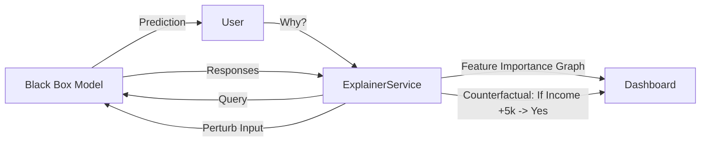

# human_centered_ai: XAI, Fairness & Accessibility (Deep Dive)

## 📜 Story Mode: The Translator

> **Mission Date**: 2044.01.15
> **Location**: United Nations AI Summit
> **Officer**: Ethics Liaison
>
> **The Problem**: The Neural Net denied the loan.
> The customer asks "Why?".
> The Engineer says "Because Neuron 452 activated".
> That is not an answer.
>
> **The Solution**: **Explainable AI (XAI)**.
> Translating Math into Meaning.
> Opening the Black Box.
>
> *"Computer. Run SHAP Analysis. Generate Counterfactual Explanations."*

---

## 1. Problem Setup & Motivation

### The 6 Engineering Questions
1.  **WHAT**: Techniques to make AI decision-making transparent, interpretable, and accessible.
2.  **WHY**: GDPR "Right to Explanation". User Trust. Debugging.
3.  **WHEN**: High-stakes decisions (Hiring, Credit, Justice, Medicine).
4.  **WHERE**: `SHAP`, `LIME`, `Captum` (PyTorch).
5.  **WHO**: Cynthia Rudin (Stop Explaining Black Boxes), Scott Lundberg (SHAP).
6.  **HOW**: Feature Importance $\to$ Local Surveillance $\to$ UI Visualization.

---

## 2. Mathematical Deep Dive: Shapley Values

### 2.1 Game Theory
How much did Player X contribute to the Team's win?
In ML: How much did Feature $X$ contribute to Prediction $Y$?
$$ \phi_i = \sum_{S \subseteq F \setminus \{i\}} \frac{|S|! (|F| - |S| - 1)!}{|F|!} [f(S \cup \{i\}) - f(S)] $$
*   Weighted average of marginal contributions across all possible subsets of features.
*   **Properties**:
    *   **Additivity**: Sum of SHAP values = Prediction Difference from Mean.
    *   **Consistency**: If a model changes so intrinsic importance increases, SHAP value increases.

---

## 3. The Ship's Code (Polyglot: SHAP & LIME)

```python
import shap
import lime
import lime.lime_tabular
import xgboost

# LEVEL 2: Extracting Explanations
def explain_model_prediction(model, data_row, background_data):
    # 1. SHAP (Global/Local Consistency)
    explainer = shap.TreeExplainer(model)
    shap_values = explainer.shap_values(data_row)
    
    print(f"SHAP: This loan was denied largely due to feature 'Income' (-0.4)")
    
    # 2. LIME (Local Surrogate)
    # Trains a simple Linear Model around the single data point
    lime_explainer = lime.lime_tabular.LimeTabularExplainer(
        background_data, mode='classification'
    )
    exp = lime_explainer.explain_instance(
        data_row, model.predict_proba
    )
    
    return shap_values, exp
```

---

## 4. System Architecture: The XAI Dashboard



---

## 13. Industry Interview Corner

### ❓ Real World Questions

**Q1: "Explain the difference between LIME and SHAP."**
*   **Answer**: "**LIME** builds a local linear approximation (surrogate) around the specific prediction. Fast but unstable. **SHAP** is game-theoretic and guarantees consistency (Additivity). Slower but mathematically rigorous."

**Q2: "What is a Counterfactual Explanation?"**
*   **Answer**: "Instead of saying 'Income was important', we say 'If your Income was $5000 higher, you would have been approved'. This gives the user **Actionable** feedback."

---

## 14. Debug Your Thinking (Misconceptions)

> [!WARNING]
> **"Interpretable Models perform worse."**
> *   **Correction**: Not always. For tabular data, Gradient Boosted Trees are interpretable (via SHAP) and SOTA. Simple rules (CORELS) can match Deep Learning in noisy domains (Criminal Recidivism) because Complex Models just overfit the noise.

> [!WARNING]
> **"Attention Weights are Explanations."**
> *   **Correction**: **Attack of the Attention mechanism**. Research shows Attention weights often do *not* correlate with feature importance. Just because the model 'looked' there doesn't mean it used that info.
