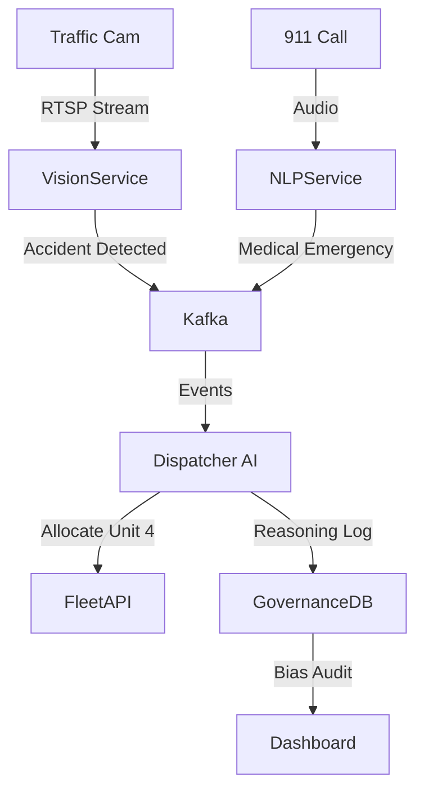

# cross_domain_capstone: Integrated Systems (Deep Dive)

## 📜 Story Mode: The System Architect

> **Mission Date**: 2044.03.01
> **Location**: Smart City Hub
> **Officer**: Chief Architect
>
> **The Goal**: Build a "Smart Emergency Response" System.
> It needs **Computer Vision** (Detect Accidents).
> It needs **NLP** (Parse 911 calls).
> It needs **Optimization** (Route Ambulances).
> It needs **Ethics** (Fair service to all neighborhoods).
>
> **The Challenge**: Integrating separate specialists into one cohesive Brain.
>
> **The Build**: **The Cross-Domain Capstone**.

---

## 1. Project Requirements

### 1.1 Core Specs
*   **Multi-Modal**: Vision + Text + Tabular.
*   **Fairness**: Audited for geographic bias.
*   **Explainable**: Why was Ambulance A sent instead of Ambulance B?
*   **Scalable**: Microservices Architecture.

### 1.2 The Tech Stack
*   **Vision**: YOLOv8 (Traffic Cams).
*   **NLP**: Whisper (Audio) $\to$ BERT (Intent).
*   **Router**: OR-Tools (Vehicle Routing Problem).
*   **Governance**: Dashboard showing Fairness Metrics per district.

---

## 2. Architecture: Event-Driven Microservices



### 2.1 The Decision Logic (Optimization)
We don't just predict; we **Optimize**.
Objective Function:
$$ \min \sum (\text{Time to Arrival}) + \lambda (\text{Fairness Penalty}) $$
We ensure high-risk neighborhoods aren't systematically ignored (Epsilon-Constraint method).

---

## 3. The Code: Bias Auditing Wrapper

```python
# A wrapper that logs decisions for audit
class AuditedDispatcher:
    def __init__(self, optimizer):
        self.optimizer = optimizer
        self.audit_log = []
        
    def dispatch(self, incident, candidates):
        # 1. Make Decision
        best_unit = self.optimizer.solve(incident, candidates)
        
        # 2. Log Attributes (Sensitive: Zip Code)
        log_entry = {
            "incident_id": incident.id,
            "zip_code": incident.zip,
            "response_time": estimate_time(best_unit, incident),
            "timestamp": datetime.now()
        }
        self.audit_log.append(log_entry)
        
        # 3. Real-time Check
        if self.check_drift(log_entry):
            alert_human("Potential Bias Spike Detected!")
            
        return best_unit

    def check_drift(self, log):
        # Rolling average of response times per Zip Code
        return False # Implementation logic
```

---

## 4. Evaluation Strategy

### 4.1 Holistic Metrics
*   **Performance**: Average Response Time (Target < 8 min).
*   **Fairness**: Max Disparity between Zip Codes (Target < 1 min difference).
*   **Reliability**: Uptime 99.99%.

### 4.2 Stress Testing
*   **Mass Event**: Simulate 100 concurrent accidents. Does Kafka choke?
*   **Sensor Failure**: Blind cameras. Do we fallback to Phone GPS?

---

## 5. Deployment Checklist
*   [ ] **Ethics Review**: Sign-off from City Council (Human-in-the-loop).
*   [ ] **Privacy**: Blur faces in video streams at the Edge.
*   [ ] **Explainability**: "Dispatch Reason" field enabled in output JSON.
