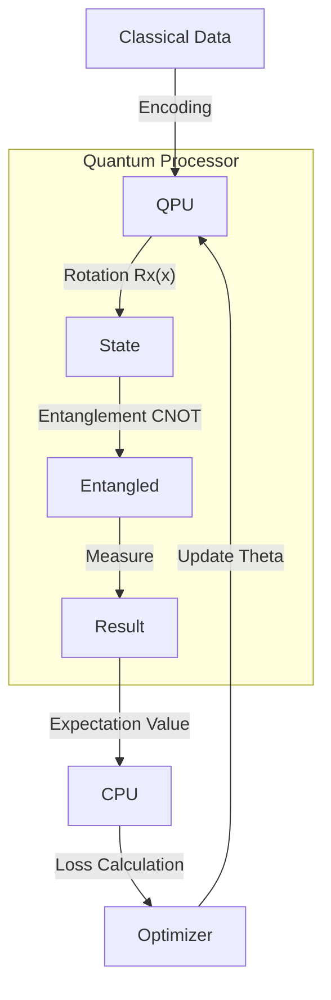

# quantum_ml: Qubits, Superposition & QNNs (Deep Dive)

## 📜 Story Mode: The Quantum Leap

> **Mission Date**: 2045.02.01
> **Location**: Cryogenic Lab 0 Kelvin
> **Officer**: Quantum Physicist
>
> **The Problem**: Optimizing a supply chain with 500 nodes is $O(N!)$.
> A classical supercomputer takes 100 years.
> We need to search all possibilities *simultaneously*.
>
> **The Solution**: **Quantum Machine Learning**.
> Superposition. Entanglement. Interference.
> "Nature isn't classical, dammit, and if you want to make a simulation of nature, you'd better make it quantum mechanical." - Feynman
>
> *"Computer. Initialize 50 Qubits. Run QAOA Circuit."*

---

## 1. Problem Setup & Motivation

### The 6 Engineering Questions
1.  **WHAT**: Using Quantum Processors (QPUs) to accelerate ML kernels.
2.  **WHY**: Exponential speedup (potentially) for Optimization, Sampling, and Linear Algebra.
3.  **WHEN**: Optimization Problems (TSP), Molecule Simulation, Kernel Methods.
4.  **WHERE**: `Qiskit` (IBM), `PennyLane`, `Cirq` (Google).
5.  **WHO**: Peter Shor (Factoring), Nielsen & Chuang (The Bible).
6.  **HOW**: Encode Data $\to$ Variational Circuit $\to$ Measure $\to$ Classical Optimizer.

---

## 2. Mathematical Deep Dive: The Qubit

### 2.1 Superposition
A bit is 0 or 1. A Qubit is:
$$ |\psi\rangle = \alpha |0\rangle + \beta |1\rangle $$
where $|\alpha|^2 + |\beta|^2 = 1$.
With $N$ qubits, we represent $2^N$ states simultaneously.

### 2.2 Quantum Neural Networks (Variational Quantum Circuits)
$$ f(x) = \langle 0 | U^\dagger(x, \theta) M U(x, \theta) | 0 \rangle $$
1.  **Encoding ($U(x)$)**: Map classical data $x$ to quantum state (Rotation).
2.  **Ansatz ($U(\theta)$)**: Trainable rotation gates (The "Weights").
3.  **Measurement ($M$)**: Collapse wave function to get prediction.

---

## 3. The Ship's Code (Polyglot: PennyLane)

```python
import pennylane as qml
from pennylane import numpy as np

# LEVEL 2: Variational Quantum Classifier
dev = qml.device("default.qubit", wires=2)

@qml.qnode(dev)
def circuit(weights, x):
    # 1. Feature Map (Angle Encoding)
    qml.AngleEmbedding(x, wires=[0, 1])
    
    # 2. Ansatz (Strongly Entangling Layers)
    qml.StronglyEntanglingLayers(weights, wires=[0, 1])
    
    # 3. Measurement (Pauli Z expectation)
    return qml.expval(qml.PauliZ(0))

def train_qnn():
    weights = np.random.random(qml.StronglyEntanglingLayers.shape(n_layers=2, n_wires=2))
    opt = qml.GradientDescentOptimizer(stepsize=0.1)
    
    # Classic Loop
    for step in range(100):
        weights = opt.step(cost_func, weights)
```

---

## 4. System Architecture: Hybrid Quantum-Classical



We don't run the *whole* model on QPU (too noisy).
We use the QPU as a **Kernel Accelerator** (like a GPU, but weirder).

---

## 13. Industry Interview Corner

### ❓ Real World Questions

**Q1: "What is Quantum Supremacy vs Quantum Advantage?"**
*   **Answer**: "**Supremacy**: Doing *something* a classical computer can't do (even if useless, like random circuit sampling). **Advantage**: Doing something *useful* (like finding a cure for cancer) faster/cheaper. We are currently in the **NISQ** (Noisy Intermediate-Scale Quantum) era—Advantage is elusive."

**Q2: "Why is data loading a bottleneck in QML?"**
*   **Answer**: "The **Input Problem**. Loading 1GB of data into a quantum state requires a deep circuit ($O(N)$ gates), which introduces so much noise due to decoherence that the calculation fails before it starts. QML works best when data is small but compute is hard (like chemical properties)."

---

## 14. Debug Your Thinking (Misconceptions)

> [!WARNING]
> **"Quantum Computers try every answer at once."**
> *   **Correction**: Pop culture myth. They exist in a superposition of states, yes, but when you **Measure**, you get only one random answer. You need **Interference** algorithms (Grover/Shor) to make the wrong answers cancel out and the right answer amplify.

> [!WARNING]
> **"QNNs replace Deep Learning."**
> *   **Correction**: Unlikely. They will likely be **Co-Processors** for specific sub-routines (e.g., inverting sparse matrices) within a larger classical PyTorch pipeline.
