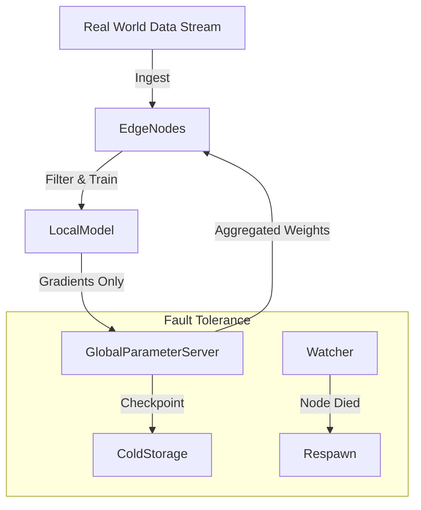

# ai_at_scale: Planet-Scale Intelligence (Deep Dive)

## 📜 Story Mode: The Galactic Brain

> **Mission Date**: 2045.03.01
> **Location**: Deep Space Network
> **Officer**: Infrastructure Admiral
>
> **The Problem**: We need to train a model on all the data produced by humanity.
> 100 Zettabytes.
> Millions of GPUs.
> Continual Learning (Never stops).
>
> **The Solution**: **Systems at Scale**.
> Asynchronous SGD.
> Fault Tolerance (Machines die every minute).
> Energy Optimization.
>
> *"Computer. Spin up the Dyson Cluster. Routing Protocol: Gossip."*

---

## 1. Problem Setup & Motivation

### The 6 Engineering Questions
1.  **WHAT**: Designing systems that scale linearly to thousands/millions of nodes.
2.  **WHY**: "Quantity has a quality all its own." (Scaling Laws).
3.  **WHEN**: Training Foundation Models (GPT-6).
4.  **WHERE**: `Slurm`, `Kubernetes Federation`, `Gossip Protocols`.
5.  **WHO**: Jeff Dean (Google Infrastucture), OpenAI Superalignment.
6.  **HOW**: Decentralization + Redundancy + Asynchrony.

---

## 2. Mathematical Deep Dive: Scaling Laws

### 2.1 Compute Optimal Scaling
Loss scales as a power law of compute $C$, Data $D$, and Parameters $N$.
$$ L(N) \approx N^{-\alpha} $$
$$ L(D) \approx D^{-\beta} $$
*   Training a model 2x bigger requires 4x more compute (roughly).
*   **Result**: We are running out of Data (The Internet is finite). Next frontier: **Synthetic Data**.

### 2.2 Communication Complexity
In a fully connected graph of $N$ GPUs:
Bandwidth $ \propto N^2 $.
This crashes at scale.
**Solution**: Sparse Topologies (Torus, Hypercube). Or **Federated Learning** (Compute locally, send only updates).

---

## 3. The Ship's Code (Polyglot: Federated Learning)

```python
import flwr as fl # Flower Framework

# LEVEL 2: Federated Client
class CifarClient(fl.client.NumPyClient):
    def get_parameters(self, config):
        return [val.cpu().numpy() for _, val in net.state_dict().items()]

    def fit(self, parameters, config):
        set_parameters(net, parameters)
        train(net, trainloader, epochs=1) # Train on local data
        return get_parameters(net), len(trainloader.dataset), {}

    def evaluate(self, parameters, config):
        set_parameters(net, parameters)
        loss, accuracy = test(net, testloader)
        return float(loss), len(testloader.dataset), {"accuracy": float(accuracy)}

# Server Side (Aggregation Strategy: FedAvg)
# It ensures data never leaves the client device (Privacy + Bandwidth savings)
strategy = fl.server.strategy.FedAvg(
    fraction_fit=0.1, # Sample 10% of clients per round
)

fl.server.start_server(config=fl.server.ServerConfig(num_rounds=3), strategy=strategy)
```

---

## 4. System Architecture: The Eternal Learner



---

## 13. Industry Interview Corner

### ❓ Real World Questions

**Q1: "How do you handle Stragglers in Distributed Training?"**
*   **Answer**: "In Synchronous SGD, one slow GPU slows down everyone. **Solution**: 1. **Asynchronous SGD** (hogwild) - Don't wait, just update (adds noise). 2. **Backup Workers** - Launch 105 jobs for 100 tasks, take the first 100 to finish (MapReduce approach)."

**Q2: "What is the energy cost of training?"**
*   **Answer**: "Training GPT-3 consumed 1300 MWh (same as 120 US homes for a year). At Scale, **Green AI** is an engineering constraint. We move workloads to regions with excess renewable energy (Data Migration follows the Sun)."

---

## 14. Debug Your Thinking (Misconceptions)

> [!WARNING]
> **"Bigger is always better."**
> *   **Correction**: **Diminishing Returns**. We are hitting the asymptote of current Architectures. Also latency constraints (Mobile) push for **Small Models** (Phi-2, Mistral). The future is likely "Swarm of Small Experts", not "One Giant Monolith".
