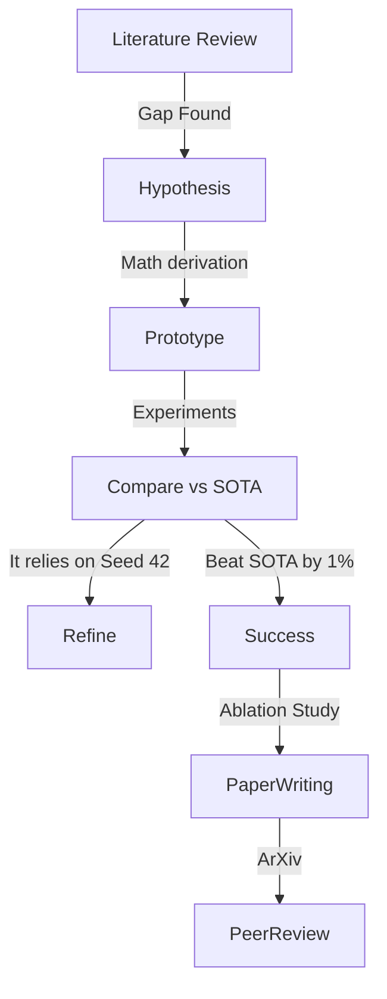

# pioneering_capstone: Original Research (Deep Dive)

## 📜 Story Mode: The Pioneer

> **Mission Date**: 2045.04.01
> **Location**: The Edge of Knowledge
> **Officer**: Ph.D. Candidate
>
> **The Goal**: To publish a paper at NeurIPS 2026.
> Not to "Use" AI. But to **Invent** new AI.
>
> **The Challenge**: The Reviewer #2.
>
> **The Build**: **The Novel Contribution**.

---

## 1. Project Requirements

### 1.1 The Criteria
An Original Contribution must be:
1.  **Novel**: No one has done exactly this.
2.  **Useful**: Needs to solve a problem better/faster/cheaper.
3.  **Rigorous**: Proven with math and empirical baselines.

### 1.2 Potential Research Directions
*   **Direction A**: "Liquid-Mamba". Combining Liquid Time Constant Networks with Selective State Spaces.
*   **Direction B**: "Quantum-RAG". Encoding Vector/Knowledge Graphs into Hilbert Space.
*   **Direction C**: "Energy-Aware Backprop". A loss function that penalizes Joules/Op.

---

## 2. Methodology: The Research Lifecycle



---

## 3. The Code: The Experiment Runner

Research code is different. It must track *everything*.

```python
import wandb

# The "Sweep" Configuration
sweep_config = {
    'method': 'bayes', # Bayesian Optimization for Hyperparams
    'metric': {'name': 'val_loss', 'goal': 'minimize'},
    'parameters': {
        'learning_rate': {'min': 0.0001, 'max': 0.1},
        'architecture_variant': {'values': ['vanilla', 'liquid', 'hybrid']}
    }
}

def train():
    with wandb.init():
        config = wandb.config
        model = build_model(config.architecture_variant)
        # Train...
        wandb.log({"val_loss": loss})

# Run the sweep
sweep_id = wandb.sweep(sweep_config, project="neurips-2026")
wandb.agent(sweep_id, train)
```

---

## 4. Writing the Paper (LaTeX)

### 4.1 Structure
1.  **Abstract**: The "Hook". (We propose X, which achieves Y, improving Z).
2.  **Introduction**: The "Why".
3.  **Related Work**: The "Context" (Don't insult Reviewers by ignoring their work).
4.  **Method**: The "How" (Math formulation).
5.  **Experiments**: The "Proof". (Tables/Charts).
6.  **Conclusion**: The "Future".

### 4.2 The Review Process
*   **Rebuttal**: "The reviewer claims X is trivial. We respectfully disagree, citing [1, 2]."
*   **Rejection**: It happens. Improve and resubmit to ICML.

---

## 5. Graduation Checklist
*   [ ] **Novelty Check**: Search ArXiv one last time.
*   [ ] **Code Release**: Clean up the messy notebooks into a library.
*   [ ] **Pre-print**: Upload to ArXiv (cc-by).
*   [ ] **Submit**: OpenReview.net.

**Congratulations. You are no longer just a User. You are a Creator.**
