# The Definitive Encyclopedia of AI Architectures
## Master Index & Volume Introductions

**Version:** Final Master Edition | **Date:** July 2026  
**Scope:** A complete, chronological, and mathematical documentation of Large Language Model (LLM) architectures, systems, and algorithms from the 2017 Original Transformer to the 2026 2.8 Trillion parameter frontier models.

---

## Preface: How to Navigate This Encyclopedia

This document is structured as a graduate-level textbook and engineering reference. It is divided into **Eight Volumes**, progressing chronologically from the foundational concepts of 2017 to the bleeding-edge deployment algorithms of 2026. 

Each chapter follows a standardized template: *Executive Summary, Historical Context, Paper Summary, Complete Architecture (with Mermaid diagrams), Algorithm Deep Dives (with Math/Pseudocode), Memory & FLOPs Analysis, and an Architecture Diff (comparing it to the previous generation).*

---

## Master Detailed Index
### Volume I: The Foundation & Dense Era (2017–2023)
*   **Chapter 1: The Original Transformer (2017)**
    *   *Models/Papers:* "Attention Is All You Need" (Vaswani et al.).
    *   *Algorithms:* Encoder-Decoder architecture, Sinusoidal Positional Encoding, Scaled Dot-Product Multi-Head Attention (MHA), Post-LayerNorm, ReLU FFN.
    *   *Key Concepts:* $O(N^2)$ complexity bottleneck, sequential RNN limitations, residual connections.
*   **Chapter 2: GPT-2 & The Pre-Norm Pivot (2019)**
    *   *Models/Papers:* GPT-2 (Radford et al.).
    *   *Algorithms:* Decoder-only architecture, Pre-LayerNorm (critical stability fix), GeLU activation, Byte-level BPE, Learned Absolute PE.
    *   *Key Concepts:* Zero-shot generation, unobstructed residual pathways, vanishing gradient problem.
*   **Chapter 3: GPT-3 & The Scaling Laws (2020)**
    *   *Models/Papers:* GPT-3 (Brown et al.).
    *   *Algorithms:* In-context learning, brute-force dense scaling, Distributed Training (Tensor/Pipeline Parallelism).
    *   *Key Concepts:* 175B parameter scale, few-shot prompting, the ruinous inference costs of dense models.
*   **Chapter 4: Chinchilla & Compute-Optimal Scaling (2022)**
    *   *Models/Papers:* Chinchilla (Hoffmann et al.).
    *   *Algorithms:* Compute-Optimal Scaling Laws, 20:1 Token-to-Parameter Ratio.
    *   *Key Concepts:* Death of the Trillion-parameter dense model, focus on data quality over parameter count.
*   **Chapter 5: LLaMA 1 & The Modern Dense Block (2023)**
    *   *Models/Papers:* LLaMA 1 (Touvron et al.).
    *   *Algorithms:* RMSNorm, RoPE (Rotary Position Embedding), SwiGLU activation, Removal of bias terms.
    *   *Key Concepts:* Relative position encoding, open-source democratization, gating mechanisms in FFN.
*   **Chapter 6: LLaMA 2 & The KV Cache Memory Wall (2023)**
    *   *Models/Papers:* LLaMA 2 (Touvron et al.).
    *   *Algorithms:* Grouped Query Attention (GQA), RLHF alignment.
    *   *Key Concepts:* KV Cache memory reduction, VRAM bottleneck, commercial deployment viability.

### Volume II: The Efficiency & Sparse Era (2023–2024)
*   **Chapter 7: Mistral 7B & Sliding Window Attention (2023)**
    *   *Models/Papers:* Mistral 7B (Jiang et al.).
    *   *Algorithms:* Sliding Window Attention (SWA).
    *   *Key Concepts:* $O(N)$ attention memory, information "bubbling up" through layers, context window extension.
*   **Chapter 8: Mixtral 8x7B & The Open-Source Debut of MoE (2023)**
    *   *Models/Papers:* Mixtral 8x7B (Jiang et al.).
    *   *Algorithms:* Mixture of Experts (MoE), Top-2 Sparse Routing, Auxiliary Load Balancing Loss.
    *   *Key Concepts:* Sparse activation, expert collapse, memory-heavy vs. compute-light tradeoffs.
*   **Chapter 9: FlashAttention (2022–2024)**
    *   *Models/Papers:* FlashAttention 1/2/3 (Dao et al.).
    *   *Algorithms:* IO-aware algorithms, Tiling, Online Softmax, FP8 precision (FA-3).
    *   *Key Concepts:* HBM vs. SRAM memory hierarchy, memory-bandwidth bound vs. compute bound, enabling 100K+ contexts.
*   **Chapter 10: DeepSeek V2 & Multi-Head Latent Attention (2024)**
    *   *Models/Papers:* DeepSeek V2 (DeepSeek-AI).
    *   *Algorithms:* Multi-Head Latent Attention (MLA), KV Cache Compression, Fine-Grained MoE, Shared Experts.
    *   *Key Concepts:* Low-rank compression of KV cache, 64x memory reduction, specialized vs. common knowledge routing.
*   **Chapter 11: DeepSeek V3 & The Triumph of Algorithmic Efficiency (2024)**
    *   *Models/Papers:* DeepSeek V3 (DeepSeek-AI).
    *   *Algorithms:* Multi-Token Prediction (MTP), Aux-loss-free MoE Routing, FP8 Mixed Precision Training.
    *   *Key Concepts:* Predicting multiple tokens for planning, dynamic bias routing, $5.5M training cost.

### Volume III: The Agentic & Extreme-Scale Frontier (2025–2026)
*   **Chapter 12: Kimi K2 & The 1-Trillion Parameter Stability Problem (2025)**
    *   *Models/Papers:* Kimi K2 (Moonshot AI).
    *   *Algorithms:* Muon Optimizer, QK-Clip (Weight Shock Absorber).
    *   *Key Concepts:* 1T parameter scaling, Newton-Schulz orthogonalization, hard weight clipping to prevent NaNs.
*   **Chapter 13: GLM-4.5 & GLM-5.2 & The 1-Million Token Agentic Frontier (2025–2026)**
    *   *Models/Papers:* GLM-4.5, GLM-5.2 (Zhipu AI).
    *   *Algorithms:* Sigmoid-gated MoE, IndexShare for Dynamic Sparse Attention (DSA), MoE-as-MTP.
    *   *Key Concepts:* Independent expert activation, reusing search indices across layers, 8-hour agentic coding.
*   **Chapter 14: The Mamba & Hybrid Revolution (2024–2025)**
    *   *Models/Papers:* Mamba, Mamba-2, Jamba, Nemotron-H.
    *   *Algorithms:* Selective State Space Models (SSMs), Parallel Associative Scan, Structured State Space Duality (SSD).
    *   *Key Concepts:* $O(N)$ time complexity, $O(1)$ inference memory, photographic memory vs. running summary, hybrid interleaving.
*   **Chapter 15: Kimi K3 & The Apex of Scale and Native Multimodality (2026)**
    *   *Models/Papers:* Kimi K3 (Moonshot AI).
    *   *Algorithms:* 2.8T Parameter MoE, MoonViT-3D, MoBA (Mixture of Block Attention).
    *   *Key Concepts:* Native multimodal tokenization, block-sparse attention, extreme sparsity (>98% dark per token).

### Volume IV: The Specialized & Global Frontier
*   **Chapter 16: Microsoft Phi-4 & The Small Language Model (SLM) Revolution (2024)**
    *   *Models/Papers:* Phi-4 (Microsoft Research).
    *   *Algorithms:* Full Multi-Head Attention (MHA) for density, Attention Sinks, Synthetic Textbook Data.
    *   *Key Concepts:* "Data as Architecture", cognitive density per parameter, softmax garbage collection.
*   **Chapter 17: Cohere Command R+ & The Enterprise RAG Architecture (2024)**
    *   *Models/Papers:* Command R+ (Cohere).
    *   *Algorithms:* Parallel Layers (Attn + FFN simultaneously), Sink/Local/Global Attention Mask, Tool-Use Pre-training.
    *   *Key Concepts:* Enterprise RAG optimization, reducing inference latency, "lost in the middle" phenomenon.
*   **Chapter 18: Sarvam AI & The Tokenizer as Architecture (2024)**
    *   *Models/Papers:* Sarvam-1 (Sarvam AI).
    *   *Algorithms:* Indic-Optimized BPE, Token Tax elimination.
    *   *Key Concepts:* Tokenizer vocabulary as a first-class architectural component, regional dominance via localization.
*   **Chapter 19: Apple AFM & Hardware-Aware Co-Design (2024)**
    *   *Models/Papers:* Apple Foundation Model (Apple).
    *   *Algorithms:* Apple Neural Engine (ANE) optimization, 4-bit Palettization, Dynamic LoRA Adapters.
    *   *Key Concepts:* Edge AI, fixed-function vector silicon, K-means lookup table quantization.

### Volume V: Post-Transformer Sequence Architectures
*   **Chapter 20: RWKV, RetNet, & xLSTM (The Non-Mamba Challengers) (2023–2024)**
    *   *Models/Papers:* RWKV, RetNet, xLSTM.
    *   *Algorithms:* Linear Recurrence, Retention Matrix, Matrix LSTM, Exponential Gating.
    *   *Key Concepts:* Parallel training + $O(1)$ recurrent inference, avoiding complex selective scans, matrix memory vs. scalar memory.

### Volume VI: The Hardware-Native & Distributed Systems Frontier
*   **Chapter 21: BitNet b1.58 & The 1.58-Bit Revolution (2024)**
    *   *Models/Papers:* BitNet b1.58 (Microsoft Research).
    *   *Algorithms:* Ternary weights ($\{-1, 0, 1\}$), Death of MatMul, Quantization-Aware Training (QAT).
    *   *Key Concepts:* Integer addition replacing floating-point multiplication, memory-bandwidth bound to compute-bound shift.
*   **Chapter 22: Soft MoE & The Fully Differentiable Sparse Router (2023)**
    *   *Models/Papers:* Soft MoE (Puigcerver et al.).
    *   *Algorithms:* Slot Mechanism, Continuous Softmax Routing.
    *   *Key Concepts:* Elimination of discrete Top-K selection, experts processing "blended" weighted averages, zero token dropping.
*   **Chapter 23: Distributed Execution Graphs (ZeRO, FSDP, & 3D Parallelism)**
    *   *Models/Papers:* ZeRO, Megatron-LM, FSDP.
    *   *Algorithms:* Memory Sharding (ZeRO-1/2/3), Fully Sharded Data Parallel (FSDP), Tensor Parallelism (TP), Pipeline Parallelism (PP) with Micro-batching.
    *   *Key Concepts:* Eradicating memory redundancy, pipeline bubbles, 16,000-GPU orchestration.

### Volume VII: The Final Frontier (Post-Training, Systems, Math, & Multimodality)
*   **Chapter 24: Post-Training & Reasoning Architectures (SFT, DPO, GRPO, MCTS)**
    *   *Models/Papers:* InstructGPT, DPO, DeepSeek-R1.
    *   *Algorithms:* RLHF (4-model graph), Direct Preference Optimization (2-model graph), Group Relative Policy Optimization (Critic-free RL), Test-Time Compute (MCTS).
    *   *Key Concepts:* Preference alignment, scaling inference compute, open-source reasoning (test-time compute).
*   **Chapter 25: Inference Serving Systems (PagedAttention, Ring Attention, Mooncake)**
    *   *Models/Papers:* vLLM, Ring Attention, Mooncake.
    *   *Algorithms:* OS-level Virtual Memory paging for KV Cache, Sequence splitting across GPUs, Disaggregated Prefill/Decode datacenters.
    *   *Key Concepts:* VRAM fragmentation, 2M context on clusters, maximizing GPU utilization.
*   **Chapter 26: Long-Context Math (YaRN, NTK-aware Scaling, & RoPE Extrapolation)**
    *   *Models/Papers:* RoPE, YaRN, NTK-aware scaling.
    *   *Algorithms:* Position Interpolation (Squish), NTK-aware Scaling (Rubber Band), YaRN (NTK-by-Parts + Temperature scaling).
    *   *Key Concepts:* Stretching RoPE frequencies, local vs. global frequency preservation, avoiding model collapse on long inputs.
*   **Chapter 27: Multimodal Fusion Architectures (LLaVA, Flamingo, Q-Former, & 3D-RoPE)**
    *   *Models/Papers:* LLaVA, Flamingo, BLIP-2, Kimi K3.
    *   *Algorithms:* MLP Projectors (Bolt-On), Gated Cross-Attention, Q-Former Compression, Native Omni-Tokenization, 3D-RoPE.
    *   *Key Concepts:* Bridging dimension gaps, spatial-temporal data processing, unified token streams.

### Volume VIII: The Deployment & Survival Algorithms (The Final Appendix)
*   **Chapter 28: Retrieval-Augmented Architectures (RETRO & Memorizing Transformers)**
    *   *Models/Papers:* RETRO (DeepMind), Memorizing Transformers (Google).
    *   *Algorithms:* Chunked Cross-Attention (CCA), External Differentiable Memory Vaults, kNN-Attention.
    *   *Key Concepts:* Decoupling reasoning from knowledge, 7B models rivaling 30B models via external databases.
*   **Chapter 29: KV Cache Eviction & Streaming Architectures (StreamingLLM, H2O)**
    *   *Models/Papers:* StreamingLLM, H2O (Heavy-Hitter Oracle).
    *   *Algorithms:* Attention Sinks, Sliding Window with Sink Tokens, Dynamic Eviction.
    *   *Key Concepts:* Infinite text streaming on fixed VRAM, mathematical garbage collection for softmax.
*   **Chapter 30: Post-Training Quantization Algorithms (GPTQ, AWQ, SmoothQuant)**
    *   *Models/Papers:* GPTQ, AWQ, SmoothQuant.
    *   *Algorithms:* Hessian-based weight quantization, Activation-aware weight quantization, Smoothing activation outliers.
    *   *Key Concepts:* Inverse Hessian matrices for error compensation, protecting "salient" weights, fitting 70B models on consumer hardware.
*   **Chapter 31: Evolutionary Model Merging (Sakana AI)**
    *   *Models/Papers:* Sakana AI Evolutionary Merging.
    *   *Algorithms:* Linear & Non-linear weight merging, Task Vectors, Evolutionary optimization of layer permutations.
    *   *Key Concepts:* Architecture without design, treating models as DNA, creating capable models without pre-training.
---


---

# Volume I: The Foundation & Dense Era (2017–2023)
This volume traces the genesis of the modern AI era. It begins with the 2017 original Encoder-Decoder Transformer and follows the OpenAI GPT lineage as it strips away the encoder, stabilizes deep networks with Pre-LayerNorm, and brute-force scales to 175B parameters (GPT-3). It culminates with Meta's LLaMA 1 and 2, which established the "Modern Dense Block" (RMSNorm, RoPE, SwiGLU, GQA) by proving that data quality and compute-optimal scaling (Chinchilla laws) matter more than raw parameter count.
## Chapter 1: The Original Transformer (2017)

### 1. Executive Summary
The original Transformer, introduced in the paper "Attention Is All You Need," represented the most significant paradigm shift in natural language processing since the introduction of recurrent neural networks (RNNs). It completely eradicated sequential processing of data, replacing it with a fully parallelizable attention mechanism. This allowed every token in a sequence to directly attend to every other token with an $O(1)$ maximum path length, fundamentally solving the long-range dependency bottleneck of RNNs/LSTMs, albeit at the cost of $O(n^2)$ computational complexity.

### 2. Historical Context
Before 2017, state-of-the-art sequence transduction (e.g., machine translation) relied on Encoder-Decoder architectures built with RNNs or LSTMs. 
*   **The Bottleneck:** These models processed data sequentially. To process token $t$, the model had to finish processing token $t-1$. This made parallelization across the sequence length impossible on GPUs.
*   **The Gradient Problem:** Over long sequences, gradients traveling backward through time steps would either vanish (become zero) or explode (become infinite), making it practically impossible to train models on contexts longer than a few hundred words.
*   **Early Attention:** Bahdanau et al. (2014) introduced "additive attention" to RNNs, allowing the decoder to look back at specific hidden states. The Transformer took this concept to the extreme: it threw away the RNN entirely and built the whole architecture around attention.

### 3. Paper Summary
*   **Authors:** Ashish Vaswani, Noam Shazeer, Niki Parmar, Jakob Uszkoreit, Llion Jones, Aidan N. Gomez, Łukasz Kaiser, Illia Polosukhin.
*   **Institution:** Google Brain, Google Research, University of Toronto.
*   **Publication:** NeurIPS 2017.
*   **Links:** [arXiv:1706.03762](https://arxiv.org/abs/1706.03762) | [GitHub (Tensor2Tensor)](https://github.com/tensorflow/tensor2tensor)

### 4. Complete Architecture
The original model was an Encoder-Decoder architecture designed for sequence-to-sequence tasks (English to French translation).

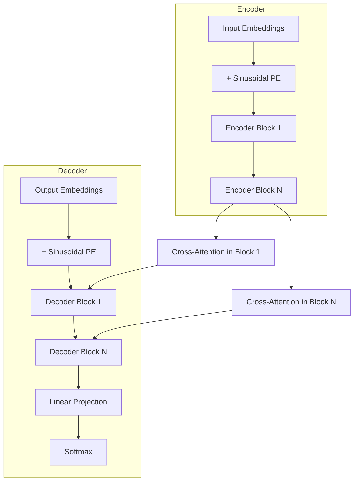

### 5. Tokenizer & Embedding Layer
*   **Tokenizer:** Used Byte-Pair Encoding (BPE) (Sennrich et al., 2015). Vocabulary size was roughly 37,000 tokens for the WMT 2014 English-French dataset.
*   **Embedding Dimension ($d_{model}$):** 512 (Base model) or 1024 (Big model).
*   **Weight Tying:** The output projection layer (before softmax) shared weights with the input embedding matrix. This reduced parameter count and acted as a regularizer.

### 6. Positional Encoding: Sinusoidal
Because self-attention contains no inherent notion of sequence order (it processes all tokens simultaneously), the model must inject positional information explicitly. The Transformer used fixed sine and cosine functions.

**Mathematical Derivation:**
For a given position $pos$ and dimension $i$ (up to $d_{model}$):
$$PE_{(pos, 2i)} = \sin\left(\frac{pos}{10000^{2i/d_{model}}}\right)$$
$$PE_{(pos, 2i+1)} = \cos\left(\frac{pos}{10000^{2i/d_{model}}}\right)$$

**Engineering Insight:** The wavelength of the sine wave progresses geometrically from $2\pi$ to $10000 \cdot 2\pi$. This design allows the model to easily learn to attend by relative positions, because for any fixed offset $k$, $PE_{pos+k}$ can be represented as a linear function of $PE_{pos}$.

### 7. Attention: Scaled Dot-Product Multi-Head Attention (MHA)
Instead of performing a single attention function, the model projects the Queries ($Q$), Keys ($K$), and Values ($V$) into $h=8$ parallel heads, allowing the model to jointly attend to information from different representation subspaces.

**Mathematical Derivation:**
$$\text{Attention}(Q, K, V) = \text{softmax}\left(\frac{QK^T}{\sqrt{d_k}}\right)V$$
$$\text{MultiHead}(Q, K, V) = \text{Concat}(\text{head}_1, ..., \text{head}_h)W^O$$
where $\text{head}_i = \text{Attention}(QW_i^Q, KW_i^K, VW_i^V)$

**Why scale by $\sqrt{d_k}$?** 
If $d_k$ is large, the dot product $QK^T$ grows large in magnitude. Large values push the softmax function into regions with extremely small gradients (vanishing gradient problem). By the law of large numbers, if $q$ and $k$ are random variables with mean 0 and variance 1, their dot product $q \cdot k$ has mean 0 and variance $d_k$. Scaling by $\sqrt{d_k}$ brings the variance back to 1, ensuring healthy gradients.

### 8. Feed-Forward Network (FFN): ReLU
After attention mixes information across the sequence, a Feed-Forward Network processes each token's vector independently. It consists of two linear transformations with a ReLU activation in between.

**Math:**
$$\text{FFN}(x) = \max(0, xW_1 + b_1)W_2 + b_2$$
The hidden dimension $d_{ff}$ is typically 4x the model dimension ($d_{model}$). E.g., if $d_{model}=512$, $d_{ff}=2048$.

### 9. Normalization: Post-LayerNorm
The original architecture applied Layer Normalization *after* the residual addition.

**Math:**
$$x_{out} = \text{LayerNorm}(x + \text{Sublayer}(x))$$
$$\text{LayerNorm}(x) = \gamma \cdot \frac{x - \mu}{\sqrt{\sigma^2 + \epsilon}} + \beta$$
where $\mu$ and $\sigma^2$ are the mean and variance computed over the last dimension $d_{model}$, and $\gamma, \beta$ are learnable parameters.

**Engineering Flaw:** Post-norm means the main residual pathway is altered by the normalization layer at every step. In deep networks (e.g., 50+ layers), this causes gradients to vanish or explode during backpropagation, making the original Transformer incredibly difficult to train from scratch without complex learning rate warmup schedules.

### 10. Memory & FLOPs Analysis
*   **Compute Complexity:** $O(n^2 \cdot d)$ for attention (where $n$ is sequence length), $O(n \cdot d^2)$ for FFN. For the short sequence lengths used in 2017 ($n < 512$), FFN dominates compute.
*   **Memory Complexity:** $O(n^2)$ to materialize the attention matrix $QK^T$ in VRAM. For $n=512$, this is a $512 \times 512$ matrix per head—negligible in 2017, but the absolute bottleneck for modern long-context models.

### 11. Architecture Diff: The Baseline
*This chapter establishes the baseline. The next chapter will detail the first major architectural pivot.*

---
## Chapter 2: GPT-2 & The Pre-Norm Pivot (2019)

### 1. Executive Summary
OpenAI's GPT-2 (1.5 billion parameters) is the true architectural ancestor of GPT-4, LLaMA, and Claude. It proved that a single, massive Decoder-only Transformer, trained on vast amounts of unlabeled internet text, could learn to perform downstream tasks like translation, summarization, and question-answering *zero-shot*—without any supervised fine-tuning. 

To achieve this unprecedented scale, OpenAI had to fix the fatal architectural flaw of the 2017 original design: **Post-LayerNorm**. By moving to **Pre-LayerNorm**, GPT-2 unlocked the ability to train stable networks dozens of layers deep.

### 2. Historical Context: The 2018 Pivot
In 2018, the field realized that the *Encoder* and the *Decoder* of the original Transformer could be used independently for pre-training. 
*   **Google (BERT):** Built an Encoder-only model. It used "Masked Language Modeling" (filling in blank words) and looked both left and right (bidirectional).
*   **OpenAI (GPT-1):** Built a Decoder-only model. It used "Causal Language Modeling" (predicting the next word) and only looked left. 

GPT-1 (117M parameters) was successful, but it still used the **Post-LayerNorm** architecture from the 2017 paper. This made GPT-1 notoriously difficult to train, requiring extensive learning rate warmup and careful initialization. To scale up 10x to GPT-2's 1.5B parameters, the architecture had to be stabilized.

### 3. Paper Summary
*   **Authors:** Alec Radford, Jeffrey Wu, Rewon Child, David Luan, Dario Amodei, Ilya Sutskever.
*   **Institution:** OpenAI.
*   **Publication:** February 2019.
*   **Links:** [OpenAI Blog](https://openai.com/research/better-language-models) | [GitHub](https://github.com/openai/gpt-2) | [Paper PDF](https://cdn.openai.com/better-language-models/language_models_are_unsupervised_multitask_learners.pdf)

### 4. Complete Architecture
GPT-2 stripped away the Encoder and the Cross-Attention, leaving a clean, unidirectional Decoder stack. 

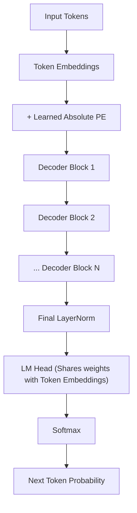

### 5. The Critical Engineering Fix: Pre-LayerNorm
This is the most important architectural change in GPT-2, and it forms the basis of all modern deep LLMs.

**The Problem (2017-2018):** In a Post-Norm block, the math is:
$$x_{out} = \text{LayerNorm}(x + \text{Sublayer}(x))$$
The main data highway ($x$) is forced to pass through the LayerNorm operation at every single floor. In a 48-layer model (GPT-2), the gradients traveling backward during training must pass through 48 LayerNorm bottlenecks. The gradients shrink to zero (vanishing gradient problem), and the model stops learning.

**The GPT-2 Fix (Pre-Norm):** Move the LayerNorm to the *input* of the sublayer.
$$x_{out} = x + \text{Sublayer}(\text{LayerNorm}(x))$$

**Engineering Impact:** Now, the main data highway ($x$) has a clean, unobstructed "bypass pipe" (residual connection) that runs straight from the first layer to the last. The LayerNorm only normalizes the data *before* it enters the Attention or FFN room. Gradients can flow backward uninterrupted. **Without Pre-Norm, scaling to 100+ layers (like GPT-4 or LLaMA) would be mathematically impossible.**

### 6. Other Architectural Updates in GPT-2

1.  **GeLU Activation:** Replaced the harsh ReLU ($\max(0, x)$) with Gaussian Error Linear Unit (GeLU).
    $$\text{GeLU}(x) = x \cdot \Phi(x) \approx 0.5x \left(1 + \tanh\left[\sqrt{2/\pi}(x + 0.044715x^3)\right]\right)$$
    GeLU is smooth and non-monotonic, slightly outperforming ReLU on NLP tasks.
2.  **Byte-level BPE (BBPE):** Instead of merging characters, GPT-2's tokenizer merges raw bytes. This allows the model to handle any Unicode character, any emoji, and any programming language symbol without an `<UNK>` (unknown) token. The vocabulary size was 50,257.
3.  **Learnable Positional Embeddings:** Dropped the fixed sine/cosine waves of the 2017 paper in favor of a learned weight matrix $E_{pos} \in \mathbb{R}^{n_{ctx} \times d_{model}}$. 
4.  **Scale:** 48 layers, $d_{model} = 1600$, 1.5B parameters. Context window = 1024 tokens.

### 7. Memory & FLOPs Analysis
*   **Compute Complexity:** Still $O(n^2 \cdot d)$ for attention and $O(n \cdot d^2)$ for FFN. However, at 1.5B parameters, the sheer volume of matrix multiplications required distributed training (model parallelism) to fit the weights and activations across multiple GPUs.
*   **Context Window:** Locked at 1024 tokens. Because of the Learned Absolute Positional Embeddings, the model literally had no weights to process token 1025. 

### 8. Architecture Diff: 2017 Original & GPT-1 vs GPT-2
**Changed:**
- [x] **Architecture:** Encoder-Decoder → Decoder-only (No Cross-Attention)
- [x] **Normalization:** Post-LayerNorm → Pre-LayerNorm *(The critical scaling fix)*
- [x] **Activation:** ReLU → GeLU
- [x] **Tokenizer:** Character/Word-level BPE → Byte-level BPE
- [x] **Positional Encoding:** Sinusoidal (Fixed) → Learned Absolute (Matrix)

**Same:**
- [x] Scaled Dot-Product Attention (Multi-Head Attention / MHA)
- [x] $d_{ff} = 4 \times d_{model}$ ratio in the FFN
- [x] Absolute positional encoding concept (word order is fixed to a specific seat number)

---
## Chapter 3: GPT-3 (2020) & The Discovery of In-Context Learning

### 1. Executive Summary
GPT-3 was a triumph of brute-force scaling. At 175 billion parameters, it was 100 times larger than GPT-2. Architecturally, it was almost identical to its predecessor, but its massive scale unlocked a new emergent capability: **in-context learning** (few-shot prompting). For the first time, a model could learn to perform a brand-new task from just a few examples provided in the prompt, without any gradient updates or fine-tuning. However, GPT-3 also exposed the fatal flaw of dense models—the extreme computational cost of inference.

### 2. Historical Context
GPT-2 demonstrated that zero-shot performance improved as models grew larger. Researchers noticed that as models scaled from 117M to 1.5B parameters, their zero-shot abilities improved logarithmically. OpenAI hypothesized that scaling a dense decoder-only model to 100B+ parameters would unlock a new paradigm: meta-learning. Instead of updating weights to learn a task, the model would use its massive attention mechanisms to recognize patterns from examples placed directly in the context window.

### 3. Paper Summary
*   **Authors:** Tom Brown, et al.
*   **Institution:** OpenAI.
*   **Publication:** NeurIPS 2020.
*   **Links:** [arXiv:2005.14165](https://arxiv.org/abs/2005.14165)

### 4. Complete Architecture
GPT-3 kept the exact same internal block layout as GPT-2 (Pre-LayerNorm, GeLU, Byte-level BPE, Learned Absolute PE). The innovation was purely in the hyperparameter scaling and the systems engineering required to train it.

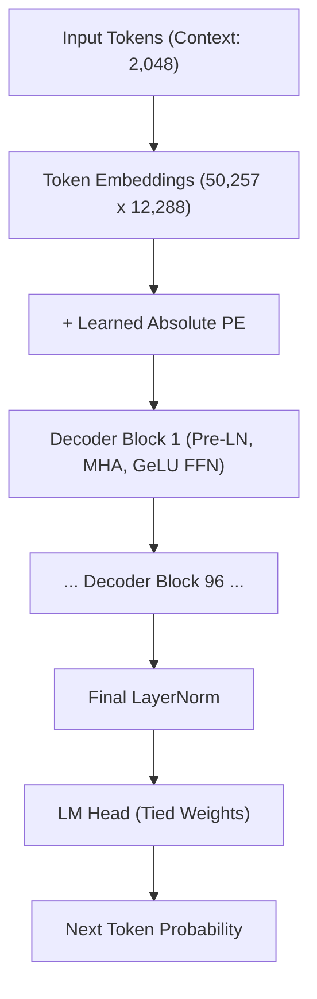

**Hyperparameter Scaling:**
*   **Layers ($L$):** 96
*   **Model Dimension ($d_{model}$):** 12,288
*   **Heads ($h$):** 96 (Head dimension $d_k = 128$)
*   **Feed-Forward Dimension ($d_{ff}$):** 49,152 (4x model dimension)
*   **Context Window:** 2,048 tokens
*   **Parameters:** 175 Billion
*   **Training Data:** 300 Billion tokens (filtered CommonCrawl, WebText2, Books1, Books2, Wikipedia)

### 5. Systems Engineering: Distributed Training
GPT-3 was too large to fit on a single GPU. A single forward pass required terabytes of VRAM for weights and activations. OpenAI had to pioneer advanced distributed training techniques to make GPT-3 possible.

1.  **Tensor Parallelism (Megatron-LM style):** Individual weight matrices were sliced horizontally across GPUs. If $d_{model} = 12,288$ and 8 GPUs are used, each GPU holds a $1,536 \times 12,288$ slice of the matrix. After computing their local part of the matrix multiplication, the GPUs communicate via `All-Reduce` to stitch the result back together. 
2.  **Pipeline Parallelism:** The 96 layers were split across different GPUs. GPU 1 computed layers 1-12, passed the activations to GPU 2 for layers 13-24, etc. To prevent GPUs from idling while waiting for data, the system used "micro-batching"—processing multiple small batches simultaneously to keep the pipeline full.

### 6. Memory & FLOPs Analysis
*   **Weight Memory:** In FP16 (2 bytes per parameter), GPT-3's 175B parameters require **350 GB** of VRAM just to store the model. An NVIDIA V100 GPU only has 32GB of VRAM, requiring a minimum cluster of 16 GPUs just to load the model.
*   **Compute (Training):** Training GPT-3 consumed an estimated 3.14 × 10^23 FLOPs (~3,640 PetaFLOP/s-days).
*   **Compute (Inference):** Generating a *single* token requires passing the input through all 96 layers, activating all 175B parameters. This means every single token generation costs $\approx 350$ GFLOPs. 

### 7. The "Dense" Bottleneck (The Catalyst for MoE)
GPT-3 highlighted the fundamental flaw of dense models: **inference cost.**
If you ask GPT-3 "What is 2+2?", the model routes the signal through 96 layers of GeLU FFN and Multi-Head Attention, activating all 175 billion parameters, even though a 1-billion parameter model could easily answer the question. 

This extreme inference cost made GPT-3 API highly expensive and slow. It proved that simply stacking more dense layers was financially unviable. This realization directly motivated the industry's transition to **Mixture of Experts (MoE)** architectures (like GPT-4 and DeepSeek), where only a fraction of the parameters are activated per token, and the intense focus on **KV-cache memory optimizations** (like GQA and MLA).

### 8. Architecture Diff: GPT-2 vs GPT-3
**Changed:**
- [x] **Scale:** 1.5B parameters → 175B parameters (100x increase)
- [x] **Context Window:** 1,024 tokens → 2,048 tokens
- [x] **Training Data:** WebText (~40GB) → 300B tokens (~570GB filtered text)
- [x] **Training System:** Single-node training → Multi-node Tensor + Pipeline Parallelism

**Same (No architectural innovations):**
- [x] Pre-LayerNorm (Volume knob *before* the room)
- [x] GeLU Activation in FFN
- [x] Learned Absolute Positional Embeddings
- [x] Multi-Head Attention (MHA)
- [x] Byte-level BPE Tokenizer

---
## Chapter 4: Chinchilla (2022) & The Compute-Optimal Scaling Laws

### 1. Executive Summary
DeepMind’s Chinchilla was not a novel neural network architecture; it was a mathematical proof that fundamentally changed how all subsequent architectures are trained. Released in 2022, it proved that existing large language models like GPT-3 were severely "undertrained" for their size. By demonstrating the "Compute-Optimal Scaling Laws," Chinchilla established the golden rule of modern AI: **you need approximately 20 training tokens for every 1 parameter in the model.** This realization killed the race for 1-Trillion parameter dense models and directly paved the way for highly efficient architectures like LLaMA.

### 2. Historical Context
Following the release of GPT-3 (175B parameters) in 2020, the AI industry adopted a simple philosophy: "bigger is better." Labs began training massive dense models, culminating in NVIDIA's Megatron-Turing NLG (530B params) and Google's Gopher (280B params). 

However, researchers at DeepMind noticed a problem: while these massive models performed better on benchmarks, they did not improve proportionally to the massive increase in compute required to train and run them. DeepMind hypothesized that the field was scaling model width and depth far too aggressively, while neglecting the volume of training data. 

### 3. Paper Summary
*   **Authors:** Jordan Hoffmann, Sebastian Borgeaud, Arthur Mensch, et al.
*   **Institution:** DeepMind.
*   **Publication:** 2022.
*   **Links:** [arXiv:2203.15556](https://arxiv.org/abs/2203.15556) (Published as "Training Compute-Optimal Large Language Models")

### 4. The Scaling Laws (Compute-Optimal)
DeepMind trained over 400 different language models, ranging from 70 million to 16 billion parameters, on datasets ranging from 5 billion to 500 billion tokens. They measured the validation loss for each to find the optimal allocation of a fixed compute budget $C$.

**The Formula:**
For a fixed compute budget $C$ (in FLOPs), the optimal number of parameters ($N$) and optimal number of training tokens ($D$) should scale equally:
$$N_{opt} \propto C^{0.5}$$
$$D_{opt} \propto C^{0.5}$$

**The Rule of Thumb (The Chinchilla Ratio):**
To achieve compute-optimal training, a model requires approximately **20 tokens per parameter**. 

**The Problem with GPT-3:**
*   GPT-3 had 175 Billion parameters but was trained on only 300 Billion tokens.
*   This is a ratio of roughly **1.7 tokens per parameter**.
*   GPT-3 was massively over-parameterized and severely undertrained. 

### 5. The Chinchilla Model
To prove their theory, DeepMind trained Chinchilla, a 70 Billion parameter model, on 1.4 Trillion tokens (exactly the 20:1 ratio).

*   **Architecture:** Chinchilla used the same decoder-only Transformer block as Gopher (Pre-LayerNorm, MHA, GeLU). The architecture itself was standard; the *training regime* was the innovation.
*   **Parameters:** 70B
*   **Training Data:** 1.4 Trillion tokens (extracted from MassiveText, a 2.335 trillion token dataset).
*   **Compute Budget:** Chinchilla used the exact same compute budget as Gopher (280B params trained on 300B tokens).

### 6. Memory & FLOPs Analysis
**The Inference Revolution:**
Chinchilla outperformed Gopher (280B) and GPT-3 (175B) on almost every benchmark. This had massive architectural implications:
*   **Inference Compute:** Generating a token with GPT-3 requires passing through 175 Billion parameters. Generating a token with Chinchilla requires passing through only 70 Billion parameters.
*   **Inference Memory:** GPT-3 requires ~350 GB of VRAM (FP16). Chinchilla requires ~140 GB of VRAM.
*   **Result:** Chinchilla provided *better* performance than GPT-3 while cutting inference compute and memory costs by more than half.

### 7. The Catalyst for Efficiency
Chinchilla fundamentally altered the architecture landscape in three ways:
1.  **Death of the Trillion-Parameter Dense Model:** It proved that building a 1-Trillion parameter dense model would require 20 Trillion tokens of data—a scale of data curation that was (and still is) practically impossible to achieve with high-quality text. 
2.  **The Rise of LLaMA:** Meta took the Chinchilla paper and applied it rigorously. They built LLaMA (2023) in several sizes (7B, 13B, 33B, 65B) and trained them all on 1.4 Trillion to 2 Trillion tokens. LLaMA proved that a 7B model trained compute-optimally could rival GPT-3.
3.  **Focus on Data Quality:** Because the 20:1 ratio meant models needed 10x more data than previously thought, labs stopped scraping the web blindly and started heavily filtering, deduplicating, and curating training data to ensure the 20 tokens per parameter were actually high-quality.

### 8. Architecture Diff: GPT-3 (2020) vs Chinchilla (2022)
**Changed:**
- [x] **Training Ratio:** ~1.7 tokens/param (GPT-3) → 20 tokens/param (Chinchilla)
- [x] **Scale Philosophy:** Maximize parameters (GPT-3) → Maximize data quality/volume (Chinchilla)
- [x] **Optimizer:** AdamW with modified $\beta_2 = 0.95$ (Chinchilla used a slightly different schedule).

**Same:**
- [x] Decoder-only Transformer block
- [x] Pre-LayerNorm
- [x] GeLU Activation in FFN
- [x] Multi-Head Attention (MHA)

---
## Chapter 5: LLaMA 1 (2023) & The Modern Dense Block

### 1. Executive Summary
Meta’s LLaMA 1 democratized frontier AI. Released in February 2023, it proved that by rigorously applying the Chinchilla scaling laws and optimizing the internal architecture for inference efficiency, a 65B parameter model could rival GPT-3 (175B). LLaMA consolidated years of fragmented research into a single, standardized "modern dense block"—replacing LayerNorm with RMSNorm, Absolute Positional Encoding with RoPE, and GeLU with SwiGLU. This exact block layout became the blueprint for almost every subsequent open-source model (Mistral, Qwen, DeepSeek).

### 2. Historical Context
Following Chinchilla (2022), the industry knew that data scale mattered more than parameter scale. However, models like GPT-3 and Chinchilla were closed-source. Meta released LLaMA 1 (7B, 13B, 33B, 65B) as open-weights (for research). The architectural goal was to create a model that could run on a single consumer GPU (e.g., an RTX 3090 or Apple M1) using 4-bit quantization, without sacrificing GPT-3 level intelligence. To achieve this, they stripped out every computationally expensive component that didn't directly improve performance.

### 3. Paper Summary
*   **Authors:** Hugo Touvron, Thibaut Lavril, Gautier Izacard, et al.
*   **Institution:** Meta AI.
*   **Publication:** February 2023.
*   **Links:** [arXiv:2302.13971](https://arxiv.org/abs/2302.13971)

### 4. Complete Architecture
LLaMA kept the decoder-only, Pre-Norm residual structure of GPT-2/3, but completely overhauled the internal components of the block.

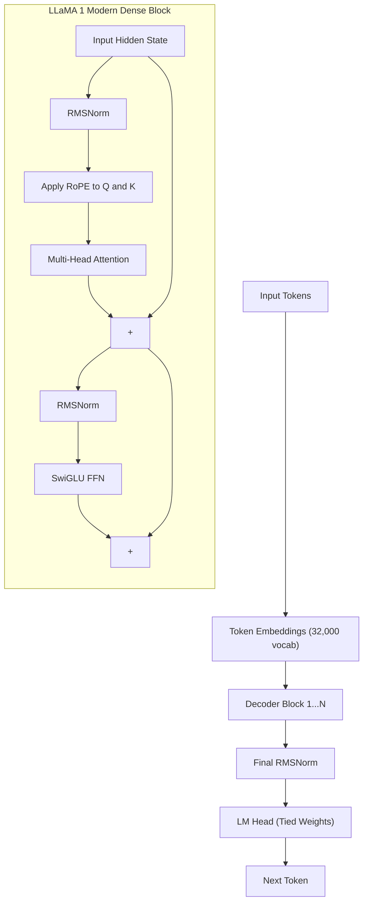

### 5. The LLaMA Stack: Architectural Updates
LLaMA 1 introduced three critical algorithmic changes that define the modern standard.

#### 5.1 RMSNorm (Root Mean Square Norm)
Replaced standard LayerNorm.
*   **Math:** $\text{RMSNorm}(x) = \frac{x}{\sqrt{\frac{1}{d}\sum_{i=1}^d x_i^2 + \epsilon}} \odot \gamma$
*   **Engineering Impact:** Drops the mean subtraction ($-\mu$) and the bias parameter ($\beta$). While computationally tiny (<1% of FLOPs), it reduces the memory bandwidth bottleneck (reading $\mu$ and $\beta$ from HBM). In memory-bound inference regimes, this makes the model 10-30% faster than LayerNorm.

#### 5.2 RoPE (Rotary Position Embedding)
Replaced Learned Absolute Positional Embeddings.
*   **The Problem:** GPT-2/3 used a learned vector for "Position 1", "Position 2", etc. If the model was trained on 2,048 tokens, it literally had no weights to process token 2,049. It could not extrapolate.
*   **The Math:** RoPE treats the Query ($Q$) and Key ($K$) vectors as pairs of complex numbers. It rotates them by an angle $\theta = m \cdot 10000^{-2i/d}$ based on their absolute position $m$. The magic is that the dot product of $Q_m$ and $K_n$ depends *only* on the relative angle $m - n$. The model inherently understands distance without storing absolute positions.
*   **Engineering Impact:** Allowed LLaMA to "extrapolate" to context windows longer than it was trained on. LLaMA 1 was trained on 2K context but could be extended to 8K via NTK-aware scaling.

#### 5.3 SwiGLU Activation
Replaced GeLU in the Feed-Forward Network.
*   **Math:** $\text{SwiGLU}(x) = (\text{Swish}(xW) \otimes xV)W_2$
*   **How it works:** Standard FFN has two weight matrices. SwiGLU adds a third "Gatekeeper" matrix ($V$). The network calculates the logic ($\text{Swish}(xW)$), but multiplies it by the gate ($xV$). If the gate outputs 0, the logic is blocked. If 1, it passes.
*   **Engineering Impact:** Gating allows the model to dynamically suppress or pass features, acting as a soft router within the dense FFN. To keep the total parameter count identical to a standard ReLU FFN, the hidden dimension $d_{ff}$ was reduced by a factor of $2/3$ (from $4d$ to $2.66d$).

#### 5.4 Removed Bias Terms
Set all bias parameters in Linear layers (Attention projections, FFN) to 0. This saved parameters and slightly improved numerical stability during quantization.

### 6. Hyperparameter Scaling & Memory
*   **Data:** Trained on 1.0 to 1.4 Trillion tokens (mostly CommonCrawl, C4, Github, Wikipedia). Strictly adhered to the Chinchilla 20:1 ratio.
*   **Context Window:** 2,048 tokens.
*   **Memory (65B model):** In FP16, the weights require ~130 GB of VRAM. However, because the architecture was clean and bias-free, it responded perfectly to 4-bit quantization (GGUF format), allowing the 65B model to run in ~40 GB of RAM—making it accessible to hobbyists.

### 7. Architecture Diff: Chinchilla/GPT-3 vs LLaMA 1
**Changed:**
- [x] **Norm Type:** LayerNorm → RMSNorm
- [x] **Positional Encoding:** Learned Absolute → RoPE (Rotary)
- [x] **FFN Activation:** GeLU → SwiGLU (3 matrices instead of 2)
- [x] **Bias Terms:** Present → Removed
- [x] **Training Ratio:** ~1.7-1.7 tokens/param → 20 tokens/param (Chinchilla optimal)

**Same:**
- [x] Decoder-only architecture
- [x] Pre-Norm residual structure (the bypass pipe)
- [x] Multi-Head Attention (MHA) *(LLaMA 1 still used standard MHA, not GQA)*

---
## Chapter 6: LLaMA 2 (2023) & The KV Cache Memory Wall

### 1. Executive Summary
While LLaMA 1 proved that small, well-trained dense models could rival GPT-3, it was a research artifact restricted to non-commercial use. LLaMA 2, released in July 2023, was Meta’s commercial pivot. However, to make the model viable for enterprise deployment (running on standard A100/H100 GPUs rather than massive clusters), Meta had to solve the "KV Cache Memory Wall." They achieved this by adopting **Grouped Query Attention (GQA)**, a mathematical compromise that slashed inference memory by up to 8x without sacrificing model quality.

### 2. Historical Context
In standard Multi-Head Attention (MHA), every one of the 64 heads has its own private Key (K) and Value (V) notepad. During autoregressive generation, the model must store the K and V vectors for *every past token* to compute attention for the next token. 

As context windows grew from 2K to 4K and beyond, this "KV Cache" became the absolute bottleneck. A LLaMA 1 65B model processing a 4,096-token batch would require ~171 GB of VRAM *just for the cache*—far exceeding an 80GB A100 GPU. The model would Out-Of-Memory (OOM) crash before it even started computing. 

In 2019, Noam Shazeer proposed **Multi-Query Attention (MQA)**, where all 64 heads shared just *1* Key and *1* Value. This slashed memory by 64x, but the model quality degraded severely because all heads were forced to look at the same "notepad." In 2023, Google proposed **Grouped Query Attention (GQA)**, the Goldilocks solution.

### 3. Paper Summary
*   **Authors:** Hugo Touvron, Louis Martin, Kevin Stone, et al.
*   **Institution:** Meta AI.
*   **Publication:** July 2023.
*   **Links:** [arXiv:2307.09288](https://arxiv.org/abs/2307.09288)

### 4. Complete Architecture
LLaMA 2 kept the exact same block as LLaMA 1 (Pre-RMSNorm, RoPE, SwiGLU, no bias). The *only* architectural change inside the block was the Attention mechanism.

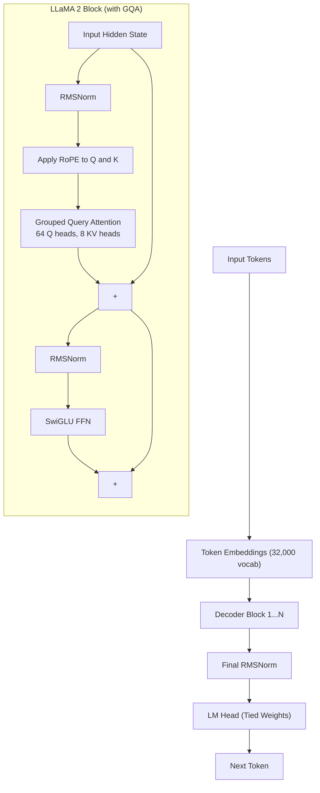

### 5. Algorithm Deep Dive: Grouped Query Attention (GQA)
GQA splits the Query heads into groups. Instead of 64 private KV heads (MHA) or 1 shared KV head (MQA), LLaMA 2 uses 8 KV heads. 8 Query heads share 1 KV head.

**The Memory Math (LLaMA 2 70B):**
*   **Layers:** 80
*   **Heads:** 64 (Query), 8 (Key/Value)
*   **Head Dimension:** 128
*   **Precision:** FP16 (2 bytes)
- **MHA (LLaMA 1) Memory per token:**
  $$
  2_{\mathrm{K\&V}}
  \times 80_{\mathrm{layers}}
  \times 64_{\mathrm{heads}}
  \times 128_{\mathrm{dim}}
  \times 2_{\mathrm{bytes}}
  = \mathbf{2.62\ MB/token}
  $$

- **GQA (LLaMA 2) Memory per token:**
  $$
  2_{\mathrm{K\&V}}
  \times 80_{\mathrm{layers}}
  \times 8_{\mathrm{heads}}
  \times 128_{\mathrm{dim}}
  \times 2_{\mathrm{bytes}}
  = \mathbf{327\ KB/token}
  $$
**The Impact:** An 8x memory reduction. The 171 GB VRAM requirement for a 4K batch drops to a manageable **21 GB**. 

**Quality Preservation:** Because there are still 8 distinct KV notepads (representing different linguistic features or concepts), the model retains 99% of MHA's representational capacity. The quality degradation of MQA is entirely avoided.

### 6. Post-Training & Safety (The Chat Models)
While LLaMA 1 was a base model, LLaMA 2 was heavily focused on alignment. Meta poured massive resources into the post-training pipeline for the "Chat" versions.
*   **Supervised Fine-Tuning (SFT):** Trained on high-quality instruction data.
*   **Rejection Sampling:** Generated thousands of responses, kept only the best ones, and retrained the model on them.
*   **RLHF (Reinforcement Learning from Human Feedback):** Used Proximal Policy Optimization (PPO) with two reward models (one for safety, one for helpfulness) to align the model's behavior.

### 7. Memory & FLOPs Analysis
*   **Compute Complexity:** GQA slightly reduces the FLOPs for the K and V projections (8x fewer matrices to multiply), but the dominant $QK^T$ and $SV$ computations remain $O(n^2 \cdot d)$. 
*   **Inference Throughput:** Because the KV cache is 8x smaller, the GPU spends significantly less time reading from HBM (VRAM). LLaMA 2 70B has roughly 2x the token generation throughput of LLaMA 1 65B on identical hardware.

### 8. Architecture Diff: LLaMA 1 vs LLaMA 2
**Changed:**
- [x] **Attention:** MHA (64 KV heads) → GQA (8 KV heads) *(The critical memory fix)*
- [x] **Context Window:** 2,048 tokens → 4,096 tokens (8K in some variants)
- [x] **Training Data:** 1.4T tokens → 2.0T tokens
- [x] **License:** Research-only → Commercial use permitted
- [x] **Post-Training:** Minimal → Heavy RLHF and Safety alignment for Chat versions

**Same:**
- [x] Pre-RMSNorm (Volume knob *before* the room)
- [x] RoPE (Rotary Position Embedding)
- [x] SwiGLU FFN (3 weight matrices, gatekeeper)
- [x] Dense architecture (no MoE)

---

# Volume II: The Efficiency & Sparse Era (2023–2024)
As dense models hit financial and physical walls, the industry pivoted to algorithmic efficiency. This volume covers Mistral's Sliding Window Attention, the open-source debut of Mixture of Experts (Mixtral), and the IO-aware memory revolution of FlashAttention. It reaches its climax with DeepSeek V2 and V3, which introduced Multi-Head Latent Attention (MLA) to compress the KV cache by 64x, and Multi-Token Prediction (MTP) to fundamentally change how models plan and generate text.
## Chapter 7: Mistral 7B (2023) & Sliding Window Attention (SWA)

### 1. Executive Summary
European startup Mistral AI proved that architectural finesse could beat raw scale. Released in September 2023, their 7B model outperformed LLaMA 2's 13B model on most benchmarks while using significantly less memory. They achieved this by introducing **Sliding Window Attention (SWA)**, an algorithmic tweak that transformed the $O(N^2)$ memory bottleneck of the attention matrix into an $O(N)$ footprint, allowing the model to process sequences of 8,000 to 32,000 tokens efficiently on standard hardware.

### 2. Historical Context
By mid-2023, the LLaMA 2 stack (Pre-RMSNorm, RoPE, SwiGLU, GQA) had become the open-source standard. However, context windows were still largely capped at 4K. While GQA solved the *KV cache memory* bottleneck for storing past tokens, it did not solve the *compute and activation memory* bottleneck of computing the attention matrix ($QK^T$) during the forward pass. For a 32K context window, computing standard attention requires materializing a $32,000 \times 32,000$ matrix in VRAM—about 4GB per layer per batch. Mistral AI realized that for most language tasks, a word only needs to look at its immediate surroundings, not the entire 32,000-word document.

### 3. Paper Summary
*   **Authors:** Albert Q. Jiang, Alexandre Sablayrolles, Arthur Mensch, et al.
*   **Institution:** Mistral AI.
*   **Publication:** September 2023.
*   **Links:** [arXiv:2310.06825](https://arxiv.org/abs/2310.06825)

### 4. Complete Architecture
Mistral 7B adopted the exact LLaMA 2 block but added SWA to the attention mechanism.

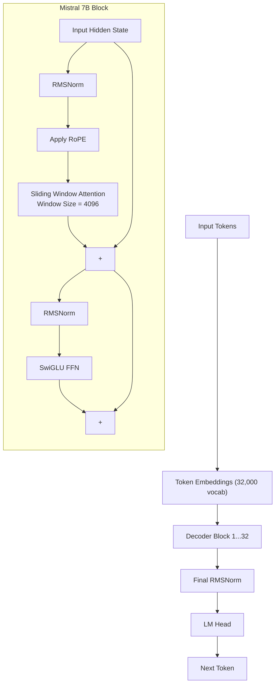

### 5. Algorithm Deep Dive: Sliding Window Attention (SWA)
Standard attention computes the dot product between a token and *every previous token* in the sequence. 

**SWA Solution:**
Mistral restricted each token to only looking at the previous **4,096 tokens**. 

**The Math:**
*   Standard Attention Compute: $O(N^2 \cdot d)$ where $N$ is the sequence length.
*   SWA Compute: $O(N \cdot w \cdot d)$ where $w$ is the window size (4,096).

**The "Shifted Window" Information Flow:**
A major concern with SWA is that a token in layer 1 can only see 4K tokens. How does the model understand a 32K document? 
*   **Layer 1:** Token at position 10,000 looks at tokens 5,904 to 10,000.
*   **Layer 2:** The output of Layer 1 (which already contains information from 5,904 to 10,000) is passed forward. Token 10,000 now attends to Layer 1 outputs from 5,904 to 10,000. But the Layer 1 output at position 5,904 contains information from 1,808 to 5,904.
*   **Result:** Even though a single layer can only see 4K tokens, information "bubbles up" through the residual stream. By Layer 8, a token has effectively processed the entire 32K context, but the compute cost remained linear.

**The Memory Impact:**
During the forward pass, the attention matrix $QK^T$ is no longer $N \times N$. It is a banded matrix of size $N \times w$. For a 32K context, the activation memory drops from 4GB per layer to ~500MB per layer.

### 6. Engineering & Tradeoffs
*   **Pros:** Massive reduction in compute and activation memory. Allows 32K context on a single 80GB A100.
*   **Cons:** SWA struggles with "needle in a haystack" tasks. If the crucial fact is at position 1, and the question is at position 31,000, the information must bubble up through 7+ layers without being diluted or overwritten. Standard full attention handles this better.
*   **FlashAttention Synergy:** SWA is highly compatible with FlashAttention. The tiling algorithm simply limits the $K, V$ blocks it loads into SRAM to only those within the window.

### 7. Memory & FLOPs Analysis
*   **Parameters:** 7.3 Billion.
*   **Active Compute:** Because it is a dense model, all 7.3B parameters are active per token.
*   **Context Window:** Natively trained at 8K, but SWA allows inference scaling to 32K without fine-tuning.
*   **KV Cache:** The KV cache size is capped. It does not grow infinitely with sequence length; it only ever stores the last 4,096 tokens per layer.

### 8. Architecture Diff: LLaMA 2 vs Mistral 7B
**Changed:**
- [x] **Attention Pattern:** Full Global Attention → Sliding Window Attention (SWA, window=4096)
- [x] **Scale:** 7B optimized to beat 13B (via better data curation and SWA efficiency)
- [x] **GQA Groups:** 8 KV heads (LLaMA 2) → 4 KV heads (Mistral, pushing sparsity slightly further)

**Same:**
- [x] Pre-RMSNorm
- [x] RoPE (Rotary Position Embedding)
- [x] SwiGLU FFN
- [x] Dense architecture (no MoE)

---
## Chapter 8: Mixtral 8x7B (2023) & The Open-Source Debut of Mixture of Experts

### 1. Executive Summary
In December 2023, Mistral AI released Mixtral 8x7B, the first truly successful, open-weights **Mixture of Experts (MoE)** language model. Mixtral proved that you could have 46.7 billion parameters of capacity, but only run 12.9 billion parameters per token. By doing so, it achieved GPT-3.5 level performance at the compute cost of a 13B dense model. This validated MoE as the definitive path forward for the open-source community, shifting the paradigm from "dense scaling" to "sparse routing."

### 2. Historical Context
GPT-3 (175B) proved that dense scaling worked, but it also proved that running 175B parameters per token was financially ruinous. Google’s Switch Transformer (2021) had experimented with Trillion-parameter MoE models, but they suffered from severe training instability and "expert collapse" (where the router sends all tokens to the same few experts). 

Mistral AI realized that the Feed-Forward Network (FFN)—which makes up 65% of a Transformer block's parameters—was being wasted. A dense FFN uses all its weights to process a math token, a French token, and a coding token. Mistral hypothesized that if they split the FFN into 8 parallel "experts," the model could dynamically route tokens to the specialists that needed them, leaving the other 6 experts dark.

### 3. Paper Summary
*   **Authors:** Albert Q. Jiang, Alexandre Sablayrolles, Arthur Mensch, et al.
*   **Institution:** Mistral AI.
*   **Publication:** December 2023.
*   **Links:** [arXiv:2401.04088](https://arxiv.org/abs/2401.04088)

### 4. Complete Architecture
Mixtral kept the exact same block as Mistral 7B (Pre-RMSNorm, RoPE, SwiGLU, SWA). The *only* component that changed was the FFN layer, which was replaced by an MoE layer.

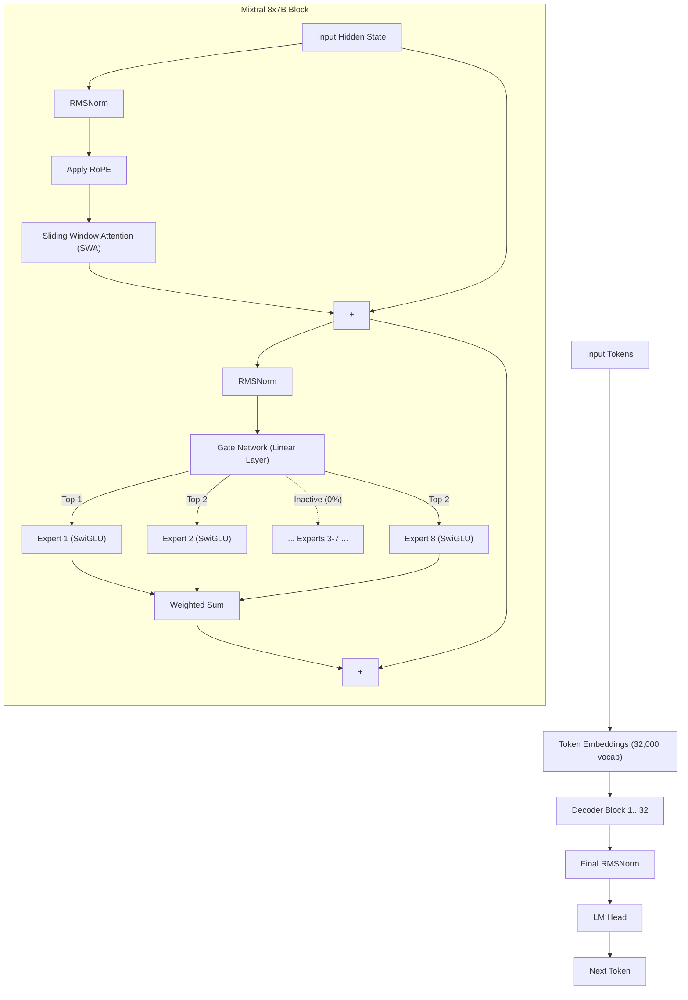

### 5. Algorithm Deep Dive: Sparse MoE Routing
In a dense model, the SwiGLU FFN is a single block of weights. Mixtral replaces this with 8 parallel SwiGLU networks (Experts).

**The Router (Gate Network):**
When a token enters the FFN layer, it passes through a tiny linear classifier. 
$$\text{Scores} = \text{Softmax}(\text{Top-2}(x \cdot W_{gate}))$$

1.  The token vector $x$ is multiplied by the router weight matrix $W_{gate}$.
2.  This produces 8 logits (one for each expert). 
3.  A Softmax is applied to turn these into probabilities.
4.  The model selects the **Top-2** experts with the highest scores.
5.  The token is processed by both selected experts. Their outputs are added together, weighted by the router's confidence. The other 6 experts stay dark and use zero electricity.

### 6. The Load Balancing Problem
The biggest challenge with MoE is "Expert Collapse." If the router accidentally sends 80% of tokens to Expert 1 (e.g., because it handles basic English well), Expert 1 becomes heavily trained, while the other 7 starve and learn nothing.

**The Solution (Auxiliary Loss):**
Mixtral uses a standard auxiliary loss penalty. At the end of every forward pass, the system calculates the fraction of tokens sent to each expert ($f_i$) and the average router probability for each expert ($P_i$). If the distribution is highly skewed, the auxiliary loss increases, applying a mathematical penalty that forces the router to distribute tokens more evenly in the future.
$$L_{aux} = \alpha \cdot N \cdot \sum_{i=1}^N f_i \cdot P_i$$

### 7. Memory & FLOPs Analysis
This is where MoE fundamentally changes the economics of AI.

*   **Total Parameters:** 46.7 Billion. (8 experts × SwiGLU weights + shared Attention layers).
*   **Active Parameters:** 12.9 Billion. (Only 2 experts active per token + shared Attention layers).
*   **VRAM Memory (The Trade-off):** To run Mixtral, you must load all 46.7B parameters into VRAM. In FP16, this requires ~90 GB of VRAM (larger than a single 80GB A100). MoE models are *memory-heavy*.
*   **Compute FLOPs (The Win):** Generating a single token only requires the matrix multiplications of 12.9B parameters. Mixtral has the inference latency and compute cost of a 13B dense model, but the intelligence of a 45B+ model.

### 8. Architecture Diff: Mistral 7B vs Mixtral 8x7B
**Changed:**
- [x] **FFN Layer:** Dense SwiGLU → 8 Expert SwiGLUs (Top-2 routing).
- [x] **Parameter Count:** 7B total → 46.7B total.
- [x] **Active Compute:** 7B active → 12.9B active.
- [x] **Context Window:** 8K (native) → 32K (native).
- [x] **Training Loss:** Standard Next-Token Prediction → NTP + Auxiliary Load Balancing Loss.

**Same:**
- [x] Sliding Window Attention (SWA)
- [x] Grouped Query Attention (GQA)
- [x] Pre-RMSNorm, RoPE
- [x] Byte-level BPE Tokenizer

---
## Chapter 9: FlashAttention (2022–2024) & The IO-Aware Memory Revolution

### 1. Executive Summary
FlashAttention is not a neural network architecture; it is an algorithmic rewrite of the exact attention mechanism. Released by Stanford researchers in 2022, it solved the $O(N^2)$ memory bottleneck of the attention matrix. By mathematically tiling the computation and using an "online softmax" trick, FlashAttention computes exact attention without ever materializing the massive $N \times N$ matrix in slow GPU memory. This single algorithm provided a 2-4x speedup and 5-20x memory reduction, making 100K+ context windows physically possible on modern GPUs. Without FlashAttention, models like LLaMA 3 (128K context) and Gemini (2M context) would not exist.

### 2. Historical Context: The GPU Memory Wall
By 2022, models were growing to 50B+ parameters, and researchers wanted context windows larger than 4K. However, standard attention faced a hard physical limit: the GPU memory hierarchy.

A GPU has two main memory pools:
1.  **HBM (High Bandwidth Memory / VRAM):** Large (80GB on A100) but relatively slow (~2 TB/s).
2.  **SRAM (Shared Memory / L1 Cache):** Tiny (164 KB per Streaming Multiprocessor) but blazingly fast (~19 TB/s).

**The Problem with Standard Attention:**
To compute attention, the model writes an $N \times N$ matrix ($S = QK^T$) to HBM. For a 16K context, this matrix is 1GB. For 128K, it is 64GB. The GPU would spend 90% of its time just moving this massive matrix back and forth between HBM and SRAM to apply the Softmax and multiply by $V$. The compute cores (Tensor Cores) sat idle, starved for data. This is known as being **memory-bandwidth bound**.

### 3. Paper Summary
*   **FlashAttention-1:** Tri Dao, Daniel Y. Fu, et al. (Stanford). NeurIPS 2022. [arXiv:2205.14135](https://arxiv.org/abs/2205.14135)
*   **FlashAttention-2:** Tri Dao. 2023. [arXiv:2307.08691](https://arxiv.org/abs/2307.08691)
*   **FlashAttention-3:** Jay Shah, et al. (Google/Stanford). 2024. [arXiv:2407.08608](https://arxiv.org/abs/2407.08608)

### 4. Algorithm Deep Dive: Tiling and Online Softmax
FlashAttention rewrites the attention algorithm to be "IO-aware"—meaning it explicitly manages how data moves between HBM and SRAM. It uses two mathematical tricks: **Tiling** and **Online Softmax**.

#### Trick 1: Tiling
Instead of loading all of $Q$, $K$, and $V$ into HBM at once, FlashAttention loads tiny blocks (tiles) of $Q$, $K$, and $V$ into ultra-fast SRAM. It computes the attention for that specific block entirely inside SRAM, and only writes the final output back to HBM. The massive $N \times N$ matrix is never written to HBM.

#### Trick 2: Online Softmax (The Magic)
The challenge with tiling is Softmax. Standard Softmax requires the *entire row* of the attention matrix to compute the denominator ($\sum \exp(S_i)$). If we only have one tile in SRAM, how do we compute the full Softmax?

FlashAttention uses an incremental, running calculation:
1.  Load a block of $Q$ and $K$ into SRAM. Compute local scores $S_{block} = Q_{block} K_{block}^T$.
2.  Find the local maximum ($m_{block}$).
3.  Compute the local exponential sum ($l_{block} = \sum \exp(S_{block} - m_{block})$).
4.  Load the next block. Update the running maximum: $m_{new} = \max(m_{old}, m_{block})$.
5.  Rescale the old running sum to match the new maximum: $l_{new} = e^{m_{old} - m_{new}} l_{old} + l_{block}$.
6.  Update the output $O$ incrementally.

**Pseudocode (Simplified):**
```python
def flash_attention(Q, K, V, block_size):
    # Initialize running stats
    O = zeros(N, d)
    m = full(N, -inf) # Running max
    l = zeros(N)      # Running sum

    for i in range(0, N, block_size): # Tile over Queries
        Qi = Q[i:i+block_size]
        Oi = zeros(block_size, d)
        mi = full(block_size, -inf)
        li = zeros(block_size)

        for j in range(0, N, block_size): # Tile over Keys/Values
            Kj = K[j:j+block_size]
            Vj = V[j:j+block_size]

            # 1. Compute block scores
            Sij = Qi @ Kj.T 
            mij = rowmax(Sij)
            lij = rowsum(exp(Sij - mij))

            # 2. Update running max and sum (Online Softmax)
            mi_new = max(mi, mij)
            li_new = exp(mi - mi_new) * li + exp(mij - mi_new) * lij

            # 3. Update output (rescale old, add new)
            Oi = (exp(mi - mi_new) * li * Oi + exp(mij - mi_new) * (exp(Sij - mij) @ Vj)) / li_new

            mi = mi_new
            li = li_new

        O[i:i+block_size] = Oi
    return O
```

### 5. Visualizing the Data Flow

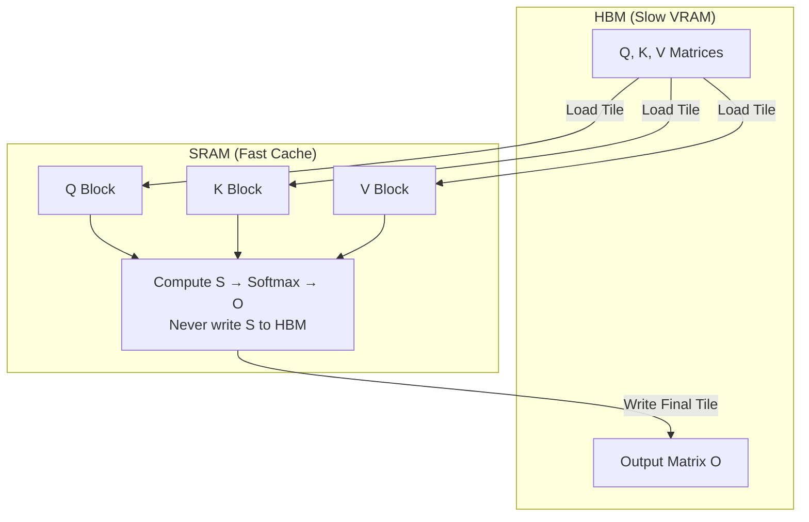

### 6. Evolution: FA-1, FA-2, FA-3
*   **FlashAttention-1 (2022):** Introduced tiling and online softmax. Reduced HBM reads/writes from $O(N^2)$ to $O(N^2 d / M)$ where $M$ is SRAM size. 
*   **FlashAttention-2 (2023):** Optimized the work partitioning. FA-1 was poorly balanced between GPU threads. FA-2 reduced non-matrix-multiplication FLOPs, achieving ~2x speedup over FA-1.
*   **FlashAttention-3 (2024):** Designed specifically for NVIDIA Hopper (H100) GPUs. Uses **Warp Specialization** (assigning different GPU threads to do matrix multiplication while others do the softmax rescaling simultaneously) and **FP8 Tensor Cores** (e4m3 format). Achieves ~1.5x speedup over FA-2.

### 7. Memory & FLOPs Analysis
*   **Compute Complexity:** Still $O(N^2 \cdot d)$. FlashAttention does the *exact same number of mathematical operations* as standard attention. 
*   **Memory Complexity (HBM):** Reduced from $O(N^2)$ to $O(N)$. The massive $N \times N$ attention matrix is never materialized in VRAM.
*   **Wall-Clock Time:** Because compute cores are no longer starved for data, the actual time to execute attention drops by 2-4x. 

### 8. Architecture Diff: Standard Attention vs FlashAttention
**Changed:**
- [x] **Memory Footprint:** $O(N^2)$ HBM → $O(N)$ HBM.
- [x] **Execution Pattern:** Materialize full $QK^T$ matrix → Block-wise tiling in SRAM.
- [x] **Softmax Calculation:** Full-row dependent → Online/Incremental running stats.
- [x] **Precision Support:** FP16 (Standard/FA-1) → FP8 (FA-3).

**Same:**
- [x] **Mathematical Result:** The output matrix $O$ is mathematically identical to standard attention (no approximation).
- [x] **Learnable Parameters:** None. FlashAttention is a drop-in replacement for the attention function.

---
## Chapter 10: DeepSeek V2 (2024) & Multi-Head Latent Attention (MLA)

### 1. Executive Summary
While LLaMA 2's GQA and Mistral's SWA made 4K to 32K contexts manageable, the industry hungered for 128K+ context windows to process entire codebases and books. Even with GQA, a 128K context window consumed 30+ GB of VRAM, crashing standard GPUs. DeepSeek V2 (released May 2024) solved this by introducing **Multi-Head Latent Attention (MLA)**, a mathematical breakthrough that compressed the KV cache by 64x. By "zipping" the Keys and Values into a tiny latent vector, MLA made 128K context commercially viable. DeepSeek V2 also refined Mixture of Experts with **fine-grained experts** and **shared experts**, setting the architectural standard for the modern frontier.

### 2. Historical Context
By 2024, the AI industry realized that the KV Cache was the ultimate enemy of scale. 
*   **MHA (GPT-3):** 64 private KV notepads per token. Massive memory.
*   **MQA (PaLM):** 1 shared KV notepad. Low memory, but degraded quality.
*   **GQA (LLaMA 2):** 8 shared KV notepads. A good compromise, but 128K context still required tens of gigabytes of VRAM.

DeepSeek approached the problem from a different angle: **Low-Rank Compression**. Instead of forcing heads to share the same notepad (which reduces the diversity of information), what if we compressed the notepad itself into a tiny "ZIP file"? 

### 3. Paper Summary
*   **Authors:** DeepSeek-AI.
*   **Publication:** May 2024.
*   **Links:** [arXiv:2405.04434](https://arxiv.org/abs/2405.04434)

### 4. Complete Architecture
DeepSeek V2 is a massive Mixture-of-Experts model (236B total, 21B active). It uses the standard Pre-RMSNorm and RoPE, but completely replaces the Attention and FFN layers with MLA and DeepSeekMoE.

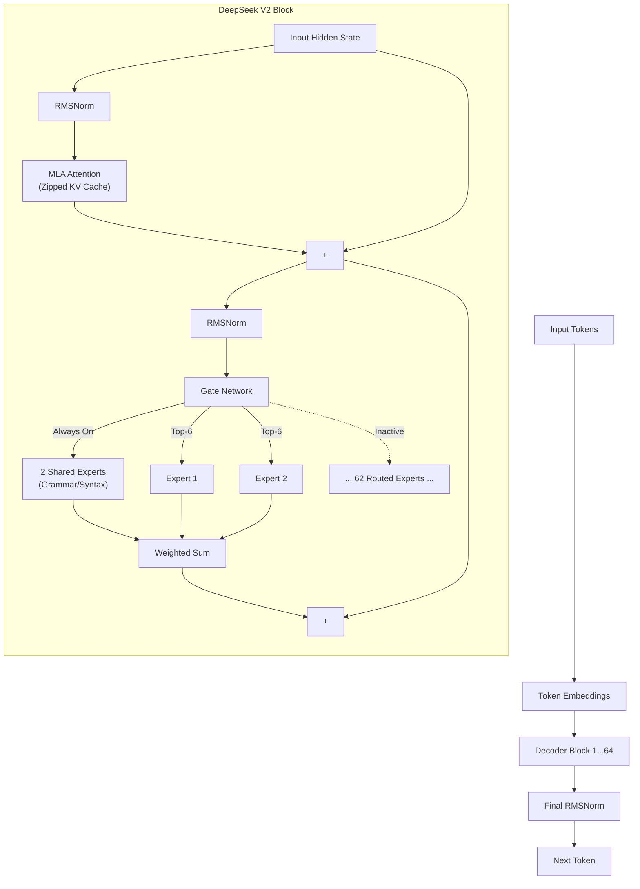

### 5. Algorithm Deep Dive: Multi-Head Latent Attention (MLA)
MLA doesn't just share notepads (GQA); it *compresses* the notepad into a tiny file.

**The Compression Math:**
1.  **Down-Projection:** Instead of computing massive $K$ and $V$ matrices, MLA projects the hidden state $x$ down into a tiny "latent vector" $c_{KV}$.
    $$c_{KV} = W^{DKV} x \quad \text{(Dimension: e.g., 512)}$$
2.  **The Cache:** **Only $c_{KV}$ (512 floats) is stored in the KV cache.** 
3.  **Up-Projection:** During the attention computation, $K$ and $V$ are reconstructed on-the-fly via up-projection matrices:
    $$k = W^{UK} c_{KV}, \quad v = W^{UV} c_{KV}$$

**The Memory Impact (DeepSeek V2):**
DeepSeek V2 uses 64 layers, 128 heads, and a head dimension of 128.
- **Standard MHA Memory per token:**  
  $2 \text{ (K\&V)} \times 64 \text{ (layers)} \times 128 \text{ (heads)} \times 128 \text{ (dim)} \times 2 \text{ (bytes)} = \mathbf{4.2}\,\mathrm{MB/token}$.
*   **MLA Memory per token:** $64 \text{ (layers)} \times 512 \text{ (latent dim)} \times 2 \text{ (bytes)} = \mathbf{65.5 \text{ KB per token}}$.
*   **Result:** A **64x memory reduction**. A 128K context window that would have required 540 GB of VRAM now requires only 8.5 GB.

### 6. Algorithm Deep Dive: DeepSeekMoE
Mixtral used 8 large experts, activating 2. DeepSeek V2 refined this with two innovations:

1.  **Fine-Grained Expert Segmentation:** Instead of 8 large experts, DeepSeek V2 uses 64 small experts, activating 6. This allows much finer specialization—one tiny expert might handle French grammar, another might handle Python loops.
2.  **Shared Expert Isolation:** DeepSeek reserves 2 experts that are *always on*. 
    *   *Why?* In Mixtral, if the router sent a basic English word to a specialized math expert, that expert wasted capacity processing basic English. The 2 Shared Experts handle universal grammar and syntax, freeing the routed experts to focus purely on specialized knowledge.

### 7. Memory & FLOPs Analysis
*   **Total Parameters:** 236B. **Active Parameters:** 21B.
*   **VRAM Memory:** Weights require ~470 GB in FP16. However, the KV cache is so small that long-context inference requires dramatically less total VRAM than LLaMA 3 70B at high context lengths.
*   **Compute FLOPs:** Generating a token only requires 21B parameters of compute, making it incredibly fast and cheap to run.

### 8. Architecture Diff: Mixtral vs DeepSeek V2
**Changed:**
- [x] **Attention:** GQA (Shared notepads) → MLA (Latent Compression / Zipped notepads) *(The 64x memory fix)*
- [x] **MoE Granularity:** 8 Large Experts (Top-2) → 64 Small Experts (Top-6)
- [x] **MoE Shared Experts:** None → 2 Shared Experts (Always on)
- [x] **Scale:** 46.7B total → 236B total

**Same:**
- [x] Pre-RMSNorm
- [x] RoPE (Rotary Position Embedding)
- [x] SwiGLU FFN (as the base function for each expert)

---

## Chapter 11: DeepSeek V3 (2024) & The Triumph of Algorithmic Efficiency

### 1. Executive Summary
Released in December 2024, DeepSeek V3 sent shockwaves through the AI industry. It scaled the V2 architecture to 671 billion parameters (37B active) and achieved GPT-4 level performance while training for a staggering **$5.5 million**—a fraction of the estimated $100M+ cost of GPT-4. DeepSeek V3 proved that algorithmic finesse could overcome hardware bottlenecks. It perfected **Aux-loss-free MoE routing**, introduced **Multi-Token Prediction (MTP)** to force the model to plan ahead, and became the first major frontier model to successfully train entirely in **FP8 precision**.

### 2. Historical Context
DeepSeek V2 (May 2024) proved that Multi-Head Latent Attention (MLA) and fine-grained MoE could solve the memory and compute bottlenecks of large models. However, V2 still used standard Next-Token Prediction (NTP) and BF16 precision. To compete with proprietary titans like GPT-4 and Claude 3.5, DeepSeek needed to squeeze maximum intelligence out of every compute cycle. They realized that standard NTP (predicting one word at a time) was computationally wasteful, and the standard MoE auxiliary loss was actively degrading model quality. 

### 3. Paper Summary
*   **Authors:** DeepSeek-AI.
*   **Publication:** December 2024.
*   **Links:** [arXiv:2412.19437](https://arxiv.org/abs/2412.19437) | [GitHub](https://github.com/deepseek-ai/DeepSeek-V3)

### 4. Complete Architecture
DeepSeek V3 is a massive decoder-only MoE model. It scales the V2 block to 61 layers and 7,168 dimensions, adding MTP heads and an FP8 execution graph.

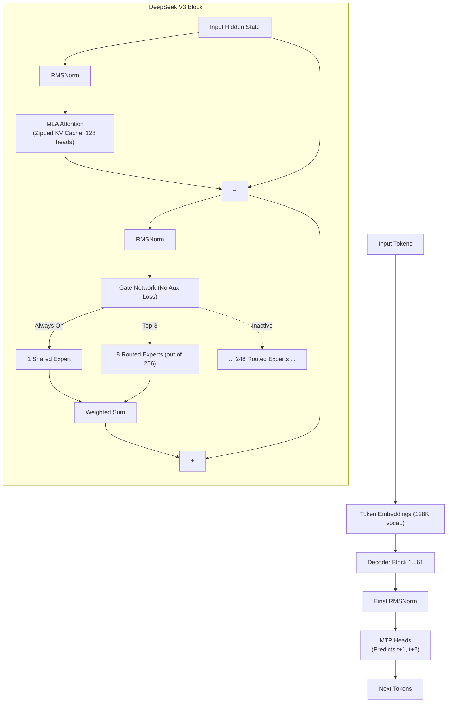

### 5. Algorithm Deep Dive: Multi-Token Prediction (MTP)
Standard LLMs train by predicting the next token: given "The cat", predict "sat". This is computationally wasteful because the model only gets one training signal per forward pass, and it encourages "greedy" local logic rather than global planning.

**MTP Training:**
DeepSeek V3 adds extra prediction heads. Given "The cat", it simultaneously predicts:
*   Head 1: "sat" (t+1)
*   Head 2: "on" (t+2)

**Engineering Impact:** 
1.  **Training Efficiency:** The model gets 2x the training signal per token. This forces the hidden state to "plan ahead" internally, dramatically improving reasoning and coding benchmarks.
2.  **Inference Speed (Speculative Decoding):** During generation, the MTP heads act as a built-in "draft model." The model drafts 2 tokens, verifies them in parallel, and if correct, outputs both at once. This doubles inference latency speed without requiring a separate draft model.

### 6. Algorithm Deep Dive: Aux-loss-free Routing
In Mixtral (and V2), if the router sent all tokens to Expert 1, the other experts would starve. To fix this, MoE models add an "Auxiliary Loss" (a mathematical penalty) to force load balancing. But this penalty degrades the main training objective, lowering overall model quality.

DeepSeek V3 introduced **Aux-loss-free routing**. Instead of a penalty loss, it dynamically adjusts a "bias" term added to the routing scores. 
*   If an expert is overloaded, its bias is lowered.
*   If an expert is empty, its bias is raised.
*   **Crucially:** This bias term is *not* part of the gradient backpropagation. It ensures perfect load balancing (every expert gets exactly 12.5% of tokens) without degrading the model's intelligence.

### 7. Systems Engineering: FP8 Mixed Precision Training
DeepSeek V3 was the first major model to successfully train almost entirely in FP8 (8-bit floating point), halving VRAM requirements and doubling compute throughput compared to BF16.

**The Engineering Feat:**
FP8 is notoriously unstable because small rounding errors compound over 61 layers and cause gradient explosions. DeepSeek solved this by using a **Fine-Grained Quantization** scheme:
1.  **Tile-Wise Quantization:** Instead of scaling the whole matrix by one number, they broke matrices into tiny $128 \times 128$ tiles and scaled each individually.
2.  **Delayed Scaling:** They delayed the scaling factor calculation by a few steps to smooth out anomalies.
This allowed them to train 671B parameters on just 2,048 H800 GPUs for 2.77 million GPU hours (~$5.5M).

### 8. Memory & FLOPs Analysis
*   **Total Parameters:** 671B. **Active Parameters:** ~37B.
*   **Weight Memory:** In FP8, the weights require ~670 GB of VRAM. 
*   **KV Cache (The MLA Advantage):** Despite being 671B parameters, the KV cache is tiny. At 128K context, the cache requires only ~8.5 GB per GPU.
*   **Compute FLOPs:** Training consumed 3.02 × 10^23 FLOPs. Generating a token requires only ~37B parameters of compute, making it 5x cheaper to run than dense models of equivalent intelligence.

### 9. Architecture Diff: DeepSeek V2 vs DeepSeek V3
**Changed:**
- [x] **Scale:** 236B total → 671B total (37B active)
- [x] **MoE Granularity:** 64 Experts (Top-6) → 256 Experts (Top-8) + 1 Shared Expert
- [x] **Training Objective:** NTP → NTP + MTP (Multi-Token Prediction)
- [x] **MoE Balancing:** Auxiliary Loss → Aux-loss-free bias routing *(Quality boost)*
- [x] **Precision:** BF16 → FP8 Mixed Precision *(Compute/Cost halved)*
- [x] **Vocabulary:** 100K → 128K tokens (better multilingual/code compression)

**Same:**
- [x] MLA (Multi-Head Latent Attention)
- [x] Pre-RMSNorm, RoPE
- [x] SwiGLU experts

---

# Volume III: The Agentic & Extreme-Scale Frontier (2025–2026)
This volume documents the push past 1 Trillion parameters. It covers Moonshot AI's Kimi K2, which used the Muon Optimizer and QK-Clip to solve 1T training instability, and Zhipu AI's GLM-5.2, which introduced IndexShare to make 1-Million token agentic contexts commercially viable. It also explores the Mamba/Hybrid revolution ($O(N)$ state space models) and concludes with the 2.8 Trillion parameter Kimi K3, the apex of scale and native multimodality.
## Chapter 12: Kimi K2 (2025) & The 1-Trillion Parameter Stability Problem

### 1. Executive Summary
Moonshot AI’s Kimi K2, released in July 2025, was the first model to successfully scale an open-weights Mixture-of-Experts (MoE) architecture past 1 Trillion parameters (1.04T total, 32B active). While DeepSeek V3 proved MoE could be highly efficient, Kimi K2 proved it could be scaled to previously untrainable heights. This was achieved not by brute force, but by abandoning the industry-standard AdamW optimizer in favor of a radical new approach: the **Muon Optimizer** paired with a mathematical shock absorber called **QK-Clip**.

### 2. Historical Context
By late 2024, the AI industry hit a hard physics wall: the "1-Trillion Parameter Barrier." When attempting to train models beyond 500B parameters using standard optimizers (like AdamW), the dot products inside the Attention mechanism ($QK^T$) grow exponentially. Once these logits exceed the floating-point limit (e.g., $65504$ in FP16/BF16), the model outputs `NaN` (Not a Number), and training permanently collapses. 

Standard fixes like Soft Capping (used by Gemma 2) or QK-Norm (used by DCLM) failed to contain this instability at the 1 Trillion parameter scale. Moonshot AI realized that the root cause was the optimizer itself. AdamW was too sample-inefficient, requiring massive amounts of data to converge, which increased the window of time for the math to explode.

### 3. Paper Summary
*   **Authors:** Yangzhilin Yang, et al. (Moonshot AI).
*   **Publication:** July 2025.
*   **Links:** [arXiv:2507.20534](https://arxiv.org/abs/2507.20534) | [GitHub](https://github.com/moonshotai/kimi-k2)

### 4. Complete Architecture
Kimi K2 scaled the DeepSeek V3 architecture to 1.04T parameters. It kept the MLA (Multi-Head Latent Attention) and Pre-RMSNorm stack, but massively expanded the MoE and completely overhauled the training algorithm.

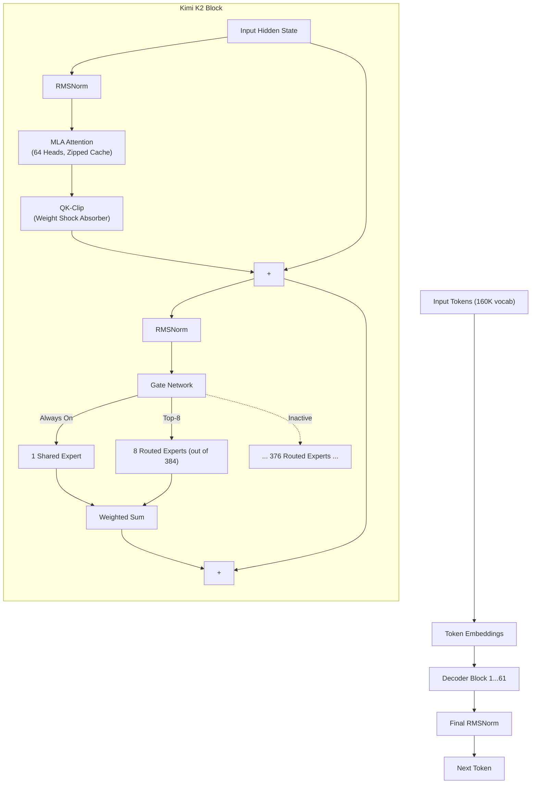

### 5. Algorithm Deep Dive: The Muon Optimizer & QK-Clip
This is the defining innovation of Kimi K2. It changed *how* the model learns, not *what* it is.

#### The Muon Optimizer
Muon (Newton-Schulz orthogonalization) replaces AdamW. 
*   **AdamW:** Updates weights based on running averages of gradients (first and second moments). It is simple but highly data-inefficient.
*   **Muon:** For 2D weight matrices (like Attention and FFN projections), Muon takes the gradient matrix and orthogonalizes it. This forces the weight updates to be perfectly orthogonal to each other, extracting maximum "intelligence" from every single token.
*   **The Problem:** Muon is highly aggressive. It learns so fast that the attention logits explode even quicker than with AdamW.

#### The QK-Clip Solution
Instead of putting a bandage on the output (Soft Capping) or normalizing the vectors (QK-Norm), QK-Clip acts as a physical shock absorber *at the root weight level*.
1. After each optimizer step, the algorithm inspects the Query and Key weight matrices ($W_q, W_k$).
2. It computes the Frobenius norm of the resulting attention logits.
3. If the norm exceeds a safe threshold $\tau$, it literally **rescales the weights down** to the safe boundary.
$$ \text{If } \|W_q W_k^T\|_F > \tau, \quad W_q \leftarrow W_q \cdot \sqrt{\frac{\tau}{\|W_q W_k^T\|_F}} $$
*   **Engineering Impact:** This hard, post-update clipping ensured Kimi K2 trained for 15.5 Trillion tokens with **zero loss spikes**, a feat previously considered impossible at 1T parameters.

### 6. Architecture Deep Dive
*   **Parameters:** 1.04T total, 32B active.
*   **Experts:** 384 routed experts (Top-8 selected) + 1 Shared Expert. (Up from DeepSeek V3's 256).
*   **Attention:** A hybrid of MLA (Multi-Head Latent Attention) and GQA. 64 heads (reduced from 128 for memory efficiency).
*   **Vocabulary:** 160K tokens (up from DeepSeek's 128K to better compress code and multilingual data).
*   **Context:** 128K → 256K.

### 7. Memory & FLOPs Analysis
*   **Weight Memory:** At 1.04T parameters, FP8 weights require ~1 TB of VRAM. Inference requires massive multi-node clusters (e.g., 16x H100 GPUs).
*   **Active Compute:** Generating a token only requires 32B parameters of compute. Despite being 1.5x larger than DeepSeek V3 in total capacity, it has roughly the same inference latency.
*   **KV Cache:** MLA limits the cache to ~130 KB per token, making the 256K context window physically possible.

### 8. Architecture Diff: DeepSeek V3 vs Kimi K2
**Changed:**
- [x] **Optimizer:** AdamW → Muon (with QK-Clip shock absorber) *(The critical 1T stability fix)*
- [x] **Scale:** 671B → 1.04T total params
- [x] **Experts:** 256 routed → 384 routed experts
- [x] **Attention Heads:** 128 → 64 (memory optimization)
- [x] **Vocabulary:** 128K → 160K
- [x] **Context:** 128K → 256K

**Same:**
- [x] MLA (Multi-Head Latent Attention for KV cache compression)
- [x] Aux-loss-free MoE routing
- [x] Pre-RMSNorm, RoPE
- [x] 1 Shared + Top-K Routed Expert design

---
## Chapter 13: GLM-4.5 & GLM-5.2 (2025–2026) & The 1-Million Token Agentic Frontier

### 1. Executive Summary
While Moonshot AI (Kimi K2) chased raw scale, Zhipu AI (z.ai) focused on **agentic efficiency**. Their goal was to build a model that could autonomously write, debug, and execute code for 8 hours straight without losing its train of thought. GLM-4.5 (Sept 2025) introduced **Sigmoid-gated MoE**, replacing competitive routing with independent expert activation. GLM-5.2 (June 2026) introduced **IndexShare**, a radical architectural tweak that solved the compute bottleneck of 1-Million token contexts, reducing FLOPs by 2.9x and making million-token coding commercially viable.

### 2. Historical Context
By 2025, the AI industry shifted from "chatbots" to "agents." Agents don't just answer questions; they read entire codebases, write files, run tests, and fix bugs over hours. 
*   **The Problem:** Even with MLA (Multi-Head Latent Attention) compressing the KV cache, computing attention across 1 Million tokens requires an "Indexer" to search for relevant past words. Running this search engine on every layer of a 100-layer model consumes too many FLOPs. The model would be too slow for real-time coding.
*   **The Solution:** GLM-5.2 realized that if Layer 1 searches for relevant words, Layers 2, 3, and 4 probably need the exact same words. They invented IndexShare to reuse search results across layers.

### 3. Release Summary
*   **GLM-4.5:** Zhipu AI, September 2025. [Z.ai Docs](https://docs.z.ai/guides/llm/glm-4.5) (355B total, 32B active).
*   **GLM-5.2:** Zhipu AI, June 2026. [Z.ai Blog](https://z.ai/blog/glm-5.2) (753B total, 40B active).

### 4. Complete Architecture
GLM-5.2 uses a Dense-Sparse-Alternating (DSA) layout. It interleaves layers that use standard attention with layers that use IndexShare Sparse Attention.

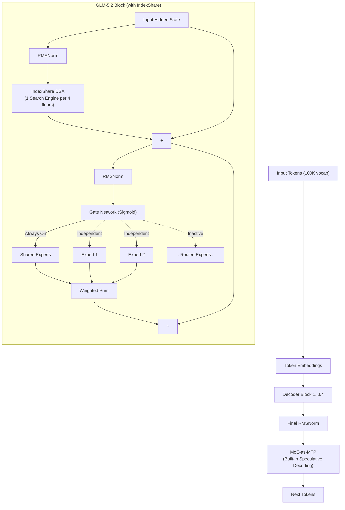

### 5. Algorithm Deep Dive: Sigmoid-Gated MoE (GLM-4.5)
Standard MoE (Mixtral, DeepSeek) uses Softmax for routing. Softmax forces a strict competition: if Expert A gets a probability of 0.9, Expert B must get 0.1. 

**The GLM Innovation:** GLM-4.5 replaced Softmax with **Sigmoid**. 
*   **Math:** $g(x) = \sigma(x \cdot W_g)$ (independent activation from 0 to 1).
*   **Why it matters:** Sigmoid allows independent activation. Expert A can be 0.9, and Expert B can also be 0.9. The model then selects the Top-K and renormalizes. This decouples the experts, making routing smoother and more sample-efficient.

### 6. Algorithm Deep Dive: MoE-as-MTP (GLM-4.5)
DeepSeek V3 added separate Multi-Token Prediction (MTP) heads. GLM-4.5 engineered the MoE layers themselves to predict future tokens.
*   **How it works:** The MoE layer processes token $t$ and outputs a hidden state. This hidden state is projected to predict token $t+1$. But because the MoE router already knows which experts are active, it uses those same active experts to predict token $t+2$.
*   **Impact:** Speculative decoding is built directly into the architecture. No extra parameters are needed for a draft model.

### 7. Algorithm Deep Dive: IndexShare for Dynamic Sparse Attention (GLM-5.2)
To process 1M tokens, models use Dynamic Sparse Attention (DSA). DSA uses an "Indexer" (a lightweight search network) to find the top-$k$ relevant past tokens for the current query. 

**The Problem:** Running this Indexer on all 64 layers takes too much compute. 
**The IndexShare Solution:** Group the floors into blocks of 4.
1.  **Floor 1:** Runs the Search Engine (Indexer). It creates a list of important word indices.
2.  **Floors 2, 3, and 4:** **Skip the search engine entirely.** They simply reuse Floor 1's index list to attend to the same relevant words.

**Pseudocode:**
```python
def indexshare_attention(x, layers, indexer):
    # layers[0]: compute indexer + sparse attention
    indices = indexer(x) # top-k indices for sparse attention
    x = sparse_attention(x, indices)
    
    # layers[1-3]: reuse indices
    for layer in layers[1:4]:
        x = sparse_attention(x, indices) # reuse same indices!
    return x
```

**Engineering Impact:** 2.9x reduction in FLOPs at 1M context. The model can read a 1-Million word codebase, and the "search engine" only runs 16 times instead of 64 times.

### 8. Memory & FLOPs Analysis
*   **Total Parameters:** 753B (GLM-5.2). **Active Parameters:** 40B.
*   **Context Window:** 1 Million tokens (genuinely usable for 8-hour agentic tasks).
*   **FLOPs Reduction:** IndexShare cuts the attention compute cost by 2.9x at 1M context compared to standard sparse attention.
*   **Throughput:** GLM-5.2 sustains 1,700+ autonomous agent steps without losing context coherence.

### 9. Architecture Diff: Kimi K2 vs GLM-5.2
**Changed:**
- [x] **MoE Routing:** Softmax (Competitive) → Sigmoid (Independent activation)
- [x] **Long Context:** Standard MLA → IndexShare DSA (Shared indexer per 4 layers)
- [x] **MTP:** Separate heads → MoE-as-MTP (Built into routing weights)
- [x] **Focus:** Raw scale (1T) → Agentic long-horizon efficiency (753B, 1M context)
- [x] **Scale:** 1.04T → 753B total params (more efficient, not just bigger)

**Same:**
- [x] Pre-RMSNorm, RoPE
- [x] Ultra-sparse MoE (massive total params, small active params)
- [x] Shared Expert architecture

---
## Chapter 14: The Mamba & Hybrid Revolution (2024–2025) & The $O(N)$ Challenge

### 1. Executive Summary
By 2024, the Transformer’s $O(N^2)$ attention mechanism hit a hard physical limit. Processing a 1-Million token document required quadratic compute and memory, making infinite context windows financially impossible. Enter **Mamba** (introduced late 2023, scaled in 2024), a **State Space Model (SSM)** that replaced photographic memory with a "running summary." Mamba achieved $O(N)$ time complexity and $O(1)$ inference memory. However, pure Mamba struggled with exact "needle in a haystack" retrieval. By 2025, the industry realized the ultimate solution was a **Hybrid Architecture**—interleaving Mamba layers for fast, compressed summarization with Transformer Attention layers for precise, photographic recall.

### 2. Historical Context
Transformers have "photographic memory." To answer a question about page 10, they look back at every word on every page. This is accurate but slow ($O(N^2)$). 
Recurrent Neural Networks (RNNs) of the 2010s kept a "running summary" (hidden state). They updated the summary word-by-word. This was fast ($O(N)$ time, $O(1)$ memory), but they forgot details and couldn't be parallelized on GPUs. 

In 2020, **Structured State Space Models (S4)** bridged the gap: they could be trained in parallel like Transformers but ran in linear time like RNNs. However, S4 used fixed math (like a static audio filter) and couldn't selectively ignore useless words. In 2023, Albert Gu and Tri Dao introduced **Mamba**, making the SSM "selective"—it learned to forget irrelevant words and remember important ones dynamically.

### 3. Paper Summary
*   **Mamba (Selective SSM):** Gu & Dao, Dec 2023. [arXiv:2312.00752](https://arxiv.org/abs/2312.00752)
*   **Mamba-2 (SSD):** Dao & Gu, May 2024. [arXiv:2405.21060](https://arxiv.org/abs/2405.21060)
*   **Jamba (Hybrid):** AI21 Labs, March 2024. [arXiv:2403.19887](https://arxiv.org/abs/2403.19887)
*   **Nemotron-H (Hybrid):** NVIDIA, April 2025.

### 4. Complete Architecture
A pure Mamba block looks very similar to a Transformer block (it has a norm, a projection, and a residual connection), but the Attention mechanism is replaced by a **Selective State Space Model**. A Hybrid model (like Nemotron-H) stacks them in an interleaved pattern.

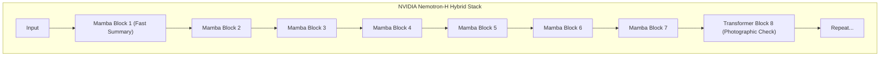

### 5. Algorithm Deep Dive: Selective State Space Models (Mamba)
Mamba maintains a compressed hidden state $h_t$. When a new word $x_t$ arrives, it updates the state and outputs a result $y_t$.

**The Math:**
$$h_t = \bar{A} h_{t-1} + \bar{B} x_t$$
$$y_t = C h_t$$
where $\bar{A}$ and $\bar{B}$ are discretized transition matrices.

**The Mamba Innovation (Selective Forgetting):**
Old SSMs had fixed $\bar{A}$ and $\bar{B}$. Mamba makes them *data-dependent*. 
*   If the model reads "The", it outputs a small $\Delta$ (step size), meaning $\bar{A} \approx 1$, and the state barely changes (it ignores the word).
*   If the model reads "Armageddon", it outputs a large $\Delta$. $\bar{A}$ shrinks toward 0, forcing the state to heavily integrate the new word.
*   *Analogy:* You are reading a book. You skim over "the" and "and", but when you read "the murderer was John", your brain's $\Delta$ spikes, and you burn that name into your summary.

**Hardware Parallelism:**
RNNs had to process word 1 before word 2. Mamba computes all $\Delta, A, B, C$ parameters in parallel. Then it uses a **Parallel Associative Scan** (a specialized GPU algorithm) to compute the running hidden states $h_1, h_2, ..., h_N$ simultaneously. 

### 6. Algorithm Deep Dive: Structured State Space Duality (Mamba-2)
Mamba-1 was fast, but it couldn't use FlashAttention's highly optimized GPU memory tiling. 
Mamba-2 proved mathematically that certain Attention patterns ($QK^T$) and certain SSM patterns ($A \otimes B$) are **mathematically equivalent**. This "duality" meant Mamba-2 could rewrite its selective scan to use the exact same SRAM tiling tricks as FlashAttention, resulting in a 2-8x training speedup over Mamba-1.

### 7. The Hybrid Architecture: Best of Both Worlds
Pure Mamba models are incredibly fast, but they struggle with exact retrieval. If you ask, "What was the 4th word in the document?", the running summary has likely overwritten it.

**The Solution: Interleaving**
Models like Jamba (AI21) and Nemotron-H (NVIDIA) use a ratio of roughly **1 Transformer layer for every 7 Mamba layers** (approx 85% Mamba, 15% Attention).
*   **Mamba Floors:** Rapidly read the text and update a compressed, long-range summary state.
*   **Transformer Floors:** Periodically stop, use photographic memory to look back at exact past tokens, and correct the Mamba summary.
*   **NVIDIA Nemotron-H Spec:** 92% Mamba-2, 8% Attention. It achieves the same accuracy as LLaMA-3.1 but is 3x faster and uses a fraction of the VRAM at long contexts.

### 8. Memory & FLOPs Analysis
*   **Compute Complexity (Training):** $O(N \cdot d \cdot d_{state})$ for Mamba vs $O(N^2 \cdot d)$ for Attention.
*   **Inference Memory (The Win):** A Transformer must store a $KV$ cache of size $O(N \cdot d)$. A Mamba model only stores the hidden state $h$, which is size $O(d_{state})$ (e.g., 16). **Mamba's inference memory is $O(1)$ regardless of context length.**
*   **Throughput:** Generating the 1-millionth token takes the exact same time and memory as generating the 1st token.

### 9. Architecture Diff: Pure Transformer vs Hybrid Mamba
**Changed:**
- [x] **Core Block:** 100% Attention → ~85% Mamba / ~15% Attention
- [x] **Memory Complexity (Inference):** $O(N)$ KV Cache → $O(1)$ Hidden State
- [x] **Time Complexity (Training):** $O(N^2)$ → $O(N)$
- [x] **GPU Kernels:** FlashAttention → Parallel Selective Scan (FlashSSM)

**Same:**
- [x] Pre-RMSNorm
- [x] SwiGLU Feed-Forward Network (used in both Mamba and Transformer blocks)
- [x] Residual Connections (Bypass pipes)

---
## Chapter 15: Kimi K3 (2026) & The Apex of Scale and Native Multimodality

### 1. Executive Summary
Released in July 2026, Moonshot AI’s Kimi K3 is the culmination of five years of architectural evolution. It is a **2.8 Trillion parameter** model—the largest open-weight model in history. K3 represents the convergence of three major architectural paradigms: the extreme scale and stability of Kimi K2 (Muon + QK-Clip), the agentic long-context focus of GLM-5.2 (1-Million token context), and the native multimodality of GPT-4o. By integrating the **MoonViT-3D** vision encoder directly into the base embeddings and utilizing **MoBA** (Mixture of Block Attention) for sparse context retrieval, K3 is designed to execute 8-hour autonomous software engineering workflows without losing its train of thought.

### 2. Historical Context
By early 2026, the "Efficiency Revolution" (MoE, MLA, FlashAttention) had largely plateaued. Algorithmic tweaks were yielding diminishing returns. To achieve the final leap toward Artificial General Intelligence (AGI) and true autonomous agency, labs realized they needed to return to raw, brute-force scale. 

However, training a dense 2.8T parameter model is physically impossible due to the VRAM and compute required. Moonshot AI combined everything they learned from K1 and K2—ultra-sparse MoE to keep active compute low (32B), QK-Clip to prevent math explosions, and native multimodal tokenization—to push the absolute limits of the MoE architecture.

### 3. Release Summary
*   **Authors:** Yangzhilin Yang, et al. (Moonshot AI).
*   **Publication:** July 2026.
*   **Links:** [Moonshot AI](https://www.moonshot.ai/) | [Kimi K3 Announcement](https://www.moonshot.ai/) (Open weights planned)

### 4. Complete Architecture
Kimi K3 uses a massive 64-layer decoder-only stack. It natively processes text, images, and video by converting them all into discrete tokens that flow through the exact same MoE layers from layer 1.

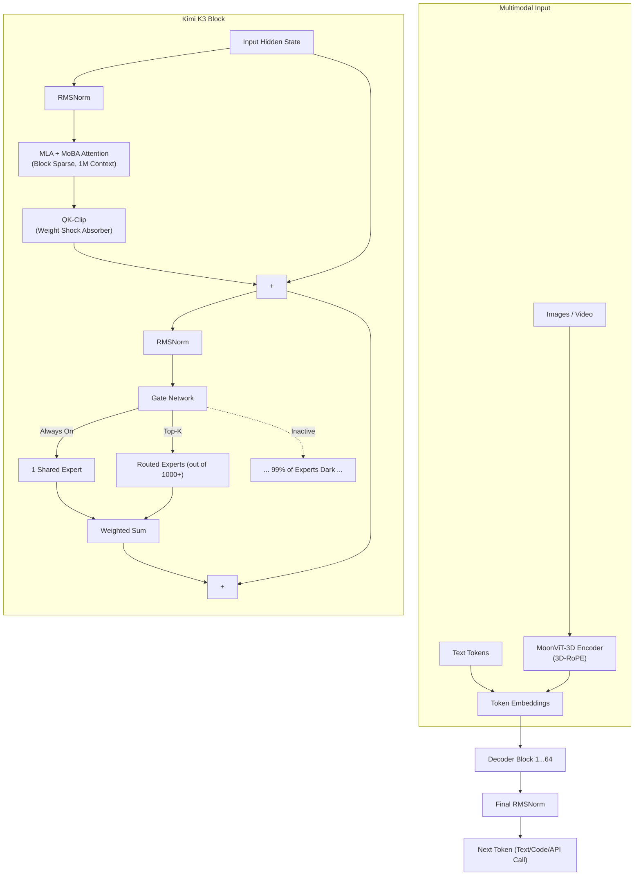

### 5. Algorithm Deep Dive: Native Multimodality (MoonViT-3D)
Older multimodal models (like early LLaVA) "bolted on" a vision encoder. The image was processed by a separate Vision Transformer (ViT), and the resulting vectors were injected into the LLM's context window. This created a boundary between text and vision processing, limiting the model's ability to deeply reason about spatial layouts and temporal motion.

**The K3 Innovation:** 
K3 uses **MoonViT-3D**, a native vision encoder integrated directly into the base model. 
1.  Video and images are compressed into discrete spatial-temporal tokens using a 3D VAE.
2.  These tokens are injected directly into the LLM's context window alongside text tokens.
3.  **3D-RoPE:** The standard 1D Rotary Position Embedding is split into three groups. Group 1 rotates based on $Y$ (Height), Group 2 on $X$ (Width), and Group 3 on $T$ (Time/Frame index). 
4.  **Impact:** A single Transformer block can simultaneously process a paragraph of code, a UI screenshot, and a 60fps video, understanding spatial layout and temporal motion natively.

### 6. Algorithm Deep Dive: MoBA (Mixture of Block Attention)
Processing 1 Million tokens requires finding the "needle in the haystack." Even with MLA compressing the KV cache, computing full attention across 1M tokens is too slow. 

**The Solution:** Moonshot AI deployed **MoBA** (Mixture of Block Attention) in production for K3.
1.  The 1M token context is divided into blocks (e.g., each block = 4,096 tokens).
2.  A lightweight gating network (similar to MoE routing) looks at the current query token and decides *which blocks* are relevant.
3.  The query only attends to the Top-K selected blocks, ignoring the rest.
4.  **Impact:** 6.5x speedup at 1M context. It can switch between full attention and sparse attention seamlessly, allowing the model to rapidly skim codebases and focus compute exactly where the agentic task requires it.

### 7. Algorithm Deep Dive: 2.8T Parameter Stability
Scaling Kimi K2's 1.04T architecture to 2.8T should have mathematically collapsed. The attention logits grow exponentially with parameter count. 
K3 relies entirely on the **Muon Optimizer + QK-Clip** architecture. 
*   The Muon optimizer extracts maximum intelligence per token, keeping the training data requirement manageable.
*   After every optimizer step, QK-Clip physically chops down the $W_q$ and $W_k$ weight matrices if their dot product exceeds a safe threshold $\tau$. 
*   **Result:** K3 trained for over 20 Trillion tokens with zero loss spikes, proving that QK-Clip is the definitive solution for extreme-scale stability.

### 8. Memory & FLOPs Analysis
*   **Total Parameters:** 2.8 Trillion. (Over 1,000 routed experts).
*   **Active Parameters:** ~32 Billion per token. (Extreme sparsity: >98.8% of the model is dark per token).
*   **Weight Memory:** In FP8, the weights require ~2.8 TB of VRAM. Inference requires a massive multi-node cluster (e.g., 32x H100 GPUs).
*   **Context Compute:** MoBA ensures that despite the 1M context window, the compute remains sub-quadratic, making real-time agentic coding economically viable.

### 9. Architecture Diff: Kimi K2 vs Kimi K3
**Changed:**
- [x] **Scale:** 1.04T → 2.8T total parameters (Largest open-weight model ever)
- [x] **Modality:** Text-only → Natively Multimodal (MoonViT-3D, 3D-RoPE)
- [x] **Context Attention:** Standard MLA → MLA + MoBA (Block Sparse Attention)
- [x] **Capability:** Chat/Reasoning → 8-hour autonomous agentic workflows
- [x] **Expert Count:** 384 → 1,000+ routed experts

**Same:**
- [x] Muon Optimizer + QK-Clip (The stability engine)
- [x] Ultra-sparse MoE architecture (1 Shared + Top-K Routed)
- [x] Pre-RMSNorm, RoPE (1D for text, 3D for vision)
- [x] MLA (Multi-Head Latent Attention for KV cache compression)

---

# Volume IV: The Specialized & Global Frontier
Not all models chase Trillion-parameter scale. This volume details architectures designed for specific constraints. It covers Microsoft Phi-4 (proving "Data is Architecture" for Small Language Models), Cohere Command R+ (architected specifically for Enterprise RAG), Sarvam AI (proving the tokenizer is a first-class architectural component for Indic languages), and Apple AFM (hardware-aware co-design for the iPhone Neural Engine). 
## Chapter 16: Microsoft Phi-4 (2024) & The Small Language Model (SLM) Revolution

### 1. Executive Summary
While the industry raced toward Trillion-parameter Mixture-of-Experts (MoE) models, Microsoft Research proved that "data quality beats scale." The Phi-4 model (14 Billion parameters) demonstrated that a highly optimized dense model, trained strictly on "textbook quality" synthetic data, could outperform a 70B model on logic and math. Phi-4's true innovation isn't in the layer design, but in the philosophy of **"Data as Architecture"**—using Full Multi-Head Attention (MHA) to maximize reasoning density in a tiny parameter footprint, and employing "Attention Sinks" to stabilize long-context generation.

### 2. Historical Context
By 2023, LLaMA 2 and Mistral had standardized the open-source stack (GQA, SwiGLU, RMSNorm). However, these models were trained on trillions of tokens of web-scraped data (CommonCrawl), which is full of spam, low-quality logic, and AI-generated slop. 

Microsoft Research (led by Sebastien Bubeck) hypothesized that LLMs were "overfed" but "undernourished." They didn't need more parameters; they needed better data. They also needed models small enough to run locally on Windows laptops (Copilot+ PCs) without requiring a datacenter. They couldn't use MoE (too much memory). They had to build ultra-dense, ultra-small models.

### 3. Paper Summary
*   **Authors:** Sebastien Bubeck, et al. (Microsoft Research).
*   **Publication:** 2024.
*   **Links:** [Microsoft Research Blog](https://www.microsoft.com/en-us/research/blog/phi-4/) | [arXiv:2412.08905](https://arxiv.org/abs/2412.08905)

### 4. Complete Architecture
Architecturally, Phi-4 is a standard decoder-only dense Transformer. The genius lies in the hyperparameter choices and the training pipeline.

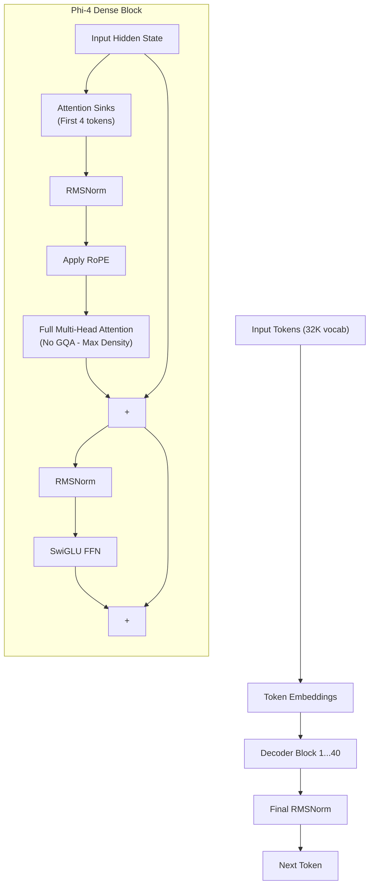

### 5. Architectural Innovation 1: Full MHA for Cognitive Density
Almost every modern model since LLaMA 2 uses Grouped Query Attention (GQA) to save memory. Phi-4 deliberately reverts to **Full Multi-Head Attention (MHA)** (where every head has its own private KV notepad).

**Why?**
*   GQA is a compromise. It saves memory by forcing heads to share information, which slightly degrades the model's representational capacity.
*   In a 70B model, you can afford this compromise. But in a 14B model, every parameter and every attention head must pull its weight. GQA would starve the 14B model of reasoning capacity.
*   By using Full MHA, Phi-4 maximizes the "cognitive density" per parameter. The context window is kept strictly at 16K to prevent the Full MHA KV cache from exploding.

### 6. Architectural Innovation 2: Attention Sinks
In 2023, researchers discovered "Attention Sinks" (Xiao et al.). They noticed that in standard LLMs, the first 1-4 tokens of a sequence absorb a massive amount of global attention, regardless of what those tokens actually are. If these tokens are evicted from the KV cache, the model's output degrades into gibberish.

**Phi-4 Implementation:**
Phi-4 explicitly hardcodes the first 4 tokens as "Attention Sinks." These tokens are given global attention (they look at everything), and they are *never* evicted from the KV cache, even when streaming text past the 16K context window. This allows Phi-4 to maintain stable generation even on very long documents, acting as a mathematical garbage collector for softmax noise.

### 7. The Core Innovation: "Data is Architecture"
Phi-4's architecture is standard, but its *training data* is completely novel.
1.  **Synthetic "Textbook" Data:** 100% of Phi-4's training data is synthetically generated by GPT-4. They prompted GPT-4 to generate step-by-step math proofs, coding logic, and reasoning trees.
2.  **No Web Slap:** Phi-4 is not trained on random Reddit or Wikipedia dumps. The data is curated to be dense in logic and reasoning.
3.  **"Next-Token with Reasoning Traces":** The model is trained to predict the next token, but the training data explicitly includes the internal reasoning steps (Chain of Thought) before the final answer.

### 8. Memory & FLOPs Analysis
*   **Parameters:** 14 Billion (Dense).
*   **Weight Memory:** In FP16, weights require ~28 GB of VRAM. In INT4 (quantized), it runs in ~8 GB, making it perfectly suited for consumer laptops and edge devices.
*   **KV Cache:** Because it uses Full MHA, the KV cache is large per token. However, the 16K context limit caps the maximum cache size to ~1 GB, keeping it manageable.

### 9. Architecture Diff: LLaMA 3 8B vs Phi-4 14B
**Changed:**
- [x] **Attention Type:** GQA → Full MHA (Maximizing reasoning capacity over memory savings)
- [x] **Context Window:** 8K → 16K
- [x] **Attention Stability:** Standard → Explicit Attention Sinks (First 4 tokens hardcoded)
- [x] **Data Strategy:** Trillions of web tokens → 100% Synthetic textbook tokens
- [x] **Training Objective:** Next-Token Prediction → Next-Token with Reasoning Traces

**Same:**
- [x] Dense architecture (No MoE)
- [x] Pre-RMSNorm
- [x] RoPE (Rotary Position Embedding)
- [x] SwiGLU FFN

---

## Chapter 17: Cohere Command R+ (2024) & The Enterprise RAG Architecture

### 1. Executive Summary
While Meta, OpenAI, and DeepSeek chased general-purpose chat and reasoning, Cohere built Command R+ (104B total, 39B active) specifically for Enterprise RAG (Retrieval-Augmented Generation) and tool-use. It was one of the first major models to abandon the "serial" Attention-then-FFN layout, moving to a **Parallel layout** (like GPT-4) to reduce inference latency. More importantly, it engineered a specialized **Sink/Local/Global Attention Mask** designed explicitly to solve the "needle in a haystack" problem for massive enterprise documents, sacrificing creative writing capability for flawless, high-speed retrieval.

### 2. Historical Context
By 2024, enterprises realized that LLMs were valuable, but they hallucinated when asked about internal company data. The solution was RAG: uploading 50 PDFs and asking "What is the Q3 revenue?" 
However, standard models (like LLaMA 2) struggled with RAG at scale. If you fed them a 100K token document, they would "forget" the middle sections (the "lost in the middle" phenomenon). Cohere realized that enterprise customers didn't want to chat; they wanted flawless, instantaneous search. This required a fundamentally different attention pattern.

### 3. Release Summary
*   **Authors:** Cohere For AI / Cohere.
*   **Publication:** April 2024.
*   **Links:** [Cohere Blog](https://cohere.com/blog/command-r-plus-microsoft-azure) | [HuggingFace](https://huggingface.co/CohereForAI/c4ai-command-r-plus)

### 4. Complete Architecture
Command R+ is a Mixture-of-Experts model. It uses the standard Pre-RMSNorm, RoPE, and SwiGLU stack, but executes the block in parallel and applies a custom attention mask.

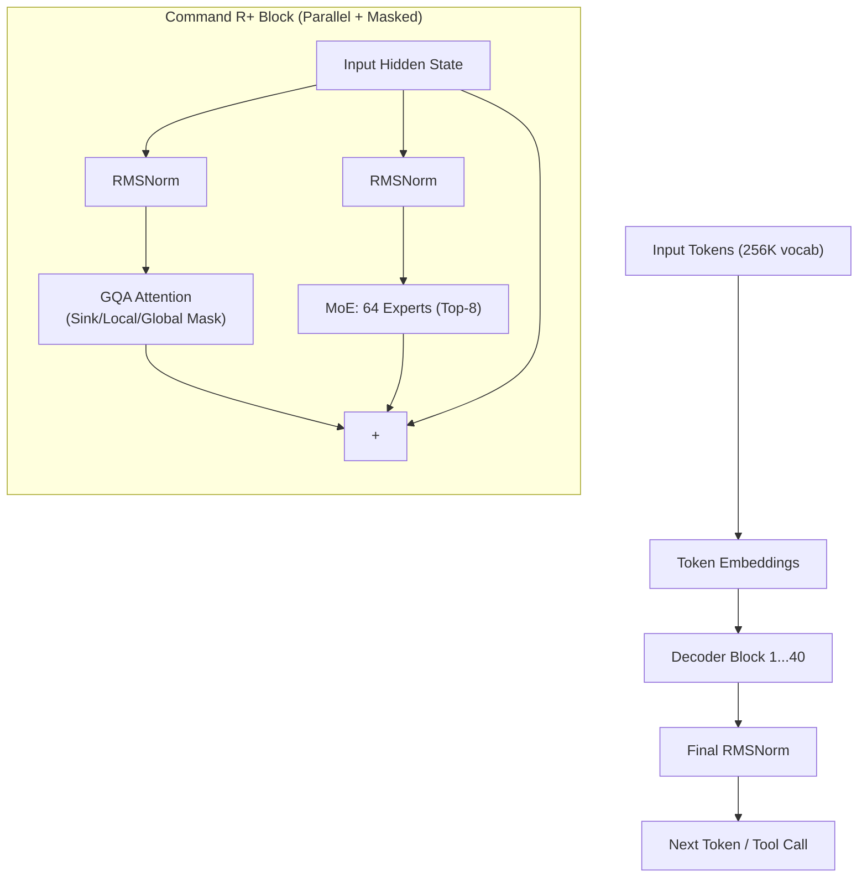

### 5. Algorithm Deep Dive: Parallel Layers
Standard Transformer blocks (LLaMA, Mistral, DeepSeek) are serial: Data goes through Attention, gets added to the residual stream, then goes through the FFN. 
$$x_{out} = x + \text{FFN}(\text{Norm}(x + \text{Attn}(\text{Norm}(x))))$$

**Command R+ Parallel Layout:**
Command R+ computes Attention and FFN at the *exact same time*, adding both to the residual stream simultaneously.
$$x_{out} = x + \text{Attn}(\text{Norm}(x)) + \text{FFN}(\text{Norm}(x))$$
*   **Engineering Impact:** This reduces the forward-pass time by ~15%. In enterprise search, where latency is critical, this is a massive win. It requires a slightly wider model to achieve the same reasoning depth, but the throughput gain is worth it.

### 6. Algorithm Deep Dive: Retrieval-Optimized Attention Mask
This is Cohere's secret weapon. Standard causal attention allows every token to look back at every previous token. This wastes compute on irrelevant text. Command R+ uses a specialized mask:

1.  **Sink Tokens (First 4 tokens):** These tokens attend globally to the entire 128K context. They act as a global "index" or "summary" absorber.
2.  **Document Tokens (Middle):** These tokens only attend locally (e.g., to the previous 2,048 tokens). This saves massive compute because the model doesn't try to relate every single word in a 100-page PDF to every other word.
3.  **Prompt Tokens (Last tokens):** The actual user question (e.g., "What is Q3 revenue?") attends globally to the whole 128K context. 

**The Impact:** Compute is focused exactly where RAG needs it. The user's question scans everything, but the document itself is processed cheaply and locally. This makes Command R+ exceptionally fast at ingesting and querying massive documents.

### 7. Algorithm Deep Dive: Tool-Use Pre-Training
Standard models learn tool-use (API calls) during post-training (RLHF). Command R+ was pre-trained from scratch with `<|tool_start|>` and `<|tool_end|>` tokens. 
*   The model natively understands JSON schemas and API structures as if they were basic grammar.
*   This makes it exceptionally reliable at formatting complex API calls (e.g., querying a SQL database or a Salesforce API) without hallucinating the syntax.

### 8. Memory & FLOPs Analysis
*   **Total Parameters:** 104B. **Active Parameters:** 39B.
*   **VRAM Memory:** Weights require ~208 GB in FP16. 
*   **Throughput:** The combination of Parallel Layers and the Local/Global mask gives Command R+ roughly 2x the tokens-per-second throughput of a standard LLaMA 3 70B when processing long documents.

### 9. Architecture Diff: Mixtral vs Cohere Command R+
**Changed:**
- [x] **Layer Execution:** Serial (Attn → FFN) → Parallel (Attn + FFN simultaneously)
- [x] **Attention Mask:** Standard Causal → Sink/Local/Global hybrid
- [x] **MoE Routing:** Softmax → Sigmoid routing for smoother expert activation
- [x] **Pre-training:** General text → Heavy tool-use/JSON syntax pre-training

**Same:**
- [x] MoE architecture (64 experts, top-8 active)
- [x] 128K Context Window
- [x] Pre-RMSNorm, RoPE, SwiGLU

---
## Chapter 18: Sarvam AI (India) & The Tokenizer as Architecture

### 1. Executive Summary
Sarvam AI, India’s frontier AI lab, proved a fundamental architectural truth that Western labs had overlooked: **The Tokenizer is Architecture.** While standard LLaMA tokenizers treat Hindi, Tamil, and Bengali words as byte-level garbage (one word costing 10 tokens), Sarvam-1 (24B parameters) rebuilt the Byte-Pair Encoding (BPE) vocabulary from scratch. By optimizing the tokenizer for Indic scripts, a 24B model outperformed LLaMA-2 70B on Indian tasks simply due to a 5x increase in token efficiency. This proved that "foundation model architecture" includes the vocabulary layout, and that regional dominance requires architectural localization, not just translated data.

### 2. Historical Context
By 2024, LLaMA and Mistral dominated the open-source landscape. However, when Indian developers used these models for Hindi or Tamil, they hit a hidden "Token Tax." 
*   **The Problem:** LLaMA’s BPE tokenizer was trained on an English-dominated corpus. English words like "unhappiness" might be 2 tokens ("un", "happiness"). But a Hindi word like "असंतोष" (dissatisfaction) is broken down into raw UTF-8 bytes, costing 10-15 tokens.
*   **The Impact:** This made Indian language APIs 10x more expensive and 10x slower. Furthermore, the model's reasoning degraded because the attention mechanism had to spend compute integrating 10 bytes into a single concept, rather than processing 1 token. 

Sarvam AI realized that translating English data wasn't enough. The structural foundation—the vocabulary itself—had to be redesigned.

### 3. Release Summary
*   **Authors:** Pratyush Kumar, et al. (Sarvam AI).
*   **Publication:** May 2024.
*   **Links:** [Sarvam AI Blog](https://www.sarvam.ai/) | [HuggingFace](https://huggingface.co/sarvamai/sarvam-2b)

### 4. Complete Architecture
Sarvam-1 uses the standard modern dense Transformer block (Pre-RMSNorm, RoPE, SwiGLU, GQA). The radical innovation is entirely contained within the Embedding and Tokenization layers.

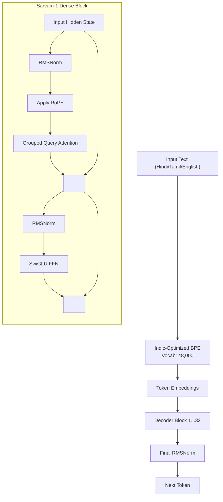

### 5. Algorithm Deep Dive: The Tokenizer as Architecture
Byte-Pair Encoding (BPE) works by iteratively merging the most frequent adjacent characters/bytes into a single token. 
*   **LLaMA 2 (32K Vocab):** Trained on mostly English. "ing", "tion", "ed" are merged into single tokens. Devanagari bytes are rarely merged.
*   **Sarvam-1 (48K Vocab):** Re-trained the BPE merges from scratch on a massive corpus of 10 Indic languages. Now, common Hindi syllables (like "कर", "ने", "में") are single tokens.

**The Engineering Math:**
If a user inputs a 1,000-word Hindi document:
*   **LLaMA 2:** 1,000 words $\times$ 10 tokens/word = 10,000 tokens.
*   **Sarvam-1:** 1,000 words $\times$ 1.8 tokens/word = 1,800 tokens.

**Architectural Impact:**
1.  **Context Window Expansion:** A 4K context window effectively holds 4x more Hindi text for Sarvam than for LLaMA.
2.  **Attention Efficiency:** The $O(N^2)$ attention compute is reduced by $(10000/1800)^2 \approx 30x$ for the same document. 
3.  **Reasoning Density:** The model spends its attention capacity on actual semantic reasoning, rather than wasting it on byte-level character assembly.

### 6. The "Token Tax" Elimination
By solving the token tax, Sarvam-1 changed the economics of AI in India. Running a 24B model that processes Hindi efficiently became cheaper than running a 7B model that processes Hindi inefficiently. 

### 7. Memory & FLOPs Analysis
*   **Parameters:** 24 Billion (Dense).
*   **VRAM Memory:** Weights require ~48 GB in FP16. 
*   **Active Compute:** The FLOPs per token are identical to LLaMA. However, the *FLOPs per sentence* are drastically lower for Indic languages, making the model functionally faster.

### 8. Architecture Diff: LLaMA-2 13B vs Sarvam-1 24B
**Changed:**
- [x] **Tokenizer Vocabulary:** 32K (English-heavy) → 48K (Indic-Optimized)
- [x] **BPE Merge Rules:** English/Latin byte merges → Devanagari/Tamil/Bengali syllable merges
- [x] **Scale:** 13B → 24B (slightly larger to handle the multilingual complexity)

**Same:**
- [x] Dense architecture (No MoE)
- [x] Pre-RMSNorm, RoPE, SwiGLU, GQA
- [x] Decoder-only structure

---
## Chapter 19: Apple AFM (2024) & Hardware-Aware Co-Design for On-Device AI

### 1. Executive Summary
With the release of Apple Intelligence in mid-2024, Apple introduced the **Apple Foundation Model (AFM)**, a ~3 Billion parameter dense language model designed to run entirely on-device (iPhone, iPad, Mac). While the architectural block is mathematically derived from the standard LLaMA stack, AFM’s true innovation is **Hardware-Aware Co-Design**. Every tensor dimension, memory access pattern, and weight precision was meticulously engineered to align with the physical constraints of the Apple Neural Engine (ANE), proving that ultimate edge AI requires designing the neural network around the silicon, not the other way around.

### 2. Historical Context
By 2024, cloud-based LLMs (GPT-4, Claude) required massive datacenters, resulting in high latency, privacy concerns, and recurring API costs. Apple’s philosophy dictates that user data should remain on the device whenever possible. 

However, running an LLM on an iPhone is a physics nightmare. A smartphone has limited RAM (8-16 GB shared with the OS and UI), strict thermal limits (no active cooling), and a battery that drains rapidly under sustained compute. Standard LLM architectures (like LLaMA-3 8B) were too memory-heavy and too slow for fluid, real-time user interactions. Apple had to build a model that was not just small, but fundamentally aligned with Apple Silicon.

### 3. Paper Summary
*   **Authors:** Apple Machine Learning Research.
*   **Publication:** July 2024 (Apple Intelligence rollout).
*   **Links:** [Apple ML Research Blog](https://machinelearning.apple.com/) | [Apple Intelligence Technical Overview](https://machinelearning.apple.com/research/introducing-apple-foundation-models)

### 4. Complete Architecture
AFM is a compact, dense decoder-only Transformer. It utilizes the modern stack (Pre-RMSNorm, RoPE, SwiGLU, GQA) but is heavily constrained in its hyperparameters to ensure it fits perfectly within the ANE's execution graph.

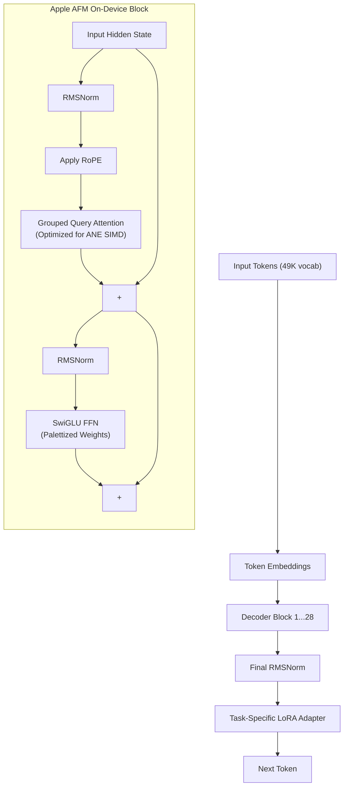

### 5. Algorithm Deep Dive: Apple Neural Engine (ANE) Co-Design
NVIDIA GPUs (A100/H100) are general-purpose parallel processors that excel at massive matrix multiplications. The Apple Neural Engine (ANE) is a fixed-function, ultra-low-power accelerator optimized specifically for convolution and matrix math, operating via a 128-bit vector width.

**The Engineering Challenge:** Standard LLM attention mechanisms use dynamic shapes and scatter/gather operations that the ANE handles poorly. 
**The AFM Solution:**
1.  **Tensor Alignment:** AFM’s internal dimensions ($d_{model}$, $d_{head}$) are chosen to be exact multiples of 16. This ensures that matrix multiplications map perfectly to the ANE's 128-bit vector registers, eliminating zero-padding and wasted compute cycles.
2.  **Stateful Execution:** The ANE is optimized for "stateful" execution, where the model weights are loaded into the ANE's ultra-fast SRAM once and kept there for the duration of the generation. AFM was sized specifically so that its weights and KV cache fit entirely within the ANE's localized memory pool, bypassing the main CPU/GPU RAM.

### 6. Algorithm Deep Dive: Palettization (Quantization)
To fit a 3B model into an iPhone's memory alongside iOS, standard 16-bit weights (which would require ~6 GB) are insufficient. Apple pioneered the use of **Palettization** (also known as k-means quantization) for LLMs.

**How it works:**
1.  Instead of storing each weight as a 16-bit float, the weights are clustered into a lookup table (LUT) of 16 or 256 distinct values (4-bit or 8-bit).
2.  The model stores only the index (0-15) into this lookup table.
3.  Apple uses a **Grouped Palettization** strategy combined with **LoRA Adapters**. The base model is frozen at 4-bit palettization. When a user needs a specific task (e.g., summarizing an email), a tiny 16-bit LoRA adapter (a few megabytes) is dynamically swapped in to restore task-specific accuracy.

### 7. The Tool-Use & Adapter Architecture
Apple does not use a single, massive model for everything. AFM is a base engine that dynamically loads task-specific adapters.
*   **Summarization Adapter:** Tuned for extracting key points from emails or notes.
*   **Rewrite Adapter:** Tuned for changing tone or proofreading.
*   **Tool-Use Adapter:** Tuned for formatting API calls to iOS apps (Calendar, Messages).
*   **Impact:** This adapter-based architecture allows a 3B model to act like a Swiss Army knife, maintaining high accuracy on specialized tasks without requiring a 70B parameter dense model.

### 8. Memory & FLOPs Analysis
*   **Parameters:** ~3 Billion (Dense).
*   **Weight Memory:** In 4-bit palettized form, the base model requires roughly **1.5 GB** of RAM. LoRA adapters require <10 MB each.
*   **Latency:** The ANE co-design allows AFM to generate tokens at ~30 tokens per second on an iPhone 15 Pro, which matches human reading speed and feels instantaneous for UI interactions.
*   **Power Consumption:** Optimized to draw less than 1 watt during generation, preventing battery drain and thermal throttling.

### 9. Architecture Diff: Phi-4 (14B) vs Apple AFM (3B)
**Changed:**
- [x] **Hardware Target:** NVIDIA GPU (General Purpose) → Apple Neural Engine (Fixed-Function Vector)
- [x] **Weight Precision:** INT4/FP8 Quantization → 4-bit Palettization (K-means LUT)
- [x] **Task Specialization:** Monolithic dense model → Base model + Dynamic LoRA Adapters
- [x] **Dimension Alignment:** Power-of-2 dimensions → Multiples of 16 (ANE vector width)

**Same:**
- [x] Dense architecture (No MoE)
- [x] Pre-RMSNorm
- [x] RoPE (Rotary Position Embedding)
- [x] Grouped Query Attention (GQA)

---
# Volume V: Post-Transformer Sequence Architectures
This volume explores the "Third Way" of AI architecture—models that are neither Transformers nor Mamba. It details RWKV (an RNN that parallelizes like a Transformer), RetNet (Microsoft's decaying retention matrix that unifies parallel training and $O(1)$ inference), and xLSTM (Sepp Hochreiter's modernization of the 1997 LSTM with matrix memory and exponential gating).
## Chapter 20: RWKV, RetNet, & xLSTM (The Non-Mamba Challengers)

### 1. Executive Summary
While Mamba (State Space Models) successfully challenged the Transformer's $O(N^2)$ bottleneck, it was not the only architecture attempting to replace the "Attention" mechanism. Between 2023 and 2024, three distinct architectures emerged offering the same holy grail: **parallel training (like a Transformer) combined with $O(1)$ recurrent inference (like an RNN)**. 
*   **RWKV** modernized the RNN with a Transformer-compatible training loop.
*   **RetNet** mathematically proved that a decaying retention matrix can replace softmax attention.
*   **xLSTM** upgraded the classic 1997 LSTM with matrix memory and exponential gating. 
Together, they represent the "Third Way" of LLM architecture—not Transformer, not SSM, but Linear Recurrent.

### 2. Historical Context
The fundamental flaw of the Transformer is that it must remember every past token's Key and Value to compute attention, leading to $O(N^2)$ compute and $O(N)$ memory during inference. 
Old RNNs (LSTMs, GRUs) had $O(1)$ inference memory, but they couldn't be parallelized on GPUs because token $t$'s hidden state depended on token $t-1$'s output. 
Mamba solved this using Selective State Spaces. However, Mamba requires a complex "Parallel Associative Scan" algorithm to train. RWKV, RetNet, and xLSTM sought simpler, more elegant mathematical formulations that achieved the exact same goal using standard matrix multiplication.

### 3. Architecture 1: RWKV (Receptance Weighted Key Value)
*   **Paper:** Peng et al., 2023. [arXiv:2305.13048](https://arxiv.org/abs/2305.13048)
*   **Concept:** An RNN that unrolls into a parallelizable matrix multiplication during training.

**The Math (Time Mixing):**
RWKV updates its hidden state $h_t$ using a time-decay mechanism.
$$r_t = \sigma(W_r \cdot x_t) \quad \text{(Receptance: How much of the past to forget)}$$
$$k_t = W_k \cdot x_t \quad \text{(Key)}$$
$$v_t = W_v \cdot x_t \quad \text{(Value)}$$
$$w_t = \exp(-\omega \cdot \Delta t) \quad \text{(Time decay vector)}$$
$$\text{state}_t = w_t \odot \text{state}_{t-1} + k_t^T \otimes v_t$$
$$o_t = r_t \odot \text{state}_t$$

**How it parallelizes:** During training, the recurrence $\text{state}_t = w_t \odot \text{state}_{t-1} + k_t^T \otimes v_t$ can be unrolled and rewritten as a linear attention kernel: $O = (K^T V) \oslash (K^T \mathbf{1})$. This allows it to be computed in $O(N \cdot d^2)$ time using standard GPU matrix multipliers, bypassing the need for Mamba's selective scan.

**Engineering Impact:** RWKV-6 (2024) is highly popular in the open-source community. Because its inference memory is strictly $O(1)$ (it only stores a fixed-size state vector), it can run 14B parameter models on consumer laptops with zero KV-cache memory growth, generating text indefinitely without crashing.

### 4. Architecture 2: RetNet (Retention Network)
*   **Paper:** Microsoft, 2023. [arXiv:2307.08621](https://arxiv.org/abs/2307.08621)
*   **Concept:** Replaces softmax attention with a decaying retention mechanism, mathematically unifying parallel training and recurrent inference.

**The Math:**
$$\text{Ret}(Q, K, V) = (Q \odot \gamma)^T (D \odot (K^T V))$$
where $D$ is a decay matrix: $D_{ij} = \gamma^{i-j}$ if $i \ge j$, else $0$.

**How it works:**
1.  **Parallel Mode (Training):** $D$ is an $N \times N$ matrix. The equation becomes a standard matrix multiplication, computed identically to standard Attention.
2.  **Recurrent Mode (Inference):** The model transitions to an RNN. The state $S_n = \gamma S_{n-1} + K_n^T V_n$. Output $O_n = Q_n S_n$. 
3.  **The Unification:** RetNet proved that the $D$ matrix is mathematically equivalent to the recurrent update. You don't need a separate algorithm for training and inference; it's the same math viewed through a different lens.

**Engineering Impact:** RetNet achieves Transformer-level training parallelism without the $O(N^2)$ memory footprint, and RNN-level $O(1)$ inference memory. It avoids the complex hardware-specific kernels required by Mamba, making it easier to optimize on standard GPUs.

### 5. Architecture 3: xLSTM (Extended Long Short-Term Memory)
*   **Paper:** Hochreiter et al., 2024. [arXiv:2405.04517](https://arxiv.org/abs/2405.04517)
*   **Concept:** Sepp Hochreiter (co-inventor of the 1997 LSTM) returned to modernize the classic architecture for the Transformer era.

**The Math (mLSTM - Matrix LSTM):**
The original LSTM had a scalar cell state $C \in \mathbb{R}^d$. The mLSTM upgrades this to a matrix state $C \in \mathbb{R}^{d \times d}$.
$$C_t = f_t \odot C_{t-1} + i_t \odot (V_t K_t^T)$$
$$n_t = f_t \odot n_{t-1} + i_t \odot K_t$$
$$h_t = o_t \odot \frac{C_t Q_t}{\max(|n_t Q_t|, 1)}$$

**Innovations:**
1.  **Matrix Memory:** The cell state $C$ is now the exact same dimensions as the $K^T V$ matrix in Attention. It is an exact associative memory.
2.  **Exponential Gating:** Replaces the sigmoid activation in the forget/input gates with an exponential function ($\exp(x)$). This solves the vanishing gradient problem perfectly without needing LayerNorm.
3.  **Parallelization:** Like RetNet and RWKV, the matrix recurrence can be unrolled and computed as a parallel block matrix multiplication.

**Engineering Impact:** xLSTM proved that with matrix memory and exponential gating, advanced RNNs can match Transformers on language modeling perplexity while being vastly more memory-efficient at inference. It is particularly strong at precise sequence retrieval tasks.

### 6. Visual Architecture Comparison

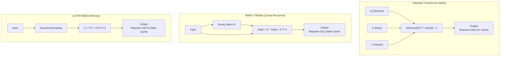

### 7. Memory & FLOPs Analysis
*   **Compute Complexity (Training):** All three architectures achieve $O(N \cdot d^2)$ compute, bypassing the Transformer's $O(N^2 \cdot d)$ bottleneck. They can be trained using standard FlashAttention-style tiling.
*   **Inference Memory:**
    *   **Transformer:** $O(N \cdot d)$ (KV cache grows with context).
    *   **RWKV/RetNet:** $O(d^2)$ (Fixed state matrix, independent of context length).
    *   **xLSTM:** $O(d^2)$ (Fixed matrix cell state).
*   **Inference Latency:** Generating the 1-millionth token takes the exact same time and memory as generating the 1st token for RWKV, RetNet, and xLSTM. A Transformer slows down linearly as the KV cache grows.

### 8. Architecture Diff: Transformer vs RWKV/RetNet/xLSTM
**Changed:**
- [x] **Core Mechanism:** Softmax Attention ($QK^T$) → Linear Recurrence / Retention ($D \odot (K^T V)$)
- [x] **Inference Memory:** $O(N)$ KV Cache → $O(1)$ or $O(d^2)$ Fixed State
- [x] **Context Extrapolation:** Degrades if not specifically trained (Requires YaRN/NTK) → Infinite context (memory footprint doesn't grow)
- [x] **Sequential Dependency:** None (Parallel) → Recurrent (but parallelizable via block matrix unrolling)

**Same:**
- [x] Pre-Norm residual structure (RMSNorm)
- [x] SwiGLU Feed-Forward Network
- [x] Token Embeddings and Output Projection

---
# Volume VI: The Hardware-Native & Distributed Systems Frontier
To train models beyond 100B parameters, the *systems architecture* must evolve alongside the *neural architecture*. This volume covers BitNet b1.58 (which replaces floating-point multiplication with 1.58-bit ternary integer addition), Soft MoE (a fully differentiable sparse router that eliminates expert collapse), and the Distributed Execution Graphs (ZeRO, FSDP, 3D Parallelism) that allow 16,000+ GPUs to train a single model without crashing.
## Chapter 21: BitNet b1.58 (2024) & The 1.58-Bit Revolution

### 1. Executive Summary
By 2024, the AI industry hit a hard physical wall: the **Memory Bandwidth Wall**. Standard LLMs (like LLaMA 3 70B) use FP16 or BF16 weights, requiring 140 GB of VRAM just to store the model. The actual bottleneck wasn't computing the math; it was moving 140 GB of data from slow VRAM (HBM) to the fast compute cores (SRAM) for every single token. Microsoft Research’s **BitNet b1.58** shattered this paradigm by forcing all weight parameters in the linear layers to exist in a ternary state: $\{-1, 0, 1\}$. This requires exactly 1.58 bits per weight ($\log_2(3)$), replacing floating-point matrix multiplication (MatMul) with simple integer addition and subtraction. It transformed LLM inference from a memory-bound problem to a pure compute-bound problem, reducing weight memory by 22x and energy consumption by 71x.

### 2. Historical Context
The standard approach to making models smaller is **Post-Training Quantization (PTQ)** (e.g., GPTQ, AWQ). You train the model in FP16, then round the weights to INT4 or INT8 afterward. However, PTQ causes accuracy degradation because the rounding errors compound across 80 layers. 

In 2023, Microsoft introduced **BitNet** (1-bit weights, $\{-1, 1\}$). It used **Quantization-Aware Training (QAT)**—simulating the 1-bit rounding during the forward pass, but keeping FP32 master weights for the backward pass. The model "learned" to compensate for the quantization noise. In 2024, they upgraded this to **BitNet b1.58**, adding the $0$ state. This addition of zero allowed the model to build highly sparse pathways (ignoring irrelevant connections), matching the accuracy of FP16 LLaMA while being mathematically native to silicon.

### 3. Paper Summary
*   **Authors:** Shuming Ma, Hongyu Wang, et al. (Microsoft Research).
*   **Publication:** February 2024.
*   **Links:** [arXiv:2402.17764](https://arxiv.org/abs/2402.17764)

### 4. Complete Architecture
BitNet keeps the standard decoder-only Transformer block (Pre-RMSNorm, RoPE, SwiGLU), but completely replaces the `nn.Linear` layers inside Attention and the FFN with **BitLinear layers**.

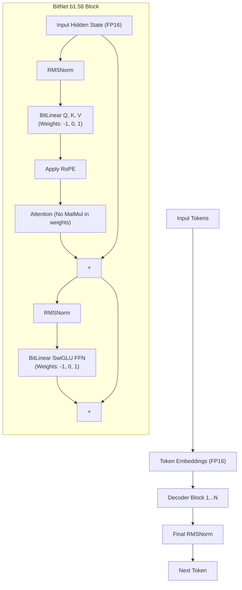

### 5. Algorithm Deep Dive: The Death of MatMul
Standard FP16 matrix multiplication requires fetching two 16-bit floats from memory, multiplying them, and adding the result. This is memory-bandwidth intensive.

**The BitNet b1.58 Algorithm:**
Every weight $w$ in the linear layers is constrained to $w \in \{-1, 0, 1\}$.
1.  **Absmax Quantization:** The FP16 input activation $x$ is quantized to INT8 via $x_{int} = \text{Round}(x / \max(|x|) \times 127)$.
2.  **The "Multiplication":** Because the weights are only -1, 0, or 1, matrix multiplication ($Y = X \cdot W$) is reduced to:
    *   If $w = 1$: $y = x$ (Pass through)
    *   If $w = -1$: $y = -x$ (Sign flip)
    *   If $w = 0$: $y = 0$ (Drop connection)
3.  **Compute:** The GPU/CPU does not execute floating-point multipliers. It only executes **integer addition and subtraction** (or bitwise XNOR + Popcount on specialized hardware).

### 6. Algorithm Deep Dive: Why 1.58 Bits?
Why not 1 bit ($\{-1, 1\}$)? 
A 1-bit model forces every connection to be either positive or negative. It cannot ignore a connection. This leads to dense, noisy signal pathways.
By adding the $0$ state, the model gains **native sparsity**. If a weight rounds to $0$, that connection is physically severed. The network prunes itself on the fly. The information density of 3 states is $\log_2(3) \approx 1.58$ bits.

### 7. Memory & FLOPs Analysis (The Paradigm Shift)
*   **Weight Memory:** A 70B parameter model in FP16 requires 140 GB of VRAM. In BitNet b1.58, it requires **~12.6 GB**. It fits comfortably on a single consumer GPU.
*   **Memory Bandwidth:** The energy required to read a weight from HBM drops by 22x. This eliminates the memory bandwidth bottleneck entirely.
*   **Compute Latency:** Standard MatMul latency scales with $O(d^2)$. BitNet latency scales with $O(d^2 / \text{sparsity})$. Because roughly 50% of weights round to $0$, half of the compute operations are skipped completely.
*   **Energy:** Matrix multiplication energy drops by 71x, as integer addition consumes vastly less power than floating-point multiplication.

### 8. Architecture Diff: Standard FP16 LLaMA vs BitNet b1.58
**Changed:**
- [x] **Linear Layers:** FP16 `nn.Linear` → Ternary `BitLinear` ($\{-1, 0, 1\}$)
- [x] **Compute Primitive:** Floating-Point Multiplication (FMA) → Integer Addition/Subtraction
- [x] **Memory Footprint:** 16 bits/weight → 1.58 bits/weight (22x reduction)
- [x] **Bottleneck Shift:** Memory-Bandwidth Bound → Compute-Bound

**Same:**
- [x] Pre-RMSNorm residual structure
- [x] RoPE (Rotary Position Embedding)
- [x] SwiGLU FFN architecture (only the weight matrices inside change)
- [x] Attention mechanism (Q, K, V dot products still occur, just with ternary weights)

---
## Chapter 22: Soft MoE (2023) & The Fully Differentiable Sparse Router

### 1. Executive Summary
While Mixtral and DeepSeek popularized Mixture of Experts (MoE), they both suffered from a fundamental mathematical flaw: **discrete Top-K routing is non-differentiable**. If an expert is barely not selected (rank 3 in a Top-2 system), it receives zero gradient and cannot learn. This causes "expert collapse" and requires complex auxiliary losses that degrade model quality. In 2023, Google Research introduced **Soft MoE**, a paradigm shift that eliminates the discrete router entirely. Instead of tokens choosing experts, the *experts choose the tokens* via a fully differentiable, continuous weighted average. Soft MoE yielded 2-3x better performance than discrete MoE at the same parameter count, establishing the mathematical foundation for the next generation of massive sparse models.

### 2. Historical Context
Standard MoE (like Mixtral 8x7B) works by passing a token through a router, which outputs a probability distribution over 8 experts. The model selects the Top-2 experts. 
*   **The Flaw:** The "selection" operation (`argmax` or `topk`) is a hard, discrete choice. If Expert A gets a score of 0.45 and Expert B gets 0.44, and the cutoff is Top-1, Expert B is entirely ignored. During backpropagation, the gradient cannot flow through a `topk` function. Expert B gets zero learning signal.
*   **The Consequence:** To prevent the router from just sending everything to Expert A, engineers must add an "Auxiliary Load Balancing Loss"—a mathematical penalty for uneven distributions. But this penalty interferes with the main training objective, effectively fighting the model's intelligence.

Soft MoE asked: What if we don't select experts at all? What if we just blend everything mathematically?

### 3. Paper Summary
*   **Authors:** Joan Puigcerver, Carlos Riquelme, et al. (Google Research).
*   **Publication:** NeurIPS 2023.
*   **Links:** [arXiv:2308.00951](https://arxiv.org/abs/2308.00951)

### 4. Complete Architecture
Soft MoE replaces the MoE routing layer with a sequence of matrix multiplications that compute "slots" (weighted combinations of all tokens) and then dispatch those slots to experts.

```mermaid
graph TD
    Input["Input Tokens (N tokens)"] --> Weights["Routing Weights (N x m)"]
    Weights --> Slots["Slots (m weighted averages)"]
    Slots --> E1["Expert 1"]
    Slots --> E2["Expert 2"]
    Slots --> EN["Expert N"]
    E1 --> Combine["Combine Weights (m x N)"]
    E2 --> Combine
    EN --> Combine
    Combine --> Output["Output Tokens (Reconstructed)"]
```

### 5. Algorithm Deep Dive: The Slot Mechanism
Soft MoE completely bypasses the discrete routing step. 

**The Algorithm:**
1.  **Compute Routing Weights:** For $N$ input tokens and $m$ total slots across all experts, compute a routing weight matrix $\alpha$ of shape $N \times m$ using a simple linear layer followed by Softmax.
2.  **Create Slots (The "Blending"):** Instead of sending a raw token to an expert, Soft MoE computes a weighted average of *all* tokens. 
    $$D_j = \sum_{i=1}^N \alpha_{i,j} X_i$$
    Here, $D_j$ is "Slot $j$". It is a mathematical blend of the entire sequence, heavily weighted by the routing scores.
3.  **Process Slots:** Each slot $D_j$ is assigned to a specific expert FFN. The expert processes its assigned slot. (e.g., Expert 1 processes slots 1-4, Expert 2 processes slots 5-8).
4.  **Reconstruct Tokens:** The outputs of the experts are combined back into token space using the same routing weights $\alpha$.
    $$Y_i = \sum_{j=1}^m \alpha_{i,j} E_j(D_j)$$

**Why this is brilliant:** 
*   **No tokens are dropped.** Every token influences every slot, and every slot influences every output token.
*   **Fully Differentiable:** The matrix $\alpha$ is computed via Softmax. Gradients flow perfectly backward through the entire routing mechanism.
*   **No Auxiliary Loss:** The Softmax naturally normalizes the weights. The model implicitly balances the slots without needing a penalty loss.

### 6. Algorithm Deep Dive: Handling Sequence Lengths
A challenge with Soft MoE is that the routing weight matrix $\alpha$ is of size $N \times m$. If $N$ (sequence length) is 1 Million, this matrix becomes massive. 
*   **Solution:** Modern implementations of Soft MoE (used in Google's Gemini models and recent vision-language models) group the sequence into blocks (e.g., 128 tokens per block) and compute the routing weights block-wise. This keeps the memory footprint manageable ($O(N \cdot m)$ instead of $O(N^2)$).

### 7. Memory & FLOPs Analysis
*   **Compute Complexity:** The expert FFN compute is strictly bounded by the number of slots $m$. If $m$ is fixed, the FLOPs are constant regardless of sequence length.
*   **Memory Overhead:** The routing matrix $\alpha$ requires $O(N \cdot m)$ memory. For a batch of 32 sequences of 4K tokens with 128 slots, $\alpha$ requires ~64 MB of FP16 memory. This is negligible compared to the KV cache.
*   **Throughput:** Because there is no discrete token dispatching (which requires complex `All-to-All` communication across GPUs to send specific tokens to specific expert GPUs), Soft MoE can be pipelined more efficiently on standard hardware.

### 8. Architecture Diff: Discrete MoE (Mixtral) vs Soft MoE
**Changed:**
- [x] **Routing Mechanism:** Discrete Top-K Selection → Continuous Softmax Weighting (Slots)
- [x] **Input to Expert:** Raw Token $X_i$ → Weighted Average of all tokens $D_j$
- [x] **Differentiability:** Non-differentiable (Straight-Through Estimator) → Fully Differentiable
- [x] **Load Balancing:** Requires Auxiliary Loss → Implicit (None required)
- [x] **Token Dropping:** Drops tokens if unselected → Zero tokens dropped

**Same:**
- [x] Expert FFN architecture (SwiGLU)
- [x] Pre-RMSNorm residual structure
- [x] The concept of sparse activation (only a subset of total parameters is active per slot)

---
## Chapter 23: Distributed Execution Graphs (ZeRO, FSDP, & 3D Parallelism)

### 1. Executive Summary
The neural network architectures defined in previous chapters (LLaMA, DeepSeek, Kimi) are mathematical blueprints. However, a 405B or 2.8T parameter model cannot fit on a single GPU—its weights and optimizer states require terabytes of VRAM. The final layer of AI architecture is the **Distributed Execution Graph**. Systems like **ZeRO (Zero Redundancy Optimizer)** and **FSDP (Fully Sharded Data Parallel)** eradicated memory redundancy by sharding the model's states across hundreds of GPUs. Meanwhile, **3D Parallelism** (Tensor + Pipeline + Data) orchestrated the physical flow of data through the cluster. Without these systems architectures, the massive neural architectures of 2024–2026 would be mathematically derivable but physically untrainable.

### 2. Historical Context
In 2018, training a model meant using **Data Parallelism (DP)**. If you had 8 GPUs, you put a *full copy* of the model on all 8 GPUs. You sent different batches of data to each, and they averaged their gradients. 
*   **The Problem:** A 70B model in FP32 mixed precision requires ~1.6 TB of VRAM (Weights + Adam Optimizer states + Gradients). An 80GB A100 cannot hold it. DP failed at scale.

### 3. The Architecture of ZeRO (Zero Redundancy Optimizer)
*Paper: Rajbhandari et al. (Microsoft), 2020. [arXiv:1910.02054](https://arxiv.org/abs/1910.02054)*

ZeRO recognized that Data Parallelism was massively redundant. If GPU 0 and GPU 1 both hold the exact same Adam optimizer states for Layer 1, that memory is wasted. ZeRO introduced memory sharding.

**ZeRO Stage 1 (Optimizer State Sharding):**
GPU 0 only holds the Adam states (momentum, variance) for Layers 1-10. GPU 1 holds them for Layers 11-20. Memory is cut by 4x.

**ZeRO Stage 2 ( + Gradient Sharding):**
During backprop, GPU 0 computes gradients for Layers 1-10, then immediately discards the gradients for Layers 11-20. Memory is cut by 8x.

**ZeRO Stage 3 / FSDP ( + Parameter Sharding):**
*This is the industry standard for training >100B models.*
GPU 0 only holds the actual model *weights* for Layers 1-10. 
**The FSDP Algorithm (Forward Pass):**
1. GPU 0 needs to compute Layer 11, but it doesn't have the weights.
2. GPU 1 broadcasts its Layer 11 weights to GPU 0 via NVLink.
3. Both GPUs compute the forward pass for Layer 11.
4. GPU 0 immediately deletes Layer 11 from its VRAM to free memory.
This allows a 405B model (which normally requires 3+ TB of VRAM) to be trained on 64 GPUs (5 TB total VRAM).

### 4. 3D Parallelism (TP + PP + DP)
FSDP allows you to fit a massive model across GPUs, but it creates a massive communication bottleneck. To optimize throughput, modern labs use **3D Parallelism**, creating a 3-dimensional grid of GPUs.

```mermaid
graph TD
    subgraph "3D Parallelism Grid (e.g., 16,384 GPUs)"
        direction TB
        TP["Tensor Parallelism (TP=8)<br>Splits weight matrices via NVLink<br>Same machine, layers intact"]
        PP["Pipeline Parallelism (PP=16)<br>Splits layers across machines<br>Micro-batching to fill bubbles"]
        DP["Data Parallel / FSDP (DP=128)<br>Shards optimizer states<br>Different batches"]
        
        TP --> PP
        PP --> DP
    end
```

#### Dimension 1: Tensor Parallelism (Megatron-LM)
*   **What it does:** Splits individual weight matrices (e.g., the $7168 \times 2048$ SwiGLU matrix) across 8 GPUs via NVLink. GPU 0 computes the left half, GPU 1 computes the right half.
*   **Engineering:** Requires an `All-Reduce` communication after every single Attention and FFN block. Only works efficiently within a single physical server (8 GPUs connected by 900 GB/s NVLink).

#### Dimension 2: Pipeline Parallelism (PP)
*   **What it does:** Splits the layers across servers. Server 1 computes Layers 1-10. Server 2 computes Layers 11-20.
*   **The Problem (Bubbles):** If Server 1 finishes first, it sits idle waiting for Server 2. This idle time is called a "pipeline bubble."
*   **The Solution (Micro-batching):** Instead of sending one massive batch of 4096 tokens, the system sends 64 micro-batches of 64 tokens. Server 1 processes micro-batch 1, passes it to Server 2, then immediately starts micro-batch 2. This keeps all servers ~90% utilized.

#### Dimension 3: Data Parallelism / FSDP
*   **What it does:** Multiple 3D pipelines run in parallel on different data batches. The optimizer states are sharded across the DP group using FSDP.

### 5. The LLaMA 3 405B Execution Graph
To understand how this works in practice, look at how Meta trained LLaMA 3 405B:
*   **Hardware:** 16,384 H100 GPUs.
*   **TP = 8:** 8 GPUs form a Tensor Parallel group (within one node).
*   **PP = 16:** 16 nodes form a Pipeline Parallel group (layers split across 128 GPUs).
*   **DP = 128:** 128 pipelines run simultaneously (16,384 total GPUs).
*   **Batch Size:** 15.6 Million tokens per step.
*   **Memory Math:** A 405B model in BF16 requires ~810 GB of VRAM just for weights. FSDP shards this across 128 GPUs, meaning each GPU only needs to permanently hold ~6.3 GB of weights, while temporarily fetching and discarding others.

### 6. Architecture Diff: Single-GPU vs. Distributed Execution
**Changed:**
- [x] **Memory Allocation:** Monolithic (All states on 1 GPU) → Sharded (States distributed across cluster)
- [x] **Compute Flow:** Sequential (Layer 1 to N on 1 GPU) → Mesh (Weights fetched on-demand via FSDP)
- [x] **Communication Overhead:** None → Massive (All-Reduce for TP, Send/Recv for PP, All-Gather for FSDP)
- [x] **Batch Sizing:** Limited by 1 GPU VRAM -> Micro-batched across pipeline stages

**Same:**
- [x] The mathematical output of the Transformer block
- [x] The backpropagation chain rule (just distributed across nodes)

---
# Volume VII: The Final Frontier (Post-Training, Systems, Math, & Multimodality)
This volume steps outside the core neural block to document the surrounding ecosystems. It covers Post-Training & Reasoning architectures (SFT, DPO, GRPO, MCTS), Inference Serving Systems (PagedAttention/vLLM, Ring Attention, Mooncake disaggregated datacenters), the mathematical hacks required for Long-Context extrapolation (YaRN, NTK-aware Scaling), and the evolution of Multimodal Fusion (from LLaVA's bolt-on projector to Kimi K3's native 3D-RoPE omni-tokenization).
## Chapter 24: Post-Training & Reasoning Architectures (SFT, DPO, GRPO, MCTS)

### 1. Executive Summary
The neural network architectures detailed in previous chapters define how a model *predicts* the next token. However, a base pre-trained model is merely a "text simulator" that hallucinates facts. The **Post-Training Architecture** dictates how a model learns to *think*, *reason*, and *align* with human intent. The field evolved from massive Supervised Fine-Tuning (SFT) to complex Reinforcement Learning (RLHF), and finally to **Group Relative Policy Optimization (GRPO)** and **Test-Time Compute (MCTS)**. This shift represents the move from "scaling parameter count" to "scaling inference compute."

### 2. Historical Context
In 2022, OpenAI released InstructGPT, proving that a 1.3B parameter model fine-tuned with human feedback (RLHF) was preferred by users over a massive 175B base model (GPT-3). For two years, RLHF (using Proximal Policy Optimization, or PPO) was the gold standard. 
However, PPO was an engineering nightmare. It required keeping 4 copies of the model in VRAM simultaneously (Actor, Reference, Reward, Critic), making it inaccessible to open-source developers. In 2023, Direct Preference Optimization (DPO) eradicated the Reward Model. In 2025, DeepSeek R1 introduced GRPO, which eradicated the Critic Model, unlocking the era of open-source reasoning models that could rival OpenAI's o1.

### 3. Architecture 1: RLHF (Reinforcement Learning from Human Feedback)
*   **The Pipeline:** SFT $\rightarrow$ Reward Model Training $\rightarrow$ PPO.
*   **The Execution Graph:** Requires 4 models in VRAM:
    1.  **Actor (LLM):** Generates responses.
    2.  **Reference (Frozen LLM):** Used to calculate a KL-divergence penalty to ensure the Actor doesn't deviate too far from human language.
    3.  **Reward Model (LLM):** Scores the Actor's response.
    4.  **Critic (Value Model):** Predicts the score the Reward Model will give, used to calculate the "Advantage" of a specific token.
*   **The Flaw:** The Critic and Actor are both 70B+ parameter models. Updating them simultaneously causes severe VRAM out-of-memory (OOM) crashes and pipeline bubbles.

### 4. Architecture 2: DPO (Direct Preference Optimization)
*Paper: Rafailov et al., 2023. [arXiv:2305.18290](https://arxiv.org/abs/2305.18290)*
*   **The Innovation:** DPO mathematically proved that the Reward Model and RLHF pipeline are unnecessary. The optimal reward function can be rewritten directly as a function of the policy (the LLM itself).
*   **The Execution Graph:** Requires only 2 models in VRAM:
    1.  **Actor (LLM):** Being trained.
    2.  **Reference (Frozen LLM):** For the implicit KL penalty.
*   **The Math (Classification, not RL):**
    $$L_{DPO} = -\log \sigma \left( \beta \log \frac{\pi_\theta(y_w|x)}{\pi_{ref}(y_w|x)} - \beta \log \frac{\pi_\theta(y_l|x)}{\pi_{ref}(y_l|x)} \right)$$
    Where $y_w$ is the human-preferred response, and $y_l$ is the rejected response. DPO simply increases the probability of $y_w$ relative to $y_l$.
*   **Impact:** Halved VRAM requirements. Became the default for open-source fine-tuning (Mistral, LLaMA 3).

### 5. Architecture 3: GRPO (Group Relative Policy Optimization)
*Paper: DeepSeek-R1, Jan 2025. [arXiv:2501.12948](https://arxiv.org/abs/2501.12948)*
*   **The Problem:** DPO is "offline"—it requires pre-collected preference datasets. It cannot "explore" and find new, better reasoning paths on its own. PPO can explore, but the Critic model is too expensive.
*   **The Innovation:** GRPO eliminates the Critic model but retains the online RL exploration of PPO.
*   **The Algorithm:**
    1.  For a single prompt, generate $G$ different responses (e.g., $G=8$) using the Actor model.
    2.  Score all 8 responses using a Rule-Based Reward Model (e.g., checking if the math answer is correct).
    3.  The Advantage $A_i$ of response $i$ is calculated relative to the *group mean*:
        $$A_i = \frac{r_i - \text{mean}(r_{1..G})}{\text{std}(r_{1..G})}$$
    4.  Update the Actor model using PPO's clipped objective, but using $A_i$ instead of a Critic's prediction.
*   **Impact:** DeepSeek used GRPO to train R1. The model spontaneously learned to generate `<think>` tokens, extending its own context window to plan and verify answers before outputting the final result.

### 6. Test-Time Compute (Search Architectures)
*The 2025 paradigm: scaling inference compute, not parameter count.*

1.  **Best-of-N (BoN) Sampling:** Generate $N$ (e.g., 64) responses from the LLM. Use a Reward Model to score them. Output the highest. (Standard for GPT-4 production).
2.  **Self-Consistency:** Generate 10 independent Chain-of-Thought (CoT) trajectories. Take the majority answer. (Used heavily in Claude 3.5 Sonnet for math).
3.  **Monte Carlo Tree Search (MCTS):**
    *   The model generates a thought step.
    *   A Process Reward Model (PRM) scores the *step* (not the final answer).
    *   If the step is bad, the algorithm backtracks and explores a different branch.
    *   *Impact:* This allows a 7B model to solve math problems that a 70B model fails at, by spending 10 minutes "thinking" (exploring the tree).

### 7. Architecture Diff: Pre-Training vs. Post-Training/Reasoning
**Changed:**
- [x] **Objective:** Next-Token Prediction (NTP) $\rightarrow$ Preference Alignment / Rule-Based Reward Maximization
- [x] **Execution Graph:** 1 Model (Pre-training) $\rightarrow$ 2 Models (DPO) $\rightarrow$ 3+ Models (MCTS/PRM)
- [x] **Compute Focus:** Training FLOPs $\rightarrow$ Inference FLOPs (Test-Time Compute)

**Same:**
- [x] The underlying Transformer block (MLA, SwiGLU, RoPE) remains identical. The post-training only adjusts the weights.

---
## Chapter 25: Inference Serving Systems (PagedAttention, Ring Attention, Mooncake)

### 1. Executive Summary
The neural network architectures detailed in previous chapters define the math, but the **Inference Serving Architecture** dictates whether that math can be executed at scale. As context windows grew from 2K to 2 Million tokens, the KV cache became a physical wall. Serving a 1M token prompt to millions of users required three distinct systems-level revolutions: **PagedAttention** (which eradicated VRAM fragmentation), **Ring Attention** (which distributed a single sequence across a cluster of GPUs), and **Mooncake** (which physically separated the "reading" phase from the "generating" phase). 

### 2. Historical Context
In 2023, running an LLM was inefficient. If a user sent a 4,000-token prompt, the standard serving engine (like Hugging Face `transformers`) would request a contiguous block of VRAM to store the future KV cache for that sequence. 
*   **The Problem:** If the model generated 1,000 tokens and stopped, that reserved space was freed. Over time, VRAM became heavily fragmented—like a hard drive with scattered files. Soon, a GPU would have 20GB of "free" VRAM, but no contiguous 2GB block to start a new request, resulting in Out-Of-Memory (OOM) crashes. Batch sizes were artificially capped at 4 or 8. 

### 3. Algorithm Deep Dive: PagedAttention (vLLM)
*Paper: Kwon et al. (UC Berkeley), SOSP 2023. [arXiv:2309.06180](https://arxiv.org/abs/2309.06180)*

PagedAttention borrowed the concept of **Virtual Memory** from Operating Systems. 

**The Architecture:**
1.  **Blocks instead of Contiguous Memory:** The KV cache is no longer stored as one massive array. It is broken into fixed-size **Blocks** (e.g., 16 tokens per block).
2.  **The Block Table:** Each sequence is assigned a "Block Table" that maps logical blocks to physical VRAM addresses.
    *   *Logical:* Sequence A needs Blocks 0, 1, 2.
    *   *Physical:* Block 0 is at Address `0x4A`, Block 1 is at `0x1F`, Block 2 is at `0x8C`.
3.  **Zero Fragmentation:** Because blocks can be scattered anywhere in VRAM, fragmentation is entirely eliminated. If a sequence finishes, its blocks are immediately returned to the free pool.

**Advanced Feature: Copy-on-Write (Beam Search)**
If a user uses Beam Search (generating 4 parallel responses that share a prefix), standard systems copy the entire KV cache 4 times. PagedAttention simply points all 4 logical sequences to the *same* physical blocks for the shared prefix. If they diverge, a new block is allocated. 

**Impact:** PagedAttention (implemented in the vLLM library) increased LLM serving throughput by **10x to 24x** on identical hardware. It is now the universal standard for LLM deployment.

### 4. Algorithm Deep Dive: Ring Attention
*Paper: Liu et al., 2024. [arXiv:2310.01889](https://arxiv.org/abs/2310.01889)*

Even with PagedAttention, a single GPU has a hard VRAM limit (80GB on an A100). A 1-Million token context window requires a KV cache of ~32GB. If you add model weights and activations, it physically cannot fit on one GPU.

**The Architecture:**
Ring Attention splits the *sequence* across a cluster of GPUs. 
1.  If you have 8 GPUs and a 1M token prompt, each GPU is assigned 125,000 tokens.
2.  GPU 1 holds the Q, K, V for tokens 1-125K. GPU 2 holds tokens 125K-250K, etc.
3.  **The Ring:** GPU 1 computes attention for its local tokens. Then, it sends its K and V blocks to GPU 2 over NVLink, while simultaneously receiving K and V blocks from GPU 8.
4.  GPU 1 computes attention using its local Queries and GPU 8's Keys/Values.
5.  The KV blocks travel in a ring around the cluster until every GPU has computed attention against every other GPU's KV blocks.

**Engineering Magic (Overlapping):**
The brilliant part of Ring Attention is that the network communication (sending KV blocks over NVLink) is perfectly overlapped with the GPU computation (calculating the dot products). The GPU never sits idle waiting for data. This enabled Google's Gemini 1.5 Pro to serve 2-Million token contexts.

### 5. Algorithm Deep Dive: Mooncake (Disaggregated Serving)
*Paper: Moonshot AI, FAST 2025. [arXiv:2407.00079](https://arxiv.org/abs/2407.00079)*

As Moonshot AI scaled Kimi to millions of users, they realized that the "Prefill" phase (processing the user's 100K prompt) and the "Decode" phase (generating the answer) have entirely different hardware profiles.
*   **Prefill is Compute-Bound:** Processing 100K tokens requires massive matrix multiplications. It maxes out the GPU's Tensor Cores.
*   **Decode is Memory-Bandwidth-Bound:** Generating 1 token at a time requires reading the entire 100K KV cache from VRAM, doing a tiny bit of math, and writing it back. It barely uses the Tensor Cores.

If run on the same GPU, the Decode phase starves the Prefill phase of compute, creating severe pipeline bubbles.

**The Mooncake Architecture (Disaggregated Datacenters):**
1.  **Prefill Node:** A cluster of GPUs dedicated solely to processing prompts. It computes the KV cache, "zips" it, and sends it over the network via RDMA (Remote Direct Memory Access).
2.  **KV Cache Pool:** A massive pool of CPU memory and SSDs acting as a transfer station.
3.  **Decode Node:** A cluster of GPUs dedicated solely to generating tokens. It unzips the KV cache from the network and rapidly generates the answer.
4.  **Impact:** By physically separating the Prefill and Decode workloads, Moonshot AI achieved near-100% GPU utilization, allowing Kimi K2/K3 to serve 1-Million token contexts to millions of concurrent users without crashing.

### 6. Architecture Diff: Standard Serving vs. Modern Serving
**Changed:**
- [x] **Memory Allocation:** Contiguous VRAM blocks → Paged Virtual Blocks (PagedAttention)
- [x] **Context Distribution:** 1 GPU per sequence → Sequence split across cluster (Ring Attention)
- [x] **Execution Phase:** Prefill + Decode on same GPU → Disaggregated across datacenter (Mooncake)
- [x] **Throughput:** 5-10 requests per GPU → 100+ requests per GPU

**Same:**
- [x] The underlying Transformer math (QK^T / sqrt(d))
- [x] The use of KV Caches to avoid recomputation

---
## Chapter 26: Long-Context Math (YaRN, NTK-aware Scaling, & RoPE Extrapolation)

### 1. Executive Summary
In Chapter 5, we established that RoPE (Rotary Position Embedding) allows models to understand relative distance. However, RoPE has a fatal flaw: if a model is trained on 4,096 tokens, its mathematical representations "break" when fed a 32,768-token prompt. The model hallucinates and collapses. To solve this without retraining the model from scratch, researchers developed mathematical hacks to "stretch" or "interpolate" the positional frequencies. The evolution from **Linear Interpolation (PI)** to **NTK-aware Scaling** to **YaRN** represents the mathematical architecture that made 128K to 1M context windows commercially viable without requiring trillion-token retrainings.

### 2. Historical Context
When LLaMA 1 was released in early 2023, it was trained with a 2,048 context window. Developers wanted 8K or 32K, but RoPE mathematically prevented it. 
*   **The Problem:** RoPE rotates vectors by an angle $\theta_i \cdot m$, where $m$ is the position. The model was trained to handle angles from $0$ to $\theta_i \cdot 2048$. If you feed it position 32,768, the rotation angle wraps around the circle multiple times. The model sees the 32,768th token as having the exact same positional fingerprint as the 1,024th token. It loses all sense of order.

### 3. Algorithm 1: Position Interpolation (PI) - The "Squish"
*Paper: Chen et al., 2023. [arXiv:2306.15595](https://arxiv.org/abs/2306.15595)*

The simplest solution is to mathematically "squish" the new positions into the old training range.

**The Math:**
Instead of rotating by angle $m$, we rotate by $m / s$, where $s$ is the scaling factor (e.g., $s = 32768 / 2048 = 16$).
$$\theta'_{i, m} = \theta_i \cdot \frac{m}{s}$$

**Analogy:** Imagine a ruler that only has markings from 0 to 10 inches. You have a 20-inch stick. Position Interpolation simply puts the 20-inch stick onto the 10-inch ruler by scaling it down to 50% size. Everything fits, but the markings are closer together.

**The Flaw:** By squishing the distances, you also squish the spaces between tokens. Words that used to be 10 tokens apart are now mathematically 0.625 tokens apart. The model loses fine-grained local resolution, causing a noticeable drop in precision on short-range tasks.

### 4. Algorithm 2: NTK-aware Scaling - The "Rubber Band"
*Paper: Bowen Peng (bloc97), 2023. [arXiv:2309.13007](https://arxiv.org/abs/2309.13007) (Conceptually introduced in Reddit/blog posts)*

NTK (Neural Tangent Kernel) scaling recognized that not all frequencies in RoPE are equal. 
*   **High Frequencies (Local context):** Rotate rapidly. These handle word-to-word grammar. They need to stay intact (extrapolated).
*   **Low Frequencies (Global context):** Rotate slowly. These handle document-level structure. These can be squished (interpolated).

**The Math:**
Instead of dividing the position $m$ by $s$, we change the base frequency $\beta$ (originally 10,000).
$$\beta' = \beta \cdot s^{\frac{d}{d-2}}$$
This formula dynamically adjusts the wavelengths. High-frequency dimensions remain almost exactly the same, while low-frequency dimensions are heavily stretched. 

**Analogy:** Imagine a rubber band with numbers written on it. If you stretch it, the numbers at the beginning (high frequency) stay relatively close together, while the numbers at the end (low frequency) stretch out massively. This preserves local grammar while expanding global reach.

### 5. Algorithm 3: YaRN (Yet another RoPE extensioN)
*Paper: Peng et al., 2023. [arXiv:2309.00071](https://arxiv.org/abs/2309.00071)*

YaRN is the state-of-the-art RoPE scaling method, used by virtually all modern LLaMA 3 and Mistral long-context variants. It combines NTK-aware scaling with an attention temperature adjustment.

**The Innovation (NTK-by-Parts):**
YaRN realizes that high frequencies should be purely extrapolated, and low frequencies purely interpolated. But what about the middle frequencies? 
YaRN introduces a ramp function. It smoothly blends from extrapolation to interpolation across the frequency spectrum.

**The Math (Temperature Scaling):**
As the context window expands, the attention logits tend to grow unstable. YaRN applies a temperature scalar $t$ to the attention matrix:
$$ \text{Attention} = \text{softmax}\left(\frac{Q K^T}{\sqrt{d_k} \cdot t}\right) V $$
where $t = 0.1 \ln(s) + 1$.

**Engineering Impact:** YaRN allows a model trained on 4K tokens to be fine-tuned on 32K tokens, and then dynamically extrapolated to 128K tokens at inference time. It is the mathematical glue that holds modern long-context models together.

### 6. Visualizing the Frequency Spectrum

```mermaid
graph TD
    subgraph "Standard RoPE (Trained at 4K)"
        HF1["High Freq (Local)"] --> LF1["Low Freq (Global)"]
        style HF1 fill:#ffcccc
        style LF1 fill:#ccccff
    end

    subgraph "Linear Interpolation (Squish)"
        HF2["High Freq (Squished)"] --> LF2["Low Freq (Squished)"]
        style HF2 fill:#ff9999
        style LF2 fill:#9999ff
    end

    subgraph "YaRN / NTK (Stretch)"
        HF3["High Freq (Intact)"] --> LF3["Low Freq (Stretched)"]
        style HF3 fill:#ffcccc
        style LF3 fill:#ccccff
    end
```

### 7. Architecture Diff: Standard RoPE vs YaRN-scaled RoPE
**Changed:**
- [x] **Base Frequency:** Fixed (10000) → Dynamic ($\beta' = \beta \cdot s^{d/(d-2)}$)
- [x] **Wavelength Handling:** Uniform → NTK-by-parts (Extrapolate high freq, Interpolate low freq)
- [x] **Attention Logits:** Standard scaling → Temperature adjusted ($t = 0.1 \ln(s) + 1$)
- [x] **Context Limit:** Hard crash beyond training length → Smooth extrapolation (2x-8x beyond training)

**Same:**
- [x] The fundamental rotation matrix $R_\Theta$
- [x] The property that dot products depend on relative distance ($m-n$)

---
## Chapter 27: Multimodal Fusion Architectures (LLaVA, Flamingo, Q-Former, & 3D-RoPE)

### 1. Executive Summary
For the first six years of the Transformer era (2017–2023), AI models were largely "blind" and "deaf." Text models could only read text; vision models (ViTs) could only read images. The **Multimodal Fusion Architecture** dictates how visual and auditory data is mathematically translated into the embedding space of a Large Language Model. The field evolved through three distinct paradigms: the "Bolt-On" projector (LLaVA), the interleaved Cross-Attention layer (Flamingo), the compression query (Q-Former), and finally, the native omni-tokenization with 3D-RoPE (Kimi K3 / GPT-4o). Understanding this evolution is critical, as the final frontier of AI relies on natively processing high-dimensional spatial and temporal data.

### 2. Historical Context
In 2021, OpenAI introduced CLIP, which proved you could align an image encoder and a text encoder in the same vector space. But CLIP could only match images to captions; it couldn't chat. 
To build a Vision-Language Model (VLM), researchers had to figure out how to feed a 1080p image (which a Vision Transformer sees as a grid of 1,024 patch tokens) into an LLM that expects a 1D sequence of text tokens. The challenge was threefold: 1) bridging the dimension gap, 2) preventing the image tokens from consuming the entire context window, and 3) preserving spatial awareness (knowing what is left vs. right, or Frame 1 vs. Frame 100).

### 3. Paper Summary
*   **LLaVA:** Liu et al., 2023. [arXiv:2304.08485](https://arxiv.org/abs/2304.08485) (The Bolt-On approach)
*   **Flamingo:** Alayrac et al., 2022. [arXiv:2204.14198](https://arxiv.org/abs/2204.14198) (Gated Cross-Attention)
*   **BLIP-2 / Q-Former:** Li et al., 2023. [arXiv:2301.12597](https://arxiv.org/abs/2301.12597) (Query Compression)
*   **Native Omni-Tokenization:** Kimi K3 / GPT-4o (2024–2026).

### 4. Complete Architecture Evolution
The architecture of multimodal fusion evolved from external projectors to native integration.

```mermaid
graph TD
    subgraph "Phase 1: LLaVA (Bolt-On)"
        Img1["Image"] --> ViT1["Frozen ViT"]
        ViT1 --> Proj1["MLP Projector"]
        Proj1 --> Concat1["Concat with Text Tokens"]
        Concat1 --> LLM1["Standard LLM"]
    end

    subgraph "Phase 2: Flamingo (Cross-Attention)"
        Img2["Image"] --> ViT2["Frozen ViT"]
        ViT2 --> Resampler["Perceiver Resampler"]
        Text2["Text Tokens"] --> LLM2["LLM with Cross-Attn"]
        Resampler --> LLM2
    end

    subgraph "Phase 3: Native Omni (Kimi K3)"
        Media["Image / Audio / Video"] --> Codec["Neural Codec (VQ-VAE / EnCodec)"]
        Codec --> Discrete["Discrete Tokens"]
        Discrete --> Embed3["Shared Token Embeddings"]
        Text3["Text Tokens"] --> Embed3
        Embed3 --> LLM3["Standard LLM Block (3D-RoPE)"]
    end
```

### 5. Algorithm Deep Dive: The Three Paradigms

#### Paradigm 1: LLaVA (The MLP Projector)
LLaVA is the simplest and most widely adopted architecture. 
1.  **Vision Encoder:** A frozen CLIP Vision Transformer (ViT) processes the image, outputting 1,024 continuous vectors (one for each 14x14 patch).
2.  **The Projector:** A simple Multi-Layer Perceptron (MLP) maps the 1024 ViT vectors to the exact dimension ($d_{model}$) of the LLM.
3.  **Concatenation:** The image vectors are treated exactly like text tokens. They are prepended to the text sequence: `[Image Token 1] ... [Image Token 1024] [Text: What is in this image?]`.
*   **The Flaw:** Images consume massive context. A 4-image prompt eats 4,096 tokens just for the images. Video is impossible.

#### Paradigm 2: Flamingo (Gated Cross-Attention)
Flamingo solved the context-consumption problem by not putting image tokens in the main sequence.
1.  **Resampler:** A "Perceiver Resampler" compresses the 1,024 image patches into just 64 "visual tokens".
2.  **Interleaved Layers:** Every 4th layer in the LLM is replaced with a **Cross-Attention layer**. 
3.  **The Math:** The text tokens act as Queries ($Q$), and the 64 visual tokens act as Keys ($K$) and Values ($V$).
    $$ \text{CrossAttn}(x) = \text{softmax}\left(\frac{x W_Q \cdot V_{visual}^T}{\sqrt{d}}\right) V_{visual} $$
4.  **The Gate:** The output of Cross-Attention is multiplied by a `tanh` gate initialized at 0. This means the model starts as a pure text LLM, and slowly "learns to see" by opening the gate.
*   **The Flaw:** Modifying the core LLM block with new layers makes training complex and breaks compatibility with standard text-only weights.

#### Paradigm 3: Q-Former (BLIP-2)
The Q-Former is a tiny Transformer (e.g., 188M parameters) that acts as a "translator" between the Vision Encoder and the LLM.
1.  **Learnable Queries:** The Q-Former holds 32 fixed, learnable "Query" tokens.
2.  **Compression:** These 32 tokens use Cross-Attention to extract information from the 1,024 image patches. 
3.  **Output:** The Q-Former outputs exactly 32 vectors. These 32 vectors are projected into the LLM space.
*   **The Flaw:** Extreme compression. Compressing a 1080p image into 32 tokens loses fine-grained detail (e.g., the model can see a "car", but cannot read the license plate).

#### Paradigm 4: Native Omni-Tokenization & 3D-RoPE (2024–2026)
GPT-4o and Kimi K3 do not "bolt on" a vision encoder. They treat all modalities as languages.
1.  **Discrete Codecs:** Audio is compressed into tokens using EnCodec (e.g., 40 tokens per second). Video is compressed using a 3D VAE into discrete spatial-temporal tokens.
2.  **Unified Stream:** Text, audio, and video tokens are all integers mapped to the exact same embedding matrix. The LLM processes them through standard Self-Attention.
3.  **3D-RoPE (The Math):** Standard RoPE is 1D (it rotates vectors based on position $m$). For video, Kimi K3 splits the RoPE frequency pairs into 3 groups:
    *   Group 1: Rotates based on $Y$ (Height coordinate).
    *   Group 2: Rotates based on $X$ (Width coordinate).
    *   Group 3: Rotates based on $T$ (Time/Frame index).
    *   *Impact:* A single Transformer block can simultaneously understand the spatial layout of a UI screenshot and the temporal motion of a 60fps video, because the attention dot-product inherently encodes 3D relative distance.

### 6. Memory & FLOPs Analysis
*   **Context Window Bottleneck:** 
    *   LLaVA: 1,024 tokens per image. 
    *   Flamingo: 64 tokens per image.
    *   Q-Former: 32 tokens per image.
    *   Native Codecs: Variable (e.g., 1 token per 8x8 patch, dynamically compressed).
*   **Compute Overhead:** Cross-Attention (Flamingo) adds $O(N_{text} \cdot N_{visual})$ FLOPs per layer. Native tokenization adds zero new layers, but increases the sequence length $N$, increasing standard Self-Attention compute by $O((N_{text} + N_{visual})^2)$.

### 7. Architecture Diff: Text-Only LLM vs. Native Multimodal LLM
**Changed:**
- [x] **Input Modality:** Text-only (BPE tokens) → Text, Audio, Video, Images (Omni-Codec tokens)
- [x] **Positional Encoding:** 1D-RoPE (sequence position) → 3D-RoPE ($X, Y, T$ coordinates)
- [x] **Embedding Matrix:** Text vocabulary → Unified Text/Visual/Audio vocabulary
- [x] **Training Data:** Text corpora → Interleaved image-text-audio-web data

**Same:**
- [x] The core Transformer block (Pre-RMSNorm, MLA/GQA, SwiGLU)
- [x] The autoregressive Next-Token Prediction objective (now predicting the next visual OR text token)

---


# Volume VIII: The Deployment & Survival Algorithms (The Final Appendix)
The final volume covers the "long-tail" deployment algorithms used when theoretical architectures meet physical hardware limits. It details Retrieval-Augmented Architectures (RETRO's external memory vault), KV Cache Eviction algorithms (StreamingLLM's Attention Sinks), Post-Training Quantization math (GPTQ's Hessian matrices and AWQ's salient weights), and Sakana AI's Evolutionary Model Merging (treating model weights as DNA to be mated and mutated).
## Chapter 28: Retrieval-Augmented Architectures (RETRO & Memorizing Transformers)

### 1. Executive Summary
Standard LLMs must memorize all their knowledge in their weights, requiring Trillion-parameter capacities to hold the internet. **RETRO (Retrieval-Enhanced Transformer)** and **Memorizing Transformers** represent a fundamentally different architecture: giving the model an external hippocampus. By interleaving standard self-attention with **Chunked Cross-Attention (CCA)** layers that query a massive external database of 2 Trillion tokens, a 7B parameter RETRO model can rival a 30B dense model. This architecture proves that scaling parameters is not the only path to intelligence; scaling retrievable memory is often cheaper and more accurate.

### 2. Historical Context
By 2022, models like GPT-3 (175B) were hitting a data wall. To know a fact, the fact had to be in the training data, and the model needed enough parameters to store it. If you wanted to update the model with new information, you had to retrain it. DeepMind sought to decouple *reasoning* (which requires parameters) from *knowledge* (which can be stored in a database). 

### 3. Paper Summary
*   **RETRO:** Borgeaud et al., DeepMind, 2022. [arXiv:2112.04426](https://arxiv.org/abs/2112.04426)
*   **Memorizing Transformers:** Wu et al., Google, 2022. [arXiv:2203.08913](https://arxiv.org/abs/2203.08913)

### 4. Complete Architecture
RETRO is a decoder-only Transformer. The majority of its layers are standard self-attention. However, every 3rd layer is replaced by a **RETRO Block**, which adds a Chunked Cross-Attention (CCA) mechanism.

```mermaid
graph TD
    Input["Input Tokens"] --> Chunker["Chunker (Splits into 64-token blocks)"]
    Chunker --> Retriever["Frozen BERT Retriever"]
    Database[(External Database<br>2 Trillion Tokens)] --> Retriever
    Retriever --> Neighbors["Retrieved Neighbors (k=2)"]
    
    Input --> LLM["Standard Self-Attention Layers"]
    LLM --> CCA["Chunked Cross-Attention (CCA)<br>Every 3rd Layer"]
    Neighbors --> CCA
    CCA --> Output["Next Token"]
```

### 5. Algorithm Deep Dive: Chunked Cross-Attention (CCA)
The external database is pre-computed using a frozen BERT model. It contains 2 Trillion tokens chunked into 64-token blocks, indexed by their BERT embeddings.

**The CCA Algorithm:**
1.  **Chunking:** The model's input is split into 64-token chunks.
2.  **Retrieval:** The chunk's hidden states are used to query the external database via approximate nearest neighbor search (ScaNN). It retrieves the top $k=2$ most similar 64-token blocks from the 2 Trillion token database.
3.  **Cross-Attention:** The retrieved neighbors are passed through a frozen encoder. The main LLM then uses Cross-Attention to attend to these retrieved neighbors.
    $$ \text{CCA}(x) = \text{softmax}\left(\frac{Q_x \cdot K_{retrieved}^T}{\sqrt{d}}\right) V_{retrieved} $$
4.  **Causal Masking:** The CCA is heavily masked. A token in chunk $C_i$ can only attend to retrieved neighbors for chunks $C_1$ through $C_{i-1}$. It cannot look at its own retrieval to prevent cheating.

**Engineering Impact:** 
*   The 7B RETRO model achieves the perplexity of a 25X larger dense model.
*   The database can be updated instantly (just add new documents to the index) without retraining the LLM.

### 6. Architecture Diff: Dense LLM vs RETRO
**Changed:**
- [x] **Knowledge Storage:** Model Weights → External Database (2 Trillion tokens)
- [x] **Architecture:** 100% Self-Attention → Interleaved with Chunked Cross-Attention (CCA)
- [x] **Inference Graph:** Single forward pass → Database query + Forward pass

**Same:**
- [x] Decoder-only core block
- [x] Pre-Norm residual structure
- [x] Next-Token Prediction objective

---

## Chapter 29: KV Cache Eviction & Streaming Architectures (StreamingLLM, H2O)

### 1. Executive Summary
Standard LLMs crash when the KV cache exceeds VRAM. If you try to process a 10-million-token stream, the cache requires terabytes of memory. **StreamingLLM** and **H2O (Heavy-Hitter Oracle)** are architectural survival algorithms that allow an LLM to run on an infinite text stream without crashing. They achieve this by discovering "Attention Sinks" and aggressively evicting mid-sequence tokens, enabling stable generation over millions of tokens on a single GPU.

### 2. Historical Context
In 2023, researchers noticed a bizarre phenomenon. If you took a model with a 4K context window and evicted the first 4 tokens to make room for token 4,001, the model's output instantly degraded into gibberish. The model was mathematically dependent on those first few tokens, regardless of what they actually said. StreamingLLM formalized this as "Attention Sinks" and built an infinite-streaming architecture around it.

### 3. Paper Summary
*   **StreamingLLM:** Xiao et al., 2023. [arXiv:2309.17453](https://arxiv.org/abs/2309.17453)
*   **H2O (Heavy-Hitter Oracle):** Zhang et al., 2023. [arXiv:2306.14048](https://arxiv.org/abs/2306.14048)

### 4. Complete Architecture
These are not new neural network blocks; they are KV Cache management algorithms that wrap around a standard Transformer.

```mermaid
graph TD
    subgraph "StreamingLLM Cache Layout"
        Sink["Attention Sinks<br>First 4 Tokens (Never Evicted)"]
        Evicted["Evicted Zone<br>Dropped to free VRAM"]
        Window["Sliding Window<br>Most Recent 4,092 Tokens"]
        
        Sequence["Token 1...Token 1,000,000"] --> Sink
        Sequence --> Evicted
        Sequence --> Window
    end
```

### 5. Algorithm Deep Dive: StreamingLLM & H2O

#### StreamingLLM (Attention Sinks)
1.  **The Discovery:** The first 1-4 tokens of any sequence absorb a massive amount of global attention. They act as mathematical "garbage collectors" for the softmax function. Softmax must sum to 1. If the model wants to pay 0% attention to past tokens, it still has to dump the probability mass somewhere. It dumps it on the first 4 tokens.
2.  **The Algorithm:** Keep the first 4 tokens (Sinks) permanently in the KV cache. Keep a sliding window of the most recent $N$ tokens (e.g., 4,092). Evict everything in the middle.
3.  **Impact:** The model can stream 10 Million tokens. The VRAM footprint is strictly fixed. Perplexity remains stable.

#### H2O (Heavy-Hitter Oracle)
StreamingLLM is static (it only keeps recent tokens). H2O is dynamic.
1.  **Tracking:** During the forward pass, H2O tracks the cumulative attention score for every token in the cache.
2.  **Eviction:** When the cache is full, H2O identifies the "Heavy Hitters" (tokens with the highest cumulative attention) and the recent tokens. It evicts the "Light Hitters" (tokens nobody is paying attention to).
3.  **Impact:** Retains critical facts mentioned early in the conversation while still freeing VRAM, outperforming static sliding windows on long-context QA tasks.

### 6. Architecture Diff: Standard KV Cache vs Streaming/Eviction
**Changed:**
- [x] **Cache Growth:** $O(N)$ (grows infinitely) → $O(1)$ (fixed size via eviction)
- [x] **Token Retention:** All tokens kept → Sinks + Recent Window (or Heavy Hitters)
- [x] **Maximum Context:** Limited by VRAM (e.g., 128K) → Infinite (Millions of tokens)

**Same:**
- [x] The underlying Transformer math
- [x] The use of $Q, K, V$ matrices

---

## Chapter 30: Post-Training Quantization Algorithms (GPTQ, AWQ, SmoothQuant)

### 1. Executive Summary
While BitNet (Chapter 21) requires training from scratch in 1.58-bit, **Post-Training Quantization (PTQ)** allows you to take an existing 16-bit model (like LLaMA 3 70B) and shrink it to 4-bit or 3-bit *without retraining*. This is the algorithmic survival tool that allows massive models to run on consumer laptops. **GPTQ** uses Hessian matrices to minimize quantization error, while **AWQ** protects the top 1% of "salient" weights to preserve intelligence.

### 2. Historical Context
In 2023, the open-source community had LLaMA 70B, but nobody could run it. A 70B model in FP16 requires 140 GB of VRAM. Simple "Round-to-Nearest" (RTN) quantization (just rounding 16-bit floats to 4-bit integers) caused severe accuracy degradation because rounding errors compound across 80 layers. Researchers needed mathematically rigorous PTQ algorithms to minimize the noise.

### 3. Paper Summary
*   **GPTQ:** Frantar et al., ICLR 2023. [arXiv:2210.17323](https://arxiv.org/abs/2210.17323)
*   **AWQ:** Lin et al., MLSys 2024. [arXiv:2306.00978](https://arxiv.org/abs/2306.00978)
*   **SmoothQuant:** Xiao et al., ICML 2023. [arXiv:2211.10438](https://arxiv.org/abs/2211.10438)

### 4. Algorithm Deep Dive: GPTQ (Hessian-Based Quantization)
GPTQ quantizes the model layer-by-layer. It uses the inverse Hessian matrix to predict how quantizing one weight will affect the others, allowing it to compensate for the error.

**The Math:**
1.  Let $W$ be the weight matrix of a layer. We want to find $\hat{W}$ (the 4-bit quantized version) that minimizes the error: $\| W X - \hat{W} X \|^2$, where $X$ is a small calibration dataset.
2.  **Hessian:** $H = 2 X X^T$. The diagonal of $H$ tells us how "sensitive" each weight is.
3.  **Sequential Quantization:** GPTQ processes weights one column at a time.
    *   Quantize weight $w_i$ to $\hat{w}_i$.
    *   Compute the error: $e = w_i - \hat{w}_i$.
    *   **The Magic:** Update all *unquantized* weights in the row by distributing the error based on the inverse Hessian: $w_{i+1:} -= e \cdot H_{i,i+1:} / H_{i,i}$.
4.  **Impact:** By propagating the rounding error forward, GPTQ ensures the final output of the layer is mathematically identical to the FP16 version. LLaMA 70B can be compressed to 4-bit with <1% accuracy loss.

### 5. Algorithm Deep Dive: AWQ (Activation-Aware Weight Quantization)
GPTQ is powerful but slow and complex. AWQ (Activation-aware Weight Quantization) observed a simpler truth: not all weights are equal.

**The Math:**
1.  **Salient Weights:** AWQ analyzes the model with a calibration dataset and finds that a tiny fraction (1%) of weights are "salient"—they have massive magnitudes and are critical to the model's reasoning.
2.  **The Scaling Trick:** If you just round these massive weights to 4-bit, they lose precision. Instead, AWQ *scales* them up by a factor $s$ before quantization, and scales the corresponding activations down by $1/s$.
3.  **Impact:** This protects the critical 1% of weights from quantization noise. AWQ is faster than GPTQ and achieves nearly identical accuracy. It is the standard algorithm used by `llama.cpp` and `vLLM` for 4-bit inference.

### 6. Architecture Diff: FP16 Inference vs PTQ Inference
**Changed:**
- [x] **Weight Precision:** FP16 (16-bit) → INT4 (4-bit)
- [x] **Memory Footprint:** 140 GB (LLaMA 70B) → ~35 GB (fits on 2 consumer GPUs)
- [x] **Compute Primitive:** Floating-Point MatMul → INT4 MatMul (with FP16 accumulation)

**Same:**
- [x] The model architecture (SwiGLU, RoPE, GQA)
- [x] The KV Cache layout

---

## Chapter 31: Evolutionary Model Merging (Sakana AI)

### 1. Executive Summary
**Evolutionary Model Merging** treats architecture as DNA. Instead of designing a Transformer block from scratch, Sakana AI uses genetic algorithms to "mate" existing open-source models (e.g., taking the Attention layers of LLaMA and the FFN layers of Mistral). By mutating and recombining the weight matrices of different models, they create entirely new, capable architectures without ever running a pre-training step. This represents a fundamentally different paradigm of AI architecture: **Architecture without design.**

### 2. Historical Context
In 2024, Hugging Face was filled with thousands of fine-tuned models. Some were great at Japanese, some at coding, some at math. Researchers discovered that you could simply average the weights of two models (Model Soups) and get a model that was good at both tasks. Sakana AI (Japan) took this concept and applied Darwinian evolution to it, resulting in the creation of state-of-the-art Japanese LLMs (like Evolutionary Large Model or EVO) without spending millions on GPU clusters.

### 3. Paper Summary
*   **Authors:** Takuya Akiba, et al. (Sakana AI).
*   **Publication:** March 2024.
*   **Links:** [arXiv:2403.13187](https://arxiv.org/abs/2403.13187) | [Sakana AI Blog](https://sakana.ai/evolutionary-model-merge/)

### 4. Complete Architecture
The "architecture" here is the evolutionary algorithm itself.

```mermaid
graph TD
    Population["Initial Population (LLaMA, Mistral, Qwen)"] --> Crossover["Crossover (Linear Weight Merging)"]
    Population --> Mutation["Mutation (Permuting Layers)"]
    Crossover -> Offspring["Offspring Model"]
    Mutation -> Offspring
    Offspring --> Fitness["Fitness Evaluation (Benchmarks)"]
    Fitness -->|"Fittest"| Survivors["Survivors"]
    Survivors --> Population
```

### 5. Algorithm Deep Dive: The Evolutionary Process
Sakana AI uses two main evolutionary operations:

#### 1. Linear Merging (Crossover)
The algorithm creates a child model by taking a weighted average of the parent models' weights.
$$ W_{child} = \alpha W_{LLaMA} + (1-\alpha) W_{Mistral} $$
The algorithm searches for the optimal blending factor $\alpha$ for *each layer*. For example, the child might use 80% LLaMA's Attention layers and 20% Mistral's, but 50/50 for the FFN layers. The evolutionary algorithm optimizes these per-layer blending ratios.

#### 2. Layer Permutation (Mutation)
Standard weight averaging fails if the internal neuron orderings differ. (Neuron 1 in LLaMA might handle "math", but Neuron 1 in Mistral might handle "French"). Sakana AI uses a permutation matrix $P$ to reorder the neurons before merging.
$$ W_{child} = \alpha W_{LLaMA} + (1-\alpha) P^T W_{Mistral} P $$
The evolutionary algorithm mutates the permutation matrix $P$ to find the optimal alignment of neurons between the two parent models.

### 6. The Result: EVO LLM
Sakana AI evolved a Japanese LLM by merging LLaMA 3 and Qwen. The resulting model scored higher on Japanese benchmarks than either parent, without ever being pre-trained on Japanese data. This proved that the "latent space" of different Transformer models is highly compatible, and evolutionary search is a viable alternative to expensive pre-training.

### 7. Architecture Diff: Pre-Training vs Evolutionary Merging
**Changed:**
- [x] **Creation Method:** Pre-training from scratch (Trillions of tokens, $10M+) → Evolutionary Merging (Minutes on a single GPU, $0)
- [x] **Architecture:** Fixed blueprint (LLaMA stack) → Dynamic mixing of different layers from different parents
- [x] **Optimization Target:** Next-Token Loss → Evolutionary Fitness (Benchmark Scores)

**Same:**
- [x] The underlying Transformer block structure
- [x] The use of Pre-RMSNorm, RoPE, SwiGLU

---
